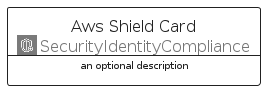

# AwsShield


```text
aws-q1-2024/Architecture/SecurityIdentityCompliance/AwsShield
```

```text
include('aws-q1-2024/Architecture/SecurityIdentityCompliance/AwsShield')
```


| Illustration | AwsShield | AwsShieldCard | AwsShieldGroup |
| :---: | :---: | :---: | :---: |
|  |  |  |  |


## Sprites
The item provides the following sriptes:

- `<$AwsShieldXs>`
- `<$AwsShieldSm>`
- `<$AwsShieldMd>`
- `<$AwsShieldLg>`


## AwsShield

### Load remotely
```plantuml
@startuml
' configures the library
!global $LIB_BASE_LOCATION="https://raw.githubusercontent.com/tmorin/plantuml-libs/master/distribution"

' loads the library's bootstrap
!include $LIB_BASE_LOCATION/bootstrap.puml

' loads the package bootstrap
include('aws-q1-2024/bootstrap')

' loads the Item which embeds the element AwsShield
include('aws-q1-2024/Architecture/SecurityIdentityCompliance/AwsShield')

' renders the element
AwsShield('AwsShield', 'Aws Shield', 'an optional tech label', 'an optional description')
@enduml
```

### Load locally
```plantuml
@startuml
' configures the library
!global $INCLUSION_MODE="local"
!global $LIB_BASE_LOCATION="../../.."

' loads the library's bootstrap
!include $LIB_BASE_LOCATION/bootstrap.puml

' loads the package bootstrap
include('aws-q1-2024/bootstrap')

' loads the Item which embeds the element AwsShield
include('aws-q1-2024/Architecture/SecurityIdentityCompliance/AwsShield')

' renders the element
AwsShield('AwsShield', 'Aws Shield', 'an optional tech label', 'an optional description')
@enduml
```

## AwsShieldCard

### Load remotely
```plantuml
@startuml
' configures the library
!global $LIB_BASE_LOCATION="https://raw.githubusercontent.com/tmorin/plantuml-libs/master/distribution"

' loads the library's bootstrap
!include $LIB_BASE_LOCATION/bootstrap.puml

' loads the package bootstrap
include('aws-q1-2024/bootstrap')

' loads the Item which embeds the element AwsShieldCard
include('aws-q1-2024/Architecture/SecurityIdentityCompliance/AwsShield')

' renders the element
AwsShieldCard('AwsShieldCard', 'Aws Shield Card', 'an optional description')
@enduml
```

### Load locally
```plantuml
@startuml
' configures the library
!global $INCLUSION_MODE="local"
!global $LIB_BASE_LOCATION="../../.."

' loads the library's bootstrap
!include $LIB_BASE_LOCATION/bootstrap.puml

' loads the package bootstrap
include('aws-q1-2024/bootstrap')

' loads the Item which embeds the element AwsShieldCard
include('aws-q1-2024/Architecture/SecurityIdentityCompliance/AwsShield')

' renders the element
AwsShieldCard('AwsShieldCard', 'Aws Shield Card', 'an optional description')
@enduml
```

## AwsShieldGroup

### Load remotely
```plantuml
@startuml
' configures the library
!global $LIB_BASE_LOCATION="https://raw.githubusercontent.com/tmorin/plantuml-libs/master/distribution"

' loads the library's bootstrap
!include $LIB_BASE_LOCATION/bootstrap.puml

' loads the package bootstrap
include('aws-q1-2024/bootstrap')

' loads the Item which embeds the element AwsShieldGroup
include('aws-q1-2024/Architecture/SecurityIdentityCompliance/AwsShield')

' renders the element
AwsShieldGroup('AwsShieldGroup', 'Aws Shield Group', 'an optional tech label') {
    note as note
        the content of the group
    end note
}
@enduml
```

### Load locally
```plantuml
@startuml
' configures the library
!global $INCLUSION_MODE="local"
!global $LIB_BASE_LOCATION="../../.."

' loads the library's bootstrap
!include $LIB_BASE_LOCATION/bootstrap.puml

' loads the package bootstrap
include('aws-q1-2024/bootstrap')

' loads the Item which embeds the element AwsShieldGroup
include('aws-q1-2024/Architecture/SecurityIdentityCompliance/AwsShield')

' renders the element
AwsShieldGroup('AwsShieldGroup', 'Aws Shield Group', 'an optional tech label') {
    note as note
        the content of the group
    end note
}
@enduml
```

