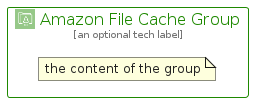

# AmazonFileCache


```text
aws-q1-2024/Architecture/Storage/AmazonFileCache
```

```text
include('aws-q1-2024/Architecture/Storage/AmazonFileCache')
```


| Illustration | AmazonFileCache | AmazonFileCacheCard | AmazonFileCacheGroup |
| :---: | :---: | :---: | :---: |
|  |  |  |  |


## Sprites
The item provides the following sriptes:

- `<$AmazonFileCacheXs>`
- `<$AmazonFileCacheSm>`
- `<$AmazonFileCacheMd>`
- `<$AmazonFileCacheLg>`


## AmazonFileCache

### Load remotely
```plantuml
@startuml
' configures the library
!global $LIB_BASE_LOCATION="https://raw.githubusercontent.com/tmorin/plantuml-libs/master/distribution"

' loads the library's bootstrap
!include $LIB_BASE_LOCATION/bootstrap.puml

' loads the package bootstrap
include('aws-q1-2024/bootstrap')

' loads the Item which embeds the element AmazonFileCache
include('aws-q1-2024/Architecture/Storage/AmazonFileCache')

' renders the element
AmazonFileCache('AmazonFileCache', 'Amazon File Cache', 'an optional tech label', 'an optional description')
@enduml
```

### Load locally
```plantuml
@startuml
' configures the library
!global $INCLUSION_MODE="local"
!global $LIB_BASE_LOCATION="../../.."

' loads the library's bootstrap
!include $LIB_BASE_LOCATION/bootstrap.puml

' loads the package bootstrap
include('aws-q1-2024/bootstrap')

' loads the Item which embeds the element AmazonFileCache
include('aws-q1-2024/Architecture/Storage/AmazonFileCache')

' renders the element
AmazonFileCache('AmazonFileCache', 'Amazon File Cache', 'an optional tech label', 'an optional description')
@enduml
```

## AmazonFileCacheCard

### Load remotely
```plantuml
@startuml
' configures the library
!global $LIB_BASE_LOCATION="https://raw.githubusercontent.com/tmorin/plantuml-libs/master/distribution"

' loads the library's bootstrap
!include $LIB_BASE_LOCATION/bootstrap.puml

' loads the package bootstrap
include('aws-q1-2024/bootstrap')

' loads the Item which embeds the element AmazonFileCacheCard
include('aws-q1-2024/Architecture/Storage/AmazonFileCache')

' renders the element
AmazonFileCacheCard('AmazonFileCacheCard', 'Amazon File Cache Card', 'an optional description')
@enduml
```

### Load locally
```plantuml
@startuml
' configures the library
!global $INCLUSION_MODE="local"
!global $LIB_BASE_LOCATION="../../.."

' loads the library's bootstrap
!include $LIB_BASE_LOCATION/bootstrap.puml

' loads the package bootstrap
include('aws-q1-2024/bootstrap')

' loads the Item which embeds the element AmazonFileCacheCard
include('aws-q1-2024/Architecture/Storage/AmazonFileCache')

' renders the element
AmazonFileCacheCard('AmazonFileCacheCard', 'Amazon File Cache Card', 'an optional description')
@enduml
```

## AmazonFileCacheGroup

### Load remotely
```plantuml
@startuml
' configures the library
!global $LIB_BASE_LOCATION="https://raw.githubusercontent.com/tmorin/plantuml-libs/master/distribution"

' loads the library's bootstrap
!include $LIB_BASE_LOCATION/bootstrap.puml

' loads the package bootstrap
include('aws-q1-2024/bootstrap')

' loads the Item which embeds the element AmazonFileCacheGroup
include('aws-q1-2024/Architecture/Storage/AmazonFileCache')

' renders the element
AmazonFileCacheGroup('AmazonFileCacheGroup', 'Amazon File Cache Group', 'an optional tech label') {
    note as note
        the content of the group
    end note
}
@enduml
```

### Load locally
```plantuml
@startuml
' configures the library
!global $INCLUSION_MODE="local"
!global $LIB_BASE_LOCATION="../../.."

' loads the library's bootstrap
!include $LIB_BASE_LOCATION/bootstrap.puml

' loads the package bootstrap
include('aws-q1-2024/bootstrap')

' loads the Item which embeds the element AmazonFileCacheGroup
include('aws-q1-2024/Architecture/Storage/AmazonFileCache')

' renders the element
AmazonFileCacheGroup('AmazonFileCacheGroup', 'Amazon File Cache Group', 'an optional tech label') {
    note as note
        the content of the group
    end note
}
@enduml
```

