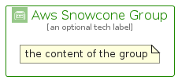

# AwsSnowcone


```text
aws-q1-2024/Architecture/Storage/AwsSnowcone
```

```text
include('aws-q1-2024/Architecture/Storage/AwsSnowcone')
```


| Illustration | AwsSnowcone | AwsSnowconeCard | AwsSnowconeGroup |
| :---: | :---: | :---: | :---: |
|  |  |  |  |


## Sprites
The item provides the following sriptes:

- `<$AwsSnowconeXs>`
- `<$AwsSnowconeSm>`
- `<$AwsSnowconeMd>`
- `<$AwsSnowconeLg>`


## AwsSnowcone

### Load remotely
```plantuml
@startuml
' configures the library
!global $LIB_BASE_LOCATION="https://raw.githubusercontent.com/tmorin/plantuml-libs/master/distribution"

' loads the library's bootstrap
!include $LIB_BASE_LOCATION/bootstrap.puml

' loads the package bootstrap
include('aws-q1-2024/bootstrap')

' loads the Item which embeds the element AwsSnowcone
include('aws-q1-2024/Architecture/Storage/AwsSnowcone')

' renders the element
AwsSnowcone('AwsSnowcone', 'Aws Snowcone', 'an optional tech label', 'an optional description')
@enduml
```

### Load locally
```plantuml
@startuml
' configures the library
!global $INCLUSION_MODE="local"
!global $LIB_BASE_LOCATION="../../.."

' loads the library's bootstrap
!include $LIB_BASE_LOCATION/bootstrap.puml

' loads the package bootstrap
include('aws-q1-2024/bootstrap')

' loads the Item which embeds the element AwsSnowcone
include('aws-q1-2024/Architecture/Storage/AwsSnowcone')

' renders the element
AwsSnowcone('AwsSnowcone', 'Aws Snowcone', 'an optional tech label', 'an optional description')
@enduml
```

## AwsSnowconeCard

### Load remotely
```plantuml
@startuml
' configures the library
!global $LIB_BASE_LOCATION="https://raw.githubusercontent.com/tmorin/plantuml-libs/master/distribution"

' loads the library's bootstrap
!include $LIB_BASE_LOCATION/bootstrap.puml

' loads the package bootstrap
include('aws-q1-2024/bootstrap')

' loads the Item which embeds the element AwsSnowconeCard
include('aws-q1-2024/Architecture/Storage/AwsSnowcone')

' renders the element
AwsSnowconeCard('AwsSnowconeCard', 'Aws Snowcone Card', 'an optional description')
@enduml
```

### Load locally
```plantuml
@startuml
' configures the library
!global $INCLUSION_MODE="local"
!global $LIB_BASE_LOCATION="../../.."

' loads the library's bootstrap
!include $LIB_BASE_LOCATION/bootstrap.puml

' loads the package bootstrap
include('aws-q1-2024/bootstrap')

' loads the Item which embeds the element AwsSnowconeCard
include('aws-q1-2024/Architecture/Storage/AwsSnowcone')

' renders the element
AwsSnowconeCard('AwsSnowconeCard', 'Aws Snowcone Card', 'an optional description')
@enduml
```

## AwsSnowconeGroup

### Load remotely
```plantuml
@startuml
' configures the library
!global $LIB_BASE_LOCATION="https://raw.githubusercontent.com/tmorin/plantuml-libs/master/distribution"

' loads the library's bootstrap
!include $LIB_BASE_LOCATION/bootstrap.puml

' loads the package bootstrap
include('aws-q1-2024/bootstrap')

' loads the Item which embeds the element AwsSnowconeGroup
include('aws-q1-2024/Architecture/Storage/AwsSnowcone')

' renders the element
AwsSnowconeGroup('AwsSnowconeGroup', 'Aws Snowcone Group', 'an optional tech label') {
    note as note
        the content of the group
    end note
}
@enduml
```

### Load locally
```plantuml
@startuml
' configures the library
!global $INCLUSION_MODE="local"
!global $LIB_BASE_LOCATION="../../.."

' loads the library's bootstrap
!include $LIB_BASE_LOCATION/bootstrap.puml

' loads the package bootstrap
include('aws-q1-2024/bootstrap')

' loads the Item which embeds the element AwsSnowconeGroup
include('aws-q1-2024/Architecture/Storage/AwsSnowcone')

' renders the element
AwsSnowconeGroup('AwsSnowconeGroup', 'Aws Snowcone Group', 'an optional tech label') {
    note as note
        the content of the group
    end note
}
@enduml
```

