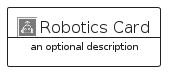
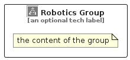

# Robotics


```text
aws-q1-2024/Category/Robotics
```

```text
include('aws-q1-2024/Category/Robotics')
```


| Illustration | Robotics | RoboticsCard | RoboticsGroup |
| :---: | :---: | :---: | :---: |
|  |  |  |  |


## Sprites
The item provides the following sriptes:

- `<$RoboticsXs>`
- `<$RoboticsSm>`
- `<$RoboticsMd>`
- `<$RoboticsLg>`


## Robotics

### Load remotely
```plantuml
@startuml
' configures the library
!global $LIB_BASE_LOCATION="https://raw.githubusercontent.com/tmorin/plantuml-libs/master/distribution"

' loads the library's bootstrap
!include $LIB_BASE_LOCATION/bootstrap.puml

' loads the package bootstrap
include('aws-q1-2024/bootstrap')

' loads the Item which embeds the element Robotics
include('aws-q1-2024/Category/Robotics')

' renders the element
Robotics('Robotics', 'Robotics', 'an optional tech label', 'an optional description')
@enduml
```

### Load locally
```plantuml
@startuml
' configures the library
!global $INCLUSION_MODE="local"
!global $LIB_BASE_LOCATION="../.."

' loads the library's bootstrap
!include $LIB_BASE_LOCATION/bootstrap.puml

' loads the package bootstrap
include('aws-q1-2024/bootstrap')

' loads the Item which embeds the element Robotics
include('aws-q1-2024/Category/Robotics')

' renders the element
Robotics('Robotics', 'Robotics', 'an optional tech label', 'an optional description')
@enduml
```

## RoboticsCard

### Load remotely
```plantuml
@startuml
' configures the library
!global $LIB_BASE_LOCATION="https://raw.githubusercontent.com/tmorin/plantuml-libs/master/distribution"

' loads the library's bootstrap
!include $LIB_BASE_LOCATION/bootstrap.puml

' loads the package bootstrap
include('aws-q1-2024/bootstrap')

' loads the Item which embeds the element RoboticsCard
include('aws-q1-2024/Category/Robotics')

' renders the element
RoboticsCard('RoboticsCard', 'Robotics Card', 'an optional description')
@enduml
```

### Load locally
```plantuml
@startuml
' configures the library
!global $INCLUSION_MODE="local"
!global $LIB_BASE_LOCATION="../.."

' loads the library's bootstrap
!include $LIB_BASE_LOCATION/bootstrap.puml

' loads the package bootstrap
include('aws-q1-2024/bootstrap')

' loads the Item which embeds the element RoboticsCard
include('aws-q1-2024/Category/Robotics')

' renders the element
RoboticsCard('RoboticsCard', 'Robotics Card', 'an optional description')
@enduml
```

## RoboticsGroup

### Load remotely
```plantuml
@startuml
' configures the library
!global $LIB_BASE_LOCATION="https://raw.githubusercontent.com/tmorin/plantuml-libs/master/distribution"

' loads the library's bootstrap
!include $LIB_BASE_LOCATION/bootstrap.puml

' loads the package bootstrap
include('aws-q1-2024/bootstrap')

' loads the Item which embeds the element RoboticsGroup
include('aws-q1-2024/Category/Robotics')

' renders the element
RoboticsGroup('RoboticsGroup', 'Robotics Group', 'an optional tech label') {
    note as note
        the content of the group
    end note
}
@enduml
```

### Load locally
```plantuml
@startuml
' configures the library
!global $INCLUSION_MODE="local"
!global $LIB_BASE_LOCATION="../.."

' loads the library's bootstrap
!include $LIB_BASE_LOCATION/bootstrap.puml

' loads the package bootstrap
include('aws-q1-2024/bootstrap')

' loads the Item which embeds the element RoboticsGroup
include('aws-q1-2024/Category/Robotics')

' renders the element
RoboticsGroup('RoboticsGroup', 'Robotics Group', 'an optional tech label') {
    note as note
        the content of the group
    end note
}
@enduml
```

