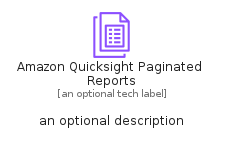
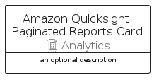

# AmazonQuicksightPaginatedReports


```text
aws-q1-2024/Resource/Analytics/AmazonQuicksightPaginatedReports
```

```text
include('aws-q1-2024/Resource/Analytics/AmazonQuicksightPaginatedReports')
```


| Illustration | AmazonQuicksightPaginatedReports | AmazonQuicksightPaginatedReportsCard | AmazonQuicksightPaginatedReportsGroup |
| :---: | :---: | :---: | :---: |
|  |  |  |  |


## Sprites
The item provides the following sriptes:

- `<$AmazonQuicksightPaginatedReportsXs>`
- `<$AmazonQuicksightPaginatedReportsSm>`
- `<$AmazonQuicksightPaginatedReportsMd>`
- `<$AmazonQuicksightPaginatedReportsLg>`


## AmazonQuicksightPaginatedReports

### Load remotely
```plantuml
@startuml
' configures the library
!global $LIB_BASE_LOCATION="https://raw.githubusercontent.com/tmorin/plantuml-libs/master/distribution"

' loads the library's bootstrap
!include $LIB_BASE_LOCATION/bootstrap.puml

' loads the package bootstrap
include('aws-q1-2024/bootstrap')

' loads the Item which embeds the element AmazonQuicksightPaginatedReports
include('aws-q1-2024/Resource/Analytics/AmazonQuicksightPaginatedReports')

' renders the element
AmazonQuicksightPaginatedReports('AmazonQuicksightPaginatedReports', 'Amazon Quicksight Paginated Reports', 'an optional tech label', 'an optional description')
@enduml
```

### Load locally
```plantuml
@startuml
' configures the library
!global $INCLUSION_MODE="local"
!global $LIB_BASE_LOCATION="../../.."

' loads the library's bootstrap
!include $LIB_BASE_LOCATION/bootstrap.puml

' loads the package bootstrap
include('aws-q1-2024/bootstrap')

' loads the Item which embeds the element AmazonQuicksightPaginatedReports
include('aws-q1-2024/Resource/Analytics/AmazonQuicksightPaginatedReports')

' renders the element
AmazonQuicksightPaginatedReports('AmazonQuicksightPaginatedReports', 'Amazon Quicksight Paginated Reports', 'an optional tech label', 'an optional description')
@enduml
```

## AmazonQuicksightPaginatedReportsCard

### Load remotely
```plantuml
@startuml
' configures the library
!global $LIB_BASE_LOCATION="https://raw.githubusercontent.com/tmorin/plantuml-libs/master/distribution"

' loads the library's bootstrap
!include $LIB_BASE_LOCATION/bootstrap.puml

' loads the package bootstrap
include('aws-q1-2024/bootstrap')

' loads the Item which embeds the element AmazonQuicksightPaginatedReportsCard
include('aws-q1-2024/Resource/Analytics/AmazonQuicksightPaginatedReports')

' renders the element
AmazonQuicksightPaginatedReportsCard('AmazonQuicksightPaginatedReportsCard', 'Amazon Quicksight Paginated Reports Card', 'an optional description')
@enduml
```

### Load locally
```plantuml
@startuml
' configures the library
!global $INCLUSION_MODE="local"
!global $LIB_BASE_LOCATION="../../.."

' loads the library's bootstrap
!include $LIB_BASE_LOCATION/bootstrap.puml

' loads the package bootstrap
include('aws-q1-2024/bootstrap')

' loads the Item which embeds the element AmazonQuicksightPaginatedReportsCard
include('aws-q1-2024/Resource/Analytics/AmazonQuicksightPaginatedReports')

' renders the element
AmazonQuicksightPaginatedReportsCard('AmazonQuicksightPaginatedReportsCard', 'Amazon Quicksight Paginated Reports Card', 'an optional description')
@enduml
```

## AmazonQuicksightPaginatedReportsGroup

### Load remotely
```plantuml
@startuml
' configures the library
!global $LIB_BASE_LOCATION="https://raw.githubusercontent.com/tmorin/plantuml-libs/master/distribution"

' loads the library's bootstrap
!include $LIB_BASE_LOCATION/bootstrap.puml

' loads the package bootstrap
include('aws-q1-2024/bootstrap')

' loads the Item which embeds the element AmazonQuicksightPaginatedReportsGroup
include('aws-q1-2024/Resource/Analytics/AmazonQuicksightPaginatedReports')

' renders the element
AmazonQuicksightPaginatedReportsGroup('AmazonQuicksightPaginatedReportsGroup', 'Amazon Quicksight Paginated Reports Group', 'an optional tech label') {
    note as note
        the content of the group
    end note
}
@enduml
```

### Load locally
```plantuml
@startuml
' configures the library
!global $INCLUSION_MODE="local"
!global $LIB_BASE_LOCATION="../../.."

' loads the library's bootstrap
!include $LIB_BASE_LOCATION/bootstrap.puml

' loads the package bootstrap
include('aws-q1-2024/bootstrap')

' loads the Item which embeds the element AmazonQuicksightPaginatedReportsGroup
include('aws-q1-2024/Resource/Analytics/AmazonQuicksightPaginatedReports')

' renders the element
AmazonQuicksightPaginatedReportsGroup('AmazonQuicksightPaginatedReportsGroup', 'Amazon Quicksight Paginated Reports Group', 'an optional tech label') {
    note as note
        the content of the group
    end note
}
@enduml
```

