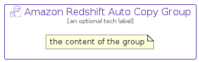

# AmazonRedshiftAutoCopy


```text
aws-q1-2024/Resource/Analytics/AmazonRedshiftAutoCopy
```

```text
include('aws-q1-2024/Resource/Analytics/AmazonRedshiftAutoCopy')
```


| Illustration | AmazonRedshiftAutoCopy | AmazonRedshiftAutoCopyCard | AmazonRedshiftAutoCopyGroup |
| :---: | :---: | :---: | :---: |
|  |  |  |  |


## Sprites
The item provides the following sriptes:

- `<$AmazonRedshiftAutoCopyXs>`
- `<$AmazonRedshiftAutoCopySm>`
- `<$AmazonRedshiftAutoCopyMd>`
- `<$AmazonRedshiftAutoCopyLg>`


## AmazonRedshiftAutoCopy

### Load remotely
```plantuml
@startuml
' configures the library
!global $LIB_BASE_LOCATION="https://raw.githubusercontent.com/tmorin/plantuml-libs/master/distribution"

' loads the library's bootstrap
!include $LIB_BASE_LOCATION/bootstrap.puml

' loads the package bootstrap
include('aws-q1-2024/bootstrap')

' loads the Item which embeds the element AmazonRedshiftAutoCopy
include('aws-q1-2024/Resource/Analytics/AmazonRedshiftAutoCopy')

' renders the element
AmazonRedshiftAutoCopy('AmazonRedshiftAutoCopy', 'Amazon Redshift Auto Copy', 'an optional tech label', 'an optional description')
@enduml
```

### Load locally
```plantuml
@startuml
' configures the library
!global $INCLUSION_MODE="local"
!global $LIB_BASE_LOCATION="../../.."

' loads the library's bootstrap
!include $LIB_BASE_LOCATION/bootstrap.puml

' loads the package bootstrap
include('aws-q1-2024/bootstrap')

' loads the Item which embeds the element AmazonRedshiftAutoCopy
include('aws-q1-2024/Resource/Analytics/AmazonRedshiftAutoCopy')

' renders the element
AmazonRedshiftAutoCopy('AmazonRedshiftAutoCopy', 'Amazon Redshift Auto Copy', 'an optional tech label', 'an optional description')
@enduml
```

## AmazonRedshiftAutoCopyCard

### Load remotely
```plantuml
@startuml
' configures the library
!global $LIB_BASE_LOCATION="https://raw.githubusercontent.com/tmorin/plantuml-libs/master/distribution"

' loads the library's bootstrap
!include $LIB_BASE_LOCATION/bootstrap.puml

' loads the package bootstrap
include('aws-q1-2024/bootstrap')

' loads the Item which embeds the element AmazonRedshiftAutoCopyCard
include('aws-q1-2024/Resource/Analytics/AmazonRedshiftAutoCopy')

' renders the element
AmazonRedshiftAutoCopyCard('AmazonRedshiftAutoCopyCard', 'Amazon Redshift Auto Copy Card', 'an optional description')
@enduml
```

### Load locally
```plantuml
@startuml
' configures the library
!global $INCLUSION_MODE="local"
!global $LIB_BASE_LOCATION="../../.."

' loads the library's bootstrap
!include $LIB_BASE_LOCATION/bootstrap.puml

' loads the package bootstrap
include('aws-q1-2024/bootstrap')

' loads the Item which embeds the element AmazonRedshiftAutoCopyCard
include('aws-q1-2024/Resource/Analytics/AmazonRedshiftAutoCopy')

' renders the element
AmazonRedshiftAutoCopyCard('AmazonRedshiftAutoCopyCard', 'Amazon Redshift Auto Copy Card', 'an optional description')
@enduml
```

## AmazonRedshiftAutoCopyGroup

### Load remotely
```plantuml
@startuml
' configures the library
!global $LIB_BASE_LOCATION="https://raw.githubusercontent.com/tmorin/plantuml-libs/master/distribution"

' loads the library's bootstrap
!include $LIB_BASE_LOCATION/bootstrap.puml

' loads the package bootstrap
include('aws-q1-2024/bootstrap')

' loads the Item which embeds the element AmazonRedshiftAutoCopyGroup
include('aws-q1-2024/Resource/Analytics/AmazonRedshiftAutoCopy')

' renders the element
AmazonRedshiftAutoCopyGroup('AmazonRedshiftAutoCopyGroup', 'Amazon Redshift Auto Copy Group', 'an optional tech label') {
    note as note
        the content of the group
    end note
}
@enduml
```

### Load locally
```plantuml
@startuml
' configures the library
!global $INCLUSION_MODE="local"
!global $LIB_BASE_LOCATION="../../.."

' loads the library's bootstrap
!include $LIB_BASE_LOCATION/bootstrap.puml

' loads the package bootstrap
include('aws-q1-2024/bootstrap')

' loads the Item which embeds the element AmazonRedshiftAutoCopyGroup
include('aws-q1-2024/Resource/Analytics/AmazonRedshiftAutoCopy')

' renders the element
AmazonRedshiftAutoCopyGroup('AmazonRedshiftAutoCopyGroup', 'Amazon Redshift Auto Copy Group', 'an optional tech label') {
    note as note
        the content of the group
    end note
}
@enduml
```

