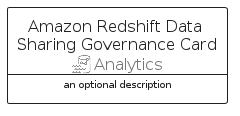

# AmazonRedshiftDataSharingGovernance


```text
aws-q1-2024/Resource/Analytics/AmazonRedshiftDataSharingGovernance
```

```text
include('aws-q1-2024/Resource/Analytics/AmazonRedshiftDataSharingGovernance')
```


| Illustration | AmazonRedshiftDataSharingGovernance | AmazonRedshiftDataSharingGovernanceCard | AmazonRedshiftDataSharingGovernanceGroup |
| :---: | :---: | :---: | :---: |
|  |  |  |  |


## Sprites
The item provides the following sriptes:

- `<$AmazonRedshiftDataSharingGovernanceXs>`
- `<$AmazonRedshiftDataSharingGovernanceSm>`
- `<$AmazonRedshiftDataSharingGovernanceMd>`
- `<$AmazonRedshiftDataSharingGovernanceLg>`


## AmazonRedshiftDataSharingGovernance

### Load remotely
```plantuml
@startuml
' configures the library
!global $LIB_BASE_LOCATION="https://raw.githubusercontent.com/tmorin/plantuml-libs/master/distribution"

' loads the library's bootstrap
!include $LIB_BASE_LOCATION/bootstrap.puml

' loads the package bootstrap
include('aws-q1-2024/bootstrap')

' loads the Item which embeds the element AmazonRedshiftDataSharingGovernance
include('aws-q1-2024/Resource/Analytics/AmazonRedshiftDataSharingGovernance')

' renders the element
AmazonRedshiftDataSharingGovernance('AmazonRedshiftDataSharingGovernance', 'Amazon Redshift Data Sharing Governance', 'an optional tech label', 'an optional description')
@enduml
```

### Load locally
```plantuml
@startuml
' configures the library
!global $INCLUSION_MODE="local"
!global $LIB_BASE_LOCATION="../../.."

' loads the library's bootstrap
!include $LIB_BASE_LOCATION/bootstrap.puml

' loads the package bootstrap
include('aws-q1-2024/bootstrap')

' loads the Item which embeds the element AmazonRedshiftDataSharingGovernance
include('aws-q1-2024/Resource/Analytics/AmazonRedshiftDataSharingGovernance')

' renders the element
AmazonRedshiftDataSharingGovernance('AmazonRedshiftDataSharingGovernance', 'Amazon Redshift Data Sharing Governance', 'an optional tech label', 'an optional description')
@enduml
```

## AmazonRedshiftDataSharingGovernanceCard

### Load remotely
```plantuml
@startuml
' configures the library
!global $LIB_BASE_LOCATION="https://raw.githubusercontent.com/tmorin/plantuml-libs/master/distribution"

' loads the library's bootstrap
!include $LIB_BASE_LOCATION/bootstrap.puml

' loads the package bootstrap
include('aws-q1-2024/bootstrap')

' loads the Item which embeds the element AmazonRedshiftDataSharingGovernanceCard
include('aws-q1-2024/Resource/Analytics/AmazonRedshiftDataSharingGovernance')

' renders the element
AmazonRedshiftDataSharingGovernanceCard('AmazonRedshiftDataSharingGovernanceCard', 'Amazon Redshift Data Sharing Governance Card', 'an optional description')
@enduml
```

### Load locally
```plantuml
@startuml
' configures the library
!global $INCLUSION_MODE="local"
!global $LIB_BASE_LOCATION="../../.."

' loads the library's bootstrap
!include $LIB_BASE_LOCATION/bootstrap.puml

' loads the package bootstrap
include('aws-q1-2024/bootstrap')

' loads the Item which embeds the element AmazonRedshiftDataSharingGovernanceCard
include('aws-q1-2024/Resource/Analytics/AmazonRedshiftDataSharingGovernance')

' renders the element
AmazonRedshiftDataSharingGovernanceCard('AmazonRedshiftDataSharingGovernanceCard', 'Amazon Redshift Data Sharing Governance Card', 'an optional description')
@enduml
```

## AmazonRedshiftDataSharingGovernanceGroup

### Load remotely
```plantuml
@startuml
' configures the library
!global $LIB_BASE_LOCATION="https://raw.githubusercontent.com/tmorin/plantuml-libs/master/distribution"

' loads the library's bootstrap
!include $LIB_BASE_LOCATION/bootstrap.puml

' loads the package bootstrap
include('aws-q1-2024/bootstrap')

' loads the Item which embeds the element AmazonRedshiftDataSharingGovernanceGroup
include('aws-q1-2024/Resource/Analytics/AmazonRedshiftDataSharingGovernance')

' renders the element
AmazonRedshiftDataSharingGovernanceGroup('AmazonRedshiftDataSharingGovernanceGroup', 'Amazon Redshift Data Sharing Governance Group', 'an optional tech label') {
    note as note
        the content of the group
    end note
}
@enduml
```

### Load locally
```plantuml
@startuml
' configures the library
!global $INCLUSION_MODE="local"
!global $LIB_BASE_LOCATION="../../.."

' loads the library's bootstrap
!include $LIB_BASE_LOCATION/bootstrap.puml

' loads the package bootstrap
include('aws-q1-2024/bootstrap')

' loads the Item which embeds the element AmazonRedshiftDataSharingGovernanceGroup
include('aws-q1-2024/Resource/Analytics/AmazonRedshiftDataSharingGovernance')

' renders the element
AmazonRedshiftDataSharingGovernanceGroup('AmazonRedshiftDataSharingGovernanceGroup', 'Amazon Redshift Data Sharing Governance Group', 'an optional tech label') {
    note as note
        the content of the group
    end note
}
@enduml
```

