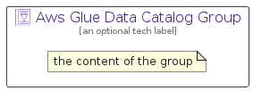

# AwsGlueDataCatalog


```text
aws-q1-2024/Resource/Analytics/AwsGlueDataCatalog
```

```text
include('aws-q1-2024/Resource/Analytics/AwsGlueDataCatalog')
```


| Illustration | AwsGlueDataCatalog | AwsGlueDataCatalogCard | AwsGlueDataCatalogGroup |
| :---: | :---: | :---: | :---: |
|  |  |  |  |


## Sprites
The item provides the following sriptes:

- `<$AwsGlueDataCatalogXs>`
- `<$AwsGlueDataCatalogSm>`
- `<$AwsGlueDataCatalogMd>`
- `<$AwsGlueDataCatalogLg>`


## AwsGlueDataCatalog

### Load remotely
```plantuml
@startuml
' configures the library
!global $LIB_BASE_LOCATION="https://raw.githubusercontent.com/tmorin/plantuml-libs/master/distribution"

' loads the library's bootstrap
!include $LIB_BASE_LOCATION/bootstrap.puml

' loads the package bootstrap
include('aws-q1-2024/bootstrap')

' loads the Item which embeds the element AwsGlueDataCatalog
include('aws-q1-2024/Resource/Analytics/AwsGlueDataCatalog')

' renders the element
AwsGlueDataCatalog('AwsGlueDataCatalog', 'Aws Glue Data Catalog', 'an optional tech label', 'an optional description')
@enduml
```

### Load locally
```plantuml
@startuml
' configures the library
!global $INCLUSION_MODE="local"
!global $LIB_BASE_LOCATION="../../.."

' loads the library's bootstrap
!include $LIB_BASE_LOCATION/bootstrap.puml

' loads the package bootstrap
include('aws-q1-2024/bootstrap')

' loads the Item which embeds the element AwsGlueDataCatalog
include('aws-q1-2024/Resource/Analytics/AwsGlueDataCatalog')

' renders the element
AwsGlueDataCatalog('AwsGlueDataCatalog', 'Aws Glue Data Catalog', 'an optional tech label', 'an optional description')
@enduml
```

## AwsGlueDataCatalogCard

### Load remotely
```plantuml
@startuml
' configures the library
!global $LIB_BASE_LOCATION="https://raw.githubusercontent.com/tmorin/plantuml-libs/master/distribution"

' loads the library's bootstrap
!include $LIB_BASE_LOCATION/bootstrap.puml

' loads the package bootstrap
include('aws-q1-2024/bootstrap')

' loads the Item which embeds the element AwsGlueDataCatalogCard
include('aws-q1-2024/Resource/Analytics/AwsGlueDataCatalog')

' renders the element
AwsGlueDataCatalogCard('AwsGlueDataCatalogCard', 'Aws Glue Data Catalog Card', 'an optional description')
@enduml
```

### Load locally
```plantuml
@startuml
' configures the library
!global $INCLUSION_MODE="local"
!global $LIB_BASE_LOCATION="../../.."

' loads the library's bootstrap
!include $LIB_BASE_LOCATION/bootstrap.puml

' loads the package bootstrap
include('aws-q1-2024/bootstrap')

' loads the Item which embeds the element AwsGlueDataCatalogCard
include('aws-q1-2024/Resource/Analytics/AwsGlueDataCatalog')

' renders the element
AwsGlueDataCatalogCard('AwsGlueDataCatalogCard', 'Aws Glue Data Catalog Card', 'an optional description')
@enduml
```

## AwsGlueDataCatalogGroup

### Load remotely
```plantuml
@startuml
' configures the library
!global $LIB_BASE_LOCATION="https://raw.githubusercontent.com/tmorin/plantuml-libs/master/distribution"

' loads the library's bootstrap
!include $LIB_BASE_LOCATION/bootstrap.puml

' loads the package bootstrap
include('aws-q1-2024/bootstrap')

' loads the Item which embeds the element AwsGlueDataCatalogGroup
include('aws-q1-2024/Resource/Analytics/AwsGlueDataCatalog')

' renders the element
AwsGlueDataCatalogGroup('AwsGlueDataCatalogGroup', 'Aws Glue Data Catalog Group', 'an optional tech label') {
    note as note
        the content of the group
    end note
}
@enduml
```

### Load locally
```plantuml
@startuml
' configures the library
!global $INCLUSION_MODE="local"
!global $LIB_BASE_LOCATION="../../.."

' loads the library's bootstrap
!include $LIB_BASE_LOCATION/bootstrap.puml

' loads the package bootstrap
include('aws-q1-2024/bootstrap')

' loads the Item which embeds the element AwsGlueDataCatalogGroup
include('aws-q1-2024/Resource/Analytics/AwsGlueDataCatalog')

' renders the element
AwsGlueDataCatalogGroup('AwsGlueDataCatalogGroup', 'Aws Glue Data Catalog Group', 'an optional tech label') {
    note as note
        the content of the group
    end note
}
@enduml
```

