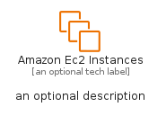
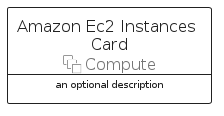
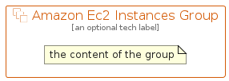

# AmazonEc2Instances


```text
aws-q1-2024/Resource/Compute/AmazonEc2Instances
```

```text
include('aws-q1-2024/Resource/Compute/AmazonEc2Instances')
```


| Illustration | AmazonEc2Instances | AmazonEc2InstancesCard | AmazonEc2InstancesGroup |
| :---: | :---: | :---: | :---: |
|  |  |  |  |


## Sprites
The item provides the following sriptes:

- `<$AmazonEc2InstancesXs>`
- `<$AmazonEc2InstancesSm>`
- `<$AmazonEc2InstancesMd>`
- `<$AmazonEc2InstancesLg>`


## AmazonEc2Instances

### Load remotely
```plantuml
@startuml
' configures the library
!global $LIB_BASE_LOCATION="https://raw.githubusercontent.com/tmorin/plantuml-libs/master/distribution"

' loads the library's bootstrap
!include $LIB_BASE_LOCATION/bootstrap.puml

' loads the package bootstrap
include('aws-q1-2024/bootstrap')

' loads the Item which embeds the element AmazonEc2Instances
include('aws-q1-2024/Resource/Compute/AmazonEc2Instances')

' renders the element
AmazonEc2Instances('AmazonEc2Instances', 'Amazon Ec2 Instances', 'an optional tech label', 'an optional description')
@enduml
```

### Load locally
```plantuml
@startuml
' configures the library
!global $INCLUSION_MODE="local"
!global $LIB_BASE_LOCATION="../../.."

' loads the library's bootstrap
!include $LIB_BASE_LOCATION/bootstrap.puml

' loads the package bootstrap
include('aws-q1-2024/bootstrap')

' loads the Item which embeds the element AmazonEc2Instances
include('aws-q1-2024/Resource/Compute/AmazonEc2Instances')

' renders the element
AmazonEc2Instances('AmazonEc2Instances', 'Amazon Ec2 Instances', 'an optional tech label', 'an optional description')
@enduml
```

## AmazonEc2InstancesCard

### Load remotely
```plantuml
@startuml
' configures the library
!global $LIB_BASE_LOCATION="https://raw.githubusercontent.com/tmorin/plantuml-libs/master/distribution"

' loads the library's bootstrap
!include $LIB_BASE_LOCATION/bootstrap.puml

' loads the package bootstrap
include('aws-q1-2024/bootstrap')

' loads the Item which embeds the element AmazonEc2InstancesCard
include('aws-q1-2024/Resource/Compute/AmazonEc2Instances')

' renders the element
AmazonEc2InstancesCard('AmazonEc2InstancesCard', 'Amazon Ec2 Instances Card', 'an optional description')
@enduml
```

### Load locally
```plantuml
@startuml
' configures the library
!global $INCLUSION_MODE="local"
!global $LIB_BASE_LOCATION="../../.."

' loads the library's bootstrap
!include $LIB_BASE_LOCATION/bootstrap.puml

' loads the package bootstrap
include('aws-q1-2024/bootstrap')

' loads the Item which embeds the element AmazonEc2InstancesCard
include('aws-q1-2024/Resource/Compute/AmazonEc2Instances')

' renders the element
AmazonEc2InstancesCard('AmazonEc2InstancesCard', 'Amazon Ec2 Instances Card', 'an optional description')
@enduml
```

## AmazonEc2InstancesGroup

### Load remotely
```plantuml
@startuml
' configures the library
!global $LIB_BASE_LOCATION="https://raw.githubusercontent.com/tmorin/plantuml-libs/master/distribution"

' loads the library's bootstrap
!include $LIB_BASE_LOCATION/bootstrap.puml

' loads the package bootstrap
include('aws-q1-2024/bootstrap')

' loads the Item which embeds the element AmazonEc2InstancesGroup
include('aws-q1-2024/Resource/Compute/AmazonEc2Instances')

' renders the element
AmazonEc2InstancesGroup('AmazonEc2InstancesGroup', 'Amazon Ec2 Instances Group', 'an optional tech label') {
    note as note
        the content of the group
    end note
}
@enduml
```

### Load locally
```plantuml
@startuml
' configures the library
!global $INCLUSION_MODE="local"
!global $LIB_BASE_LOCATION="../../.."

' loads the library's bootstrap
!include $LIB_BASE_LOCATION/bootstrap.puml

' loads the package bootstrap
include('aws-q1-2024/bootstrap')

' loads the Item which embeds the element AmazonEc2InstancesGroup
include('aws-q1-2024/Resource/Compute/AmazonEc2Instances')

' renders the element
AmazonEc2InstancesGroup('AmazonEc2InstancesGroup', 'Amazon Ec2 Instances Group', 'an optional tech label') {
    note as note
        the content of the group
    end note
}
@enduml
```

