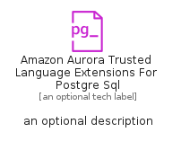

# AmazonAuroraTrustedLanguageExtensionsForPostgreSql


```text
aws-q1-2024/Resource/Database/AmazonAuroraTrustedLanguageExtensionsForPostgreSql
```

```text
include('aws-q1-2024/Resource/Database/AmazonAuroraTrustedLanguageExtensionsForPostgreSql')
```


| Illustration | AmazonAuroraTrustedLanguageExtensionsForPostgreSql | AmazonAuroraTrustedLanguageExtensionsForPostgreSqlCard | AmazonAuroraTrustedLanguageExtensionsForPostgreSqlGroup |
| :---: | :---: | :---: | :---: |
|  |  |  |  |


## Sprites
The item provides the following sriptes:

- `<$AmazonAuroraTrustedLanguageExtensionsForPostgreSqlXs>`
- `<$AmazonAuroraTrustedLanguageExtensionsForPostgreSqlSm>`
- `<$AmazonAuroraTrustedLanguageExtensionsForPostgreSqlMd>`
- `<$AmazonAuroraTrustedLanguageExtensionsForPostgreSqlLg>`


## AmazonAuroraTrustedLanguageExtensionsForPostgreSql

### Load remotely
```plantuml
@startuml
' configures the library
!global $LIB_BASE_LOCATION="https://raw.githubusercontent.com/tmorin/plantuml-libs/master/distribution"

' loads the library's bootstrap
!include $LIB_BASE_LOCATION/bootstrap.puml

' loads the package bootstrap
include('aws-q1-2024/bootstrap')

' loads the Item which embeds the element AmazonAuroraTrustedLanguageExtensionsForPostgreSql
include('aws-q1-2024/Resource/Database/AmazonAuroraTrustedLanguageExtensionsForPostgreSql')

' renders the element
AmazonAuroraTrustedLanguageExtensionsForPostgreSql('AmazonAuroraTrustedLanguageExtensionsForPostgreSql', 'Amazon Aurora Trusted Language Extensions For Postgre Sql', 'an optional tech label', 'an optional description')
@enduml
```

### Load locally
```plantuml
@startuml
' configures the library
!global $INCLUSION_MODE="local"
!global $LIB_BASE_LOCATION="../../.."

' loads the library's bootstrap
!include $LIB_BASE_LOCATION/bootstrap.puml

' loads the package bootstrap
include('aws-q1-2024/bootstrap')

' loads the Item which embeds the element AmazonAuroraTrustedLanguageExtensionsForPostgreSql
include('aws-q1-2024/Resource/Database/AmazonAuroraTrustedLanguageExtensionsForPostgreSql')

' renders the element
AmazonAuroraTrustedLanguageExtensionsForPostgreSql('AmazonAuroraTrustedLanguageExtensionsForPostgreSql', 'Amazon Aurora Trusted Language Extensions For Postgre Sql', 'an optional tech label', 'an optional description')
@enduml
```

## AmazonAuroraTrustedLanguageExtensionsForPostgreSqlCard

### Load remotely
```plantuml
@startuml
' configures the library
!global $LIB_BASE_LOCATION="https://raw.githubusercontent.com/tmorin/plantuml-libs/master/distribution"

' loads the library's bootstrap
!include $LIB_BASE_LOCATION/bootstrap.puml

' loads the package bootstrap
include('aws-q1-2024/bootstrap')

' loads the Item which embeds the element AmazonAuroraTrustedLanguageExtensionsForPostgreSqlCard
include('aws-q1-2024/Resource/Database/AmazonAuroraTrustedLanguageExtensionsForPostgreSql')

' renders the element
AmazonAuroraTrustedLanguageExtensionsForPostgreSqlCard('AmazonAuroraTrustedLanguageExtensionsForPostgreSqlCard', 'Amazon Aurora Trusted Language Extensions For Postgre Sql Card', 'an optional description')
@enduml
```

### Load locally
```plantuml
@startuml
' configures the library
!global $INCLUSION_MODE="local"
!global $LIB_BASE_LOCATION="../../.."

' loads the library's bootstrap
!include $LIB_BASE_LOCATION/bootstrap.puml

' loads the package bootstrap
include('aws-q1-2024/bootstrap')

' loads the Item which embeds the element AmazonAuroraTrustedLanguageExtensionsForPostgreSqlCard
include('aws-q1-2024/Resource/Database/AmazonAuroraTrustedLanguageExtensionsForPostgreSql')

' renders the element
AmazonAuroraTrustedLanguageExtensionsForPostgreSqlCard('AmazonAuroraTrustedLanguageExtensionsForPostgreSqlCard', 'Amazon Aurora Trusted Language Extensions For Postgre Sql Card', 'an optional description')
@enduml
```

## AmazonAuroraTrustedLanguageExtensionsForPostgreSqlGroup

### Load remotely
```plantuml
@startuml
' configures the library
!global $LIB_BASE_LOCATION="https://raw.githubusercontent.com/tmorin/plantuml-libs/master/distribution"

' loads the library's bootstrap
!include $LIB_BASE_LOCATION/bootstrap.puml

' loads the package bootstrap
include('aws-q1-2024/bootstrap')

' loads the Item which embeds the element AmazonAuroraTrustedLanguageExtensionsForPostgreSqlGroup
include('aws-q1-2024/Resource/Database/AmazonAuroraTrustedLanguageExtensionsForPostgreSql')

' renders the element
AmazonAuroraTrustedLanguageExtensionsForPostgreSqlGroup('AmazonAuroraTrustedLanguageExtensionsForPostgreSqlGroup', 'Amazon Aurora Trusted Language Extensions For Postgre Sql Group', 'an optional tech label') {
    note as note
        the content of the group
    end note
}
@enduml
```

### Load locally
```plantuml
@startuml
' configures the library
!global $INCLUSION_MODE="local"
!global $LIB_BASE_LOCATION="../../.."

' loads the library's bootstrap
!include $LIB_BASE_LOCATION/bootstrap.puml

' loads the package bootstrap
include('aws-q1-2024/bootstrap')

' loads the Item which embeds the element AmazonAuroraTrustedLanguageExtensionsForPostgreSqlGroup
include('aws-q1-2024/Resource/Database/AmazonAuroraTrustedLanguageExtensionsForPostgreSql')

' renders the element
AmazonAuroraTrustedLanguageExtensionsForPostgreSqlGroup('AmazonAuroraTrustedLanguageExtensionsForPostgreSqlGroup', 'Amazon Aurora Trusted Language Extensions For Postgre Sql Group', 'an optional tech label') {
    note as note
        the content of the group
    end note
}
@enduml
```

