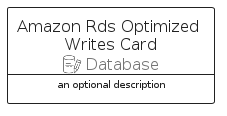

# AmazonRdsOptimizedWrites


```text
aws-q1-2024/Resource/Database/AmazonRdsOptimizedWrites
```

```text
include('aws-q1-2024/Resource/Database/AmazonRdsOptimizedWrites')
```


| Illustration | AmazonRdsOptimizedWrites | AmazonRdsOptimizedWritesCard | AmazonRdsOptimizedWritesGroup |
| :---: | :---: | :---: | :---: |
|  |  |  |  |


## Sprites
The item provides the following sriptes:

- `<$AmazonRdsOptimizedWritesXs>`
- `<$AmazonRdsOptimizedWritesSm>`
- `<$AmazonRdsOptimizedWritesMd>`
- `<$AmazonRdsOptimizedWritesLg>`


## AmazonRdsOptimizedWrites

### Load remotely
```plantuml
@startuml
' configures the library
!global $LIB_BASE_LOCATION="https://raw.githubusercontent.com/tmorin/plantuml-libs/master/distribution"

' loads the library's bootstrap
!include $LIB_BASE_LOCATION/bootstrap.puml

' loads the package bootstrap
include('aws-q1-2024/bootstrap')

' loads the Item which embeds the element AmazonRdsOptimizedWrites
include('aws-q1-2024/Resource/Database/AmazonRdsOptimizedWrites')

' renders the element
AmazonRdsOptimizedWrites('AmazonRdsOptimizedWrites', 'Amazon Rds Optimized Writes', 'an optional tech label', 'an optional description')
@enduml
```

### Load locally
```plantuml
@startuml
' configures the library
!global $INCLUSION_MODE="local"
!global $LIB_BASE_LOCATION="../../.."

' loads the library's bootstrap
!include $LIB_BASE_LOCATION/bootstrap.puml

' loads the package bootstrap
include('aws-q1-2024/bootstrap')

' loads the Item which embeds the element AmazonRdsOptimizedWrites
include('aws-q1-2024/Resource/Database/AmazonRdsOptimizedWrites')

' renders the element
AmazonRdsOptimizedWrites('AmazonRdsOptimizedWrites', 'Amazon Rds Optimized Writes', 'an optional tech label', 'an optional description')
@enduml
```

## AmazonRdsOptimizedWritesCard

### Load remotely
```plantuml
@startuml
' configures the library
!global $LIB_BASE_LOCATION="https://raw.githubusercontent.com/tmorin/plantuml-libs/master/distribution"

' loads the library's bootstrap
!include $LIB_BASE_LOCATION/bootstrap.puml

' loads the package bootstrap
include('aws-q1-2024/bootstrap')

' loads the Item which embeds the element AmazonRdsOptimizedWritesCard
include('aws-q1-2024/Resource/Database/AmazonRdsOptimizedWrites')

' renders the element
AmazonRdsOptimizedWritesCard('AmazonRdsOptimizedWritesCard', 'Amazon Rds Optimized Writes Card', 'an optional description')
@enduml
```

### Load locally
```plantuml
@startuml
' configures the library
!global $INCLUSION_MODE="local"
!global $LIB_BASE_LOCATION="../../.."

' loads the library's bootstrap
!include $LIB_BASE_LOCATION/bootstrap.puml

' loads the package bootstrap
include('aws-q1-2024/bootstrap')

' loads the Item which embeds the element AmazonRdsOptimizedWritesCard
include('aws-q1-2024/Resource/Database/AmazonRdsOptimizedWrites')

' renders the element
AmazonRdsOptimizedWritesCard('AmazonRdsOptimizedWritesCard', 'Amazon Rds Optimized Writes Card', 'an optional description')
@enduml
```

## AmazonRdsOptimizedWritesGroup

### Load remotely
```plantuml
@startuml
' configures the library
!global $LIB_BASE_LOCATION="https://raw.githubusercontent.com/tmorin/plantuml-libs/master/distribution"

' loads the library's bootstrap
!include $LIB_BASE_LOCATION/bootstrap.puml

' loads the package bootstrap
include('aws-q1-2024/bootstrap')

' loads the Item which embeds the element AmazonRdsOptimizedWritesGroup
include('aws-q1-2024/Resource/Database/AmazonRdsOptimizedWrites')

' renders the element
AmazonRdsOptimizedWritesGroup('AmazonRdsOptimizedWritesGroup', 'Amazon Rds Optimized Writes Group', 'an optional tech label') {
    note as note
        the content of the group
    end note
}
@enduml
```

### Load locally
```plantuml
@startuml
' configures the library
!global $INCLUSION_MODE="local"
!global $LIB_BASE_LOCATION="../../.."

' loads the library's bootstrap
!include $LIB_BASE_LOCATION/bootstrap.puml

' loads the package bootstrap
include('aws-q1-2024/bootstrap')

' loads the Item which embeds the element AmazonRdsOptimizedWritesGroup
include('aws-q1-2024/Resource/Database/AmazonRdsOptimizedWrites')

' renders the element
AmazonRdsOptimizedWritesGroup('AmazonRdsOptimizedWritesGroup', 'Amazon Rds Optimized Writes Group', 'an optional tech label') {
    note as note
        the content of the group
    end note
}
@enduml
```

