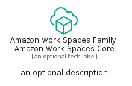

# AmazonWorkSpacesFamilyAmazonWorkSpacesCore


```text
aws-q1-2024/Resource/EndUserComputing/AmazonWorkSpacesFamilyAmazonWorkSpacesCore
```

```text
include('aws-q1-2024/Resource/EndUserComputing/AmazonWorkSpacesFamilyAmazonWorkSpacesCore')
```


| Illustration | AmazonWorkSpacesFamilyAmazonWorkSpacesCore | AmazonWorkSpacesFamilyAmazonWorkSpacesCoreCard | AmazonWorkSpacesFamilyAmazonWorkSpacesCoreGroup |
| :---: | :---: | :---: | :---: |
|  |  |  |  |


## Sprites
The item provides the following sriptes:

- `<$AmazonWorkSpacesFamilyAmazonWorkSpacesCoreXs>`
- `<$AmazonWorkSpacesFamilyAmazonWorkSpacesCoreSm>`
- `<$AmazonWorkSpacesFamilyAmazonWorkSpacesCoreMd>`
- `<$AmazonWorkSpacesFamilyAmazonWorkSpacesCoreLg>`


## AmazonWorkSpacesFamilyAmazonWorkSpacesCore

### Load remotely
```plantuml
@startuml
' configures the library
!global $LIB_BASE_LOCATION="https://raw.githubusercontent.com/tmorin/plantuml-libs/master/distribution"

' loads the library's bootstrap
!include $LIB_BASE_LOCATION/bootstrap.puml

' loads the package bootstrap
include('aws-q1-2024/bootstrap')

' loads the Item which embeds the element AmazonWorkSpacesFamilyAmazonWorkSpacesCore
include('aws-q1-2024/Resource/EndUserComputing/AmazonWorkSpacesFamilyAmazonWorkSpacesCore')

' renders the element
AmazonWorkSpacesFamilyAmazonWorkSpacesCore('AmazonWorkSpacesFamilyAmazonWorkSpacesCore', 'Amazon Work Spaces Family Amazon Work Spaces Core', 'an optional tech label', 'an optional description')
@enduml
```

### Load locally
```plantuml
@startuml
' configures the library
!global $INCLUSION_MODE="local"
!global $LIB_BASE_LOCATION="../../.."

' loads the library's bootstrap
!include $LIB_BASE_LOCATION/bootstrap.puml

' loads the package bootstrap
include('aws-q1-2024/bootstrap')

' loads the Item which embeds the element AmazonWorkSpacesFamilyAmazonWorkSpacesCore
include('aws-q1-2024/Resource/EndUserComputing/AmazonWorkSpacesFamilyAmazonWorkSpacesCore')

' renders the element
AmazonWorkSpacesFamilyAmazonWorkSpacesCore('AmazonWorkSpacesFamilyAmazonWorkSpacesCore', 'Amazon Work Spaces Family Amazon Work Spaces Core', 'an optional tech label', 'an optional description')
@enduml
```

## AmazonWorkSpacesFamilyAmazonWorkSpacesCoreCard

### Load remotely
```plantuml
@startuml
' configures the library
!global $LIB_BASE_LOCATION="https://raw.githubusercontent.com/tmorin/plantuml-libs/master/distribution"

' loads the library's bootstrap
!include $LIB_BASE_LOCATION/bootstrap.puml

' loads the package bootstrap
include('aws-q1-2024/bootstrap')

' loads the Item which embeds the element AmazonWorkSpacesFamilyAmazonWorkSpacesCoreCard
include('aws-q1-2024/Resource/EndUserComputing/AmazonWorkSpacesFamilyAmazonWorkSpacesCore')

' renders the element
AmazonWorkSpacesFamilyAmazonWorkSpacesCoreCard('AmazonWorkSpacesFamilyAmazonWorkSpacesCoreCard', 'Amazon Work Spaces Family Amazon Work Spaces Core Card', 'an optional description')
@enduml
```

### Load locally
```plantuml
@startuml
' configures the library
!global $INCLUSION_MODE="local"
!global $LIB_BASE_LOCATION="../../.."

' loads the library's bootstrap
!include $LIB_BASE_LOCATION/bootstrap.puml

' loads the package bootstrap
include('aws-q1-2024/bootstrap')

' loads the Item which embeds the element AmazonWorkSpacesFamilyAmazonWorkSpacesCoreCard
include('aws-q1-2024/Resource/EndUserComputing/AmazonWorkSpacesFamilyAmazonWorkSpacesCore')

' renders the element
AmazonWorkSpacesFamilyAmazonWorkSpacesCoreCard('AmazonWorkSpacesFamilyAmazonWorkSpacesCoreCard', 'Amazon Work Spaces Family Amazon Work Spaces Core Card', 'an optional description')
@enduml
```

## AmazonWorkSpacesFamilyAmazonWorkSpacesCoreGroup

### Load remotely
```plantuml
@startuml
' configures the library
!global $LIB_BASE_LOCATION="https://raw.githubusercontent.com/tmorin/plantuml-libs/master/distribution"

' loads the library's bootstrap
!include $LIB_BASE_LOCATION/bootstrap.puml

' loads the package bootstrap
include('aws-q1-2024/bootstrap')

' loads the Item which embeds the element AmazonWorkSpacesFamilyAmazonWorkSpacesCoreGroup
include('aws-q1-2024/Resource/EndUserComputing/AmazonWorkSpacesFamilyAmazonWorkSpacesCore')

' renders the element
AmazonWorkSpacesFamilyAmazonWorkSpacesCoreGroup('AmazonWorkSpacesFamilyAmazonWorkSpacesCoreGroup', 'Amazon Work Spaces Family Amazon Work Spaces Core Group', 'an optional tech label') {
    note as note
        the content of the group
    end note
}
@enduml
```

### Load locally
```plantuml
@startuml
' configures the library
!global $INCLUSION_MODE="local"
!global $LIB_BASE_LOCATION="../../.."

' loads the library's bootstrap
!include $LIB_BASE_LOCATION/bootstrap.puml

' loads the package bootstrap
include('aws-q1-2024/bootstrap')

' loads the Item which embeds the element AmazonWorkSpacesFamilyAmazonWorkSpacesCoreGroup
include('aws-q1-2024/Resource/EndUserComputing/AmazonWorkSpacesFamilyAmazonWorkSpacesCore')

' renders the element
AmazonWorkSpacesFamilyAmazonWorkSpacesCoreGroup('AmazonWorkSpacesFamilyAmazonWorkSpacesCoreGroup', 'Amazon Work Spaces Family Amazon Work Spaces Core Group', 'an optional tech label') {
    note as note
        the content of the group
    end note
}
@enduml
```

