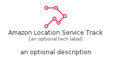

# AmazonLocationServiceTrack


```text
aws-q1-2024/Resource/FrontEndWebMobile/AmazonLocationServiceTrack
```

```text
include('aws-q1-2024/Resource/FrontEndWebMobile/AmazonLocationServiceTrack')
```


| Illustration | AmazonLocationServiceTrack | AmazonLocationServiceTrackCard | AmazonLocationServiceTrackGroup |
| :---: | :---: | :---: | :---: |
|  |  |  |  |


## Sprites
The item provides the following sriptes:

- `<$AmazonLocationServiceTrackXs>`
- `<$AmazonLocationServiceTrackSm>`
- `<$AmazonLocationServiceTrackMd>`
- `<$AmazonLocationServiceTrackLg>`


## AmazonLocationServiceTrack

### Load remotely
```plantuml
@startuml
' configures the library
!global $LIB_BASE_LOCATION="https://raw.githubusercontent.com/tmorin/plantuml-libs/master/distribution"

' loads the library's bootstrap
!include $LIB_BASE_LOCATION/bootstrap.puml

' loads the package bootstrap
include('aws-q1-2024/bootstrap')

' loads the Item which embeds the element AmazonLocationServiceTrack
include('aws-q1-2024/Resource/FrontEndWebMobile/AmazonLocationServiceTrack')

' renders the element
AmazonLocationServiceTrack('AmazonLocationServiceTrack', 'Amazon Location Service Track', 'an optional tech label', 'an optional description')
@enduml
```

### Load locally
```plantuml
@startuml
' configures the library
!global $INCLUSION_MODE="local"
!global $LIB_BASE_LOCATION="../../.."

' loads the library's bootstrap
!include $LIB_BASE_LOCATION/bootstrap.puml

' loads the package bootstrap
include('aws-q1-2024/bootstrap')

' loads the Item which embeds the element AmazonLocationServiceTrack
include('aws-q1-2024/Resource/FrontEndWebMobile/AmazonLocationServiceTrack')

' renders the element
AmazonLocationServiceTrack('AmazonLocationServiceTrack', 'Amazon Location Service Track', 'an optional tech label', 'an optional description')
@enduml
```

## AmazonLocationServiceTrackCard

### Load remotely
```plantuml
@startuml
' configures the library
!global $LIB_BASE_LOCATION="https://raw.githubusercontent.com/tmorin/plantuml-libs/master/distribution"

' loads the library's bootstrap
!include $LIB_BASE_LOCATION/bootstrap.puml

' loads the package bootstrap
include('aws-q1-2024/bootstrap')

' loads the Item which embeds the element AmazonLocationServiceTrackCard
include('aws-q1-2024/Resource/FrontEndWebMobile/AmazonLocationServiceTrack')

' renders the element
AmazonLocationServiceTrackCard('AmazonLocationServiceTrackCard', 'Amazon Location Service Track Card', 'an optional description')
@enduml
```

### Load locally
```plantuml
@startuml
' configures the library
!global $INCLUSION_MODE="local"
!global $LIB_BASE_LOCATION="../../.."

' loads the library's bootstrap
!include $LIB_BASE_LOCATION/bootstrap.puml

' loads the package bootstrap
include('aws-q1-2024/bootstrap')

' loads the Item which embeds the element AmazonLocationServiceTrackCard
include('aws-q1-2024/Resource/FrontEndWebMobile/AmazonLocationServiceTrack')

' renders the element
AmazonLocationServiceTrackCard('AmazonLocationServiceTrackCard', 'Amazon Location Service Track Card', 'an optional description')
@enduml
```

## AmazonLocationServiceTrackGroup

### Load remotely
```plantuml
@startuml
' configures the library
!global $LIB_BASE_LOCATION="https://raw.githubusercontent.com/tmorin/plantuml-libs/master/distribution"

' loads the library's bootstrap
!include $LIB_BASE_LOCATION/bootstrap.puml

' loads the package bootstrap
include('aws-q1-2024/bootstrap')

' loads the Item which embeds the element AmazonLocationServiceTrackGroup
include('aws-q1-2024/Resource/FrontEndWebMobile/AmazonLocationServiceTrack')

' renders the element
AmazonLocationServiceTrackGroup('AmazonLocationServiceTrackGroup', 'Amazon Location Service Track Group', 'an optional tech label') {
    note as note
        the content of the group
    end note
}
@enduml
```

### Load locally
```plantuml
@startuml
' configures the library
!global $INCLUSION_MODE="local"
!global $LIB_BASE_LOCATION="../../.."

' loads the library's bootstrap
!include $LIB_BASE_LOCATION/bootstrap.puml

' loads the package bootstrap
include('aws-q1-2024/bootstrap')

' loads the Item which embeds the element AmazonLocationServiceTrackGroup
include('aws-q1-2024/Resource/FrontEndWebMobile/AmazonLocationServiceTrack')

' renders the element
AmazonLocationServiceTrackGroup('AmazonLocationServiceTrackGroup', 'Amazon Location Service Track Group', 'an optional tech label') {
    note as note
        the content of the group
    end note
}
@enduml
```

