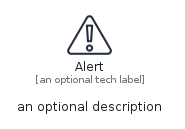
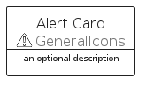
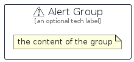

# Alert


```text
aws-q1-2024/Resource/GeneralIcons/Alert
```

```text
include('aws-q1-2024/Resource/GeneralIcons/Alert')
```


| Illustration | Alert | AlertCard | AlertGroup |
| :---: | :---: | :---: | :---: |
|  |  |  |  |


## Sprites
The item provides the following sriptes:

- `<$AlertXs>`
- `<$AlertSm>`
- `<$AlertMd>`
- `<$AlertLg>`


## Alert

### Load remotely
```plantuml
@startuml
' configures the library
!global $LIB_BASE_LOCATION="https://raw.githubusercontent.com/tmorin/plantuml-libs/master/distribution"

' loads the library's bootstrap
!include $LIB_BASE_LOCATION/bootstrap.puml

' loads the package bootstrap
include('aws-q1-2024/bootstrap')

' loads the Item which embeds the element Alert
include('aws-q1-2024/Resource/GeneralIcons/Alert')

' renders the element
Alert('Alert', 'Alert', 'an optional tech label', 'an optional description')
@enduml
```

### Load locally
```plantuml
@startuml
' configures the library
!global $INCLUSION_MODE="local"
!global $LIB_BASE_LOCATION="../../.."

' loads the library's bootstrap
!include $LIB_BASE_LOCATION/bootstrap.puml

' loads the package bootstrap
include('aws-q1-2024/bootstrap')

' loads the Item which embeds the element Alert
include('aws-q1-2024/Resource/GeneralIcons/Alert')

' renders the element
Alert('Alert', 'Alert', 'an optional tech label', 'an optional description')
@enduml
```

## AlertCard

### Load remotely
```plantuml
@startuml
' configures the library
!global $LIB_BASE_LOCATION="https://raw.githubusercontent.com/tmorin/plantuml-libs/master/distribution"

' loads the library's bootstrap
!include $LIB_BASE_LOCATION/bootstrap.puml

' loads the package bootstrap
include('aws-q1-2024/bootstrap')

' loads the Item which embeds the element AlertCard
include('aws-q1-2024/Resource/GeneralIcons/Alert')

' renders the element
AlertCard('AlertCard', 'Alert Card', 'an optional description')
@enduml
```

### Load locally
```plantuml
@startuml
' configures the library
!global $INCLUSION_MODE="local"
!global $LIB_BASE_LOCATION="../../.."

' loads the library's bootstrap
!include $LIB_BASE_LOCATION/bootstrap.puml

' loads the package bootstrap
include('aws-q1-2024/bootstrap')

' loads the Item which embeds the element AlertCard
include('aws-q1-2024/Resource/GeneralIcons/Alert')

' renders the element
AlertCard('AlertCard', 'Alert Card', 'an optional description')
@enduml
```

## AlertGroup

### Load remotely
```plantuml
@startuml
' configures the library
!global $LIB_BASE_LOCATION="https://raw.githubusercontent.com/tmorin/plantuml-libs/master/distribution"

' loads the library's bootstrap
!include $LIB_BASE_LOCATION/bootstrap.puml

' loads the package bootstrap
include('aws-q1-2024/bootstrap')

' loads the Item which embeds the element AlertGroup
include('aws-q1-2024/Resource/GeneralIcons/Alert')

' renders the element
AlertGroup('AlertGroup', 'Alert Group', 'an optional tech label') {
    note as note
        the content of the group
    end note
}
@enduml
```

### Load locally
```plantuml
@startuml
' configures the library
!global $INCLUSION_MODE="local"
!global $LIB_BASE_LOCATION="../../.."

' loads the library's bootstrap
!include $LIB_BASE_LOCATION/bootstrap.puml

' loads the package bootstrap
include('aws-q1-2024/bootstrap')

' loads the Item which embeds the element AlertGroup
include('aws-q1-2024/Resource/GeneralIcons/Alert')

' renders the element
AlertGroup('AlertGroup', 'Alert Group', 'an optional tech label') {
    note as note
        the content of the group
    end note
}
@enduml
```

