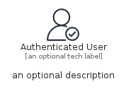

# AuthenticatedUser


```text
aws-q1-2024/Resource/GeneralIcons/AuthenticatedUser
```

```text
include('aws-q1-2024/Resource/GeneralIcons/AuthenticatedUser')
```


| Illustration | AuthenticatedUser | AuthenticatedUserCard | AuthenticatedUserGroup |
| :---: | :---: | :---: | :---: |
|  |  |  |  |


## Sprites
The item provides the following sriptes:

- `<$AuthenticatedUserXs>`
- `<$AuthenticatedUserSm>`
- `<$AuthenticatedUserMd>`
- `<$AuthenticatedUserLg>`


## AuthenticatedUser

### Load remotely
```plantuml
@startuml
' configures the library
!global $LIB_BASE_LOCATION="https://raw.githubusercontent.com/tmorin/plantuml-libs/master/distribution"

' loads the library's bootstrap
!include $LIB_BASE_LOCATION/bootstrap.puml

' loads the package bootstrap
include('aws-q1-2024/bootstrap')

' loads the Item which embeds the element AuthenticatedUser
include('aws-q1-2024/Resource/GeneralIcons/AuthenticatedUser')

' renders the element
AuthenticatedUser('AuthenticatedUser', 'Authenticated User', 'an optional tech label', 'an optional description')
@enduml
```

### Load locally
```plantuml
@startuml
' configures the library
!global $INCLUSION_MODE="local"
!global $LIB_BASE_LOCATION="../../.."

' loads the library's bootstrap
!include $LIB_BASE_LOCATION/bootstrap.puml

' loads the package bootstrap
include('aws-q1-2024/bootstrap')

' loads the Item which embeds the element AuthenticatedUser
include('aws-q1-2024/Resource/GeneralIcons/AuthenticatedUser')

' renders the element
AuthenticatedUser('AuthenticatedUser', 'Authenticated User', 'an optional tech label', 'an optional description')
@enduml
```

## AuthenticatedUserCard

### Load remotely
```plantuml
@startuml
' configures the library
!global $LIB_BASE_LOCATION="https://raw.githubusercontent.com/tmorin/plantuml-libs/master/distribution"

' loads the library's bootstrap
!include $LIB_BASE_LOCATION/bootstrap.puml

' loads the package bootstrap
include('aws-q1-2024/bootstrap')

' loads the Item which embeds the element AuthenticatedUserCard
include('aws-q1-2024/Resource/GeneralIcons/AuthenticatedUser')

' renders the element
AuthenticatedUserCard('AuthenticatedUserCard', 'Authenticated User Card', 'an optional description')
@enduml
```

### Load locally
```plantuml
@startuml
' configures the library
!global $INCLUSION_MODE="local"
!global $LIB_BASE_LOCATION="../../.."

' loads the library's bootstrap
!include $LIB_BASE_LOCATION/bootstrap.puml

' loads the package bootstrap
include('aws-q1-2024/bootstrap')

' loads the Item which embeds the element AuthenticatedUserCard
include('aws-q1-2024/Resource/GeneralIcons/AuthenticatedUser')

' renders the element
AuthenticatedUserCard('AuthenticatedUserCard', 'Authenticated User Card', 'an optional description')
@enduml
```

## AuthenticatedUserGroup

### Load remotely
```plantuml
@startuml
' configures the library
!global $LIB_BASE_LOCATION="https://raw.githubusercontent.com/tmorin/plantuml-libs/master/distribution"

' loads the library's bootstrap
!include $LIB_BASE_LOCATION/bootstrap.puml

' loads the package bootstrap
include('aws-q1-2024/bootstrap')

' loads the Item which embeds the element AuthenticatedUserGroup
include('aws-q1-2024/Resource/GeneralIcons/AuthenticatedUser')

' renders the element
AuthenticatedUserGroup('AuthenticatedUserGroup', 'Authenticated User Group', 'an optional tech label') {
    note as note
        the content of the group
    end note
}
@enduml
```

### Load locally
```plantuml
@startuml
' configures the library
!global $INCLUSION_MODE="local"
!global $LIB_BASE_LOCATION="../../.."

' loads the library's bootstrap
!include $LIB_BASE_LOCATION/bootstrap.puml

' loads the package bootstrap
include('aws-q1-2024/bootstrap')

' loads the Item which embeds the element AuthenticatedUserGroup
include('aws-q1-2024/Resource/GeneralIcons/AuthenticatedUser')

' renders the element
AuthenticatedUserGroup('AuthenticatedUserGroup', 'Authenticated User Group', 'an optional tech label') {
    note as note
        the content of the group
    end note
}
@enduml
```

