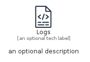
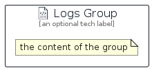

# Logs


```text
aws-q1-2024/Resource/GeneralIcons/Logs
```

```text
include('aws-q1-2024/Resource/GeneralIcons/Logs')
```


| Illustration | Logs | LogsCard | LogsGroup |
| :---: | :---: | :---: | :---: |
|  |  |  |  |


## Sprites
The item provides the following sriptes:

- `<$LogsXs>`
- `<$LogsSm>`
- `<$LogsMd>`
- `<$LogsLg>`


## Logs

### Load remotely
```plantuml
@startuml
' configures the library
!global $LIB_BASE_LOCATION="https://raw.githubusercontent.com/tmorin/plantuml-libs/master/distribution"

' loads the library's bootstrap
!include $LIB_BASE_LOCATION/bootstrap.puml

' loads the package bootstrap
include('aws-q1-2024/bootstrap')

' loads the Item which embeds the element Logs
include('aws-q1-2024/Resource/GeneralIcons/Logs')

' renders the element
Logs('Logs', 'Logs', 'an optional tech label', 'an optional description')
@enduml
```

### Load locally
```plantuml
@startuml
' configures the library
!global $INCLUSION_MODE="local"
!global $LIB_BASE_LOCATION="../../.."

' loads the library's bootstrap
!include $LIB_BASE_LOCATION/bootstrap.puml

' loads the package bootstrap
include('aws-q1-2024/bootstrap')

' loads the Item which embeds the element Logs
include('aws-q1-2024/Resource/GeneralIcons/Logs')

' renders the element
Logs('Logs', 'Logs', 'an optional tech label', 'an optional description')
@enduml
```

## LogsCard

### Load remotely
```plantuml
@startuml
' configures the library
!global $LIB_BASE_LOCATION="https://raw.githubusercontent.com/tmorin/plantuml-libs/master/distribution"

' loads the library's bootstrap
!include $LIB_BASE_LOCATION/bootstrap.puml

' loads the package bootstrap
include('aws-q1-2024/bootstrap')

' loads the Item which embeds the element LogsCard
include('aws-q1-2024/Resource/GeneralIcons/Logs')

' renders the element
LogsCard('LogsCard', 'Logs Card', 'an optional description')
@enduml
```

### Load locally
```plantuml
@startuml
' configures the library
!global $INCLUSION_MODE="local"
!global $LIB_BASE_LOCATION="../../.."

' loads the library's bootstrap
!include $LIB_BASE_LOCATION/bootstrap.puml

' loads the package bootstrap
include('aws-q1-2024/bootstrap')

' loads the Item which embeds the element LogsCard
include('aws-q1-2024/Resource/GeneralIcons/Logs')

' renders the element
LogsCard('LogsCard', 'Logs Card', 'an optional description')
@enduml
```

## LogsGroup

### Load remotely
```plantuml
@startuml
' configures the library
!global $LIB_BASE_LOCATION="https://raw.githubusercontent.com/tmorin/plantuml-libs/master/distribution"

' loads the library's bootstrap
!include $LIB_BASE_LOCATION/bootstrap.puml

' loads the package bootstrap
include('aws-q1-2024/bootstrap')

' loads the Item which embeds the element LogsGroup
include('aws-q1-2024/Resource/GeneralIcons/Logs')

' renders the element
LogsGroup('LogsGroup', 'Logs Group', 'an optional tech label') {
    note as note
        the content of the group
    end note
}
@enduml
```

### Load locally
```plantuml
@startuml
' configures the library
!global $INCLUSION_MODE="local"
!global $LIB_BASE_LOCATION="../../.."

' loads the library's bootstrap
!include $LIB_BASE_LOCATION/bootstrap.puml

' loads the package bootstrap
include('aws-q1-2024/bootstrap')

' loads the Item which embeds the element LogsGroup
include('aws-q1-2024/Resource/GeneralIcons/Logs')

' renders the element
LogsGroup('LogsGroup', 'Logs Group', 'an optional tech label') {
    note as note
        the content of the group
    end note
}
@enduml
```

