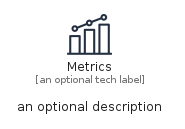
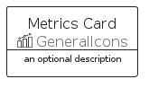
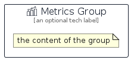

# Metrics


```text
aws-q1-2024/Resource/GeneralIcons/Metrics
```

```text
include('aws-q1-2024/Resource/GeneralIcons/Metrics')
```


| Illustration | Metrics | MetricsCard | MetricsGroup |
| :---: | :---: | :---: | :---: |
|  |  |  |  |


## Sprites
The item provides the following sriptes:

- `<$MetricsXs>`
- `<$MetricsSm>`
- `<$MetricsMd>`
- `<$MetricsLg>`


## Metrics

### Load remotely
```plantuml
@startuml
' configures the library
!global $LIB_BASE_LOCATION="https://raw.githubusercontent.com/tmorin/plantuml-libs/master/distribution"

' loads the library's bootstrap
!include $LIB_BASE_LOCATION/bootstrap.puml

' loads the package bootstrap
include('aws-q1-2024/bootstrap')

' loads the Item which embeds the element Metrics
include('aws-q1-2024/Resource/GeneralIcons/Metrics')

' renders the element
Metrics('Metrics', 'Metrics', 'an optional tech label', 'an optional description')
@enduml
```

### Load locally
```plantuml
@startuml
' configures the library
!global $INCLUSION_MODE="local"
!global $LIB_BASE_LOCATION="../../.."

' loads the library's bootstrap
!include $LIB_BASE_LOCATION/bootstrap.puml

' loads the package bootstrap
include('aws-q1-2024/bootstrap')

' loads the Item which embeds the element Metrics
include('aws-q1-2024/Resource/GeneralIcons/Metrics')

' renders the element
Metrics('Metrics', 'Metrics', 'an optional tech label', 'an optional description')
@enduml
```

## MetricsCard

### Load remotely
```plantuml
@startuml
' configures the library
!global $LIB_BASE_LOCATION="https://raw.githubusercontent.com/tmorin/plantuml-libs/master/distribution"

' loads the library's bootstrap
!include $LIB_BASE_LOCATION/bootstrap.puml

' loads the package bootstrap
include('aws-q1-2024/bootstrap')

' loads the Item which embeds the element MetricsCard
include('aws-q1-2024/Resource/GeneralIcons/Metrics')

' renders the element
MetricsCard('MetricsCard', 'Metrics Card', 'an optional description')
@enduml
```

### Load locally
```plantuml
@startuml
' configures the library
!global $INCLUSION_MODE="local"
!global $LIB_BASE_LOCATION="../../.."

' loads the library's bootstrap
!include $LIB_BASE_LOCATION/bootstrap.puml

' loads the package bootstrap
include('aws-q1-2024/bootstrap')

' loads the Item which embeds the element MetricsCard
include('aws-q1-2024/Resource/GeneralIcons/Metrics')

' renders the element
MetricsCard('MetricsCard', 'Metrics Card', 'an optional description')
@enduml
```

## MetricsGroup

### Load remotely
```plantuml
@startuml
' configures the library
!global $LIB_BASE_LOCATION="https://raw.githubusercontent.com/tmorin/plantuml-libs/master/distribution"

' loads the library's bootstrap
!include $LIB_BASE_LOCATION/bootstrap.puml

' loads the package bootstrap
include('aws-q1-2024/bootstrap')

' loads the Item which embeds the element MetricsGroup
include('aws-q1-2024/Resource/GeneralIcons/Metrics')

' renders the element
MetricsGroup('MetricsGroup', 'Metrics Group', 'an optional tech label') {
    note as note
        the content of the group
    end note
}
@enduml
```

### Load locally
```plantuml
@startuml
' configures the library
!global $INCLUSION_MODE="local"
!global $LIB_BASE_LOCATION="../../.."

' loads the library's bootstrap
!include $LIB_BASE_LOCATION/bootstrap.puml

' loads the package bootstrap
include('aws-q1-2024/bootstrap')

' loads the Item which embeds the element MetricsGroup
include('aws-q1-2024/Resource/GeneralIcons/Metrics')

' renders the element
MetricsGroup('MetricsGroup', 'Metrics Group', 'an optional tech label') {
    note as note
        the content of the group
    end note
}
@enduml
```

