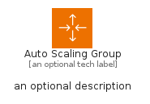
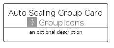
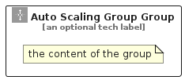

# AutoScalingGroup


```text
aws-q1-2024/Resource/GroupIcons/AutoScalingGroup
```

```text
include('aws-q1-2024/Resource/GroupIcons/AutoScalingGroup')
```


| Illustration | AutoScalingGroup | AutoScalingGroupCard | AutoScalingGroupGroup |
| :---: | :---: | :---: | :---: |
|  |  |  |  |


## Sprites
The item provides the following sriptes:

- `<$AutoScalingGroupXs>`
- `<$AutoScalingGroupSm>`
- `<$AutoScalingGroupMd>`
- `<$AutoScalingGroupLg>`


## AutoScalingGroup

### Load remotely
```plantuml
@startuml
' configures the library
!global $LIB_BASE_LOCATION="https://raw.githubusercontent.com/tmorin/plantuml-libs/master/distribution"

' loads the library's bootstrap
!include $LIB_BASE_LOCATION/bootstrap.puml

' loads the package bootstrap
include('aws-q1-2024/bootstrap')

' loads the Item which embeds the element AutoScalingGroup
include('aws-q1-2024/Resource/GroupIcons/AutoScalingGroup')

' renders the element
AutoScalingGroup('AutoScalingGroup', 'Auto Scaling Group', 'an optional tech label', 'an optional description')
@enduml
```

### Load locally
```plantuml
@startuml
' configures the library
!global $INCLUSION_MODE="local"
!global $LIB_BASE_LOCATION="../../.."

' loads the library's bootstrap
!include $LIB_BASE_LOCATION/bootstrap.puml

' loads the package bootstrap
include('aws-q1-2024/bootstrap')

' loads the Item which embeds the element AutoScalingGroup
include('aws-q1-2024/Resource/GroupIcons/AutoScalingGroup')

' renders the element
AutoScalingGroup('AutoScalingGroup', 'Auto Scaling Group', 'an optional tech label', 'an optional description')
@enduml
```

## AutoScalingGroupCard

### Load remotely
```plantuml
@startuml
' configures the library
!global $LIB_BASE_LOCATION="https://raw.githubusercontent.com/tmorin/plantuml-libs/master/distribution"

' loads the library's bootstrap
!include $LIB_BASE_LOCATION/bootstrap.puml

' loads the package bootstrap
include('aws-q1-2024/bootstrap')

' loads the Item which embeds the element AutoScalingGroupCard
include('aws-q1-2024/Resource/GroupIcons/AutoScalingGroup')

' renders the element
AutoScalingGroupCard('AutoScalingGroupCard', 'Auto Scaling Group Card', 'an optional description')
@enduml
```

### Load locally
```plantuml
@startuml
' configures the library
!global $INCLUSION_MODE="local"
!global $LIB_BASE_LOCATION="../../.."

' loads the library's bootstrap
!include $LIB_BASE_LOCATION/bootstrap.puml

' loads the package bootstrap
include('aws-q1-2024/bootstrap')

' loads the Item which embeds the element AutoScalingGroupCard
include('aws-q1-2024/Resource/GroupIcons/AutoScalingGroup')

' renders the element
AutoScalingGroupCard('AutoScalingGroupCard', 'Auto Scaling Group Card', 'an optional description')
@enduml
```

## AutoScalingGroupGroup

### Load remotely
```plantuml
@startuml
' configures the library
!global $LIB_BASE_LOCATION="https://raw.githubusercontent.com/tmorin/plantuml-libs/master/distribution"

' loads the library's bootstrap
!include $LIB_BASE_LOCATION/bootstrap.puml

' loads the package bootstrap
include('aws-q1-2024/bootstrap')

' loads the Item which embeds the element AutoScalingGroupGroup
include('aws-q1-2024/Resource/GroupIcons/AutoScalingGroup')

' renders the element
AutoScalingGroupGroup('AutoScalingGroupGroup', 'Auto Scaling Group Group', 'an optional tech label') {
    note as note
        the content of the group
    end note
}
@enduml
```

### Load locally
```plantuml
@startuml
' configures the library
!global $INCLUSION_MODE="local"
!global $LIB_BASE_LOCATION="../../.."

' loads the library's bootstrap
!include $LIB_BASE_LOCATION/bootstrap.puml

' loads the package bootstrap
include('aws-q1-2024/bootstrap')

' loads the Item which embeds the element AutoScalingGroupGroup
include('aws-q1-2024/Resource/GroupIcons/AutoScalingGroup')

' renders the element
AutoScalingGroupGroup('AutoScalingGroupGroup', 'Auto Scaling Group Group', 'an optional tech label') {
    note as note
        the content of the group
    end note
}
@enduml
```

