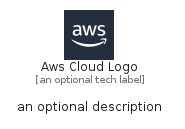

# AwsCloudLogo


```text
aws-q1-2024/Resource/GroupIcons/AwsCloudLogo
```

```text
include('aws-q1-2024/Resource/GroupIcons/AwsCloudLogo')
```


| Illustration | AwsCloudLogo | AwsCloudLogoCard | AwsCloudLogoGroup |
| :---: | :---: | :---: | :---: |
|  |  |  |  |


## Sprites
The item provides the following sriptes:

- `<$AwsCloudLogoXs>`
- `<$AwsCloudLogoSm>`
- `<$AwsCloudLogoMd>`
- `<$AwsCloudLogoLg>`


## AwsCloudLogo

### Load remotely
```plantuml
@startuml
' configures the library
!global $LIB_BASE_LOCATION="https://raw.githubusercontent.com/tmorin/plantuml-libs/master/distribution"

' loads the library's bootstrap
!include $LIB_BASE_LOCATION/bootstrap.puml

' loads the package bootstrap
include('aws-q1-2024/bootstrap')

' loads the Item which embeds the element AwsCloudLogo
include('aws-q1-2024/Resource/GroupIcons/AwsCloudLogo')

' renders the element
AwsCloudLogo('AwsCloudLogo', 'Aws Cloud Logo', 'an optional tech label', 'an optional description')
@enduml
```

### Load locally
```plantuml
@startuml
' configures the library
!global $INCLUSION_MODE="local"
!global $LIB_BASE_LOCATION="../../.."

' loads the library's bootstrap
!include $LIB_BASE_LOCATION/bootstrap.puml

' loads the package bootstrap
include('aws-q1-2024/bootstrap')

' loads the Item which embeds the element AwsCloudLogo
include('aws-q1-2024/Resource/GroupIcons/AwsCloudLogo')

' renders the element
AwsCloudLogo('AwsCloudLogo', 'Aws Cloud Logo', 'an optional tech label', 'an optional description')
@enduml
```

## AwsCloudLogoCard

### Load remotely
```plantuml
@startuml
' configures the library
!global $LIB_BASE_LOCATION="https://raw.githubusercontent.com/tmorin/plantuml-libs/master/distribution"

' loads the library's bootstrap
!include $LIB_BASE_LOCATION/bootstrap.puml

' loads the package bootstrap
include('aws-q1-2024/bootstrap')

' loads the Item which embeds the element AwsCloudLogoCard
include('aws-q1-2024/Resource/GroupIcons/AwsCloudLogo')

' renders the element
AwsCloudLogoCard('AwsCloudLogoCard', 'Aws Cloud Logo Card', 'an optional description')
@enduml
```

### Load locally
```plantuml
@startuml
' configures the library
!global $INCLUSION_MODE="local"
!global $LIB_BASE_LOCATION="../../.."

' loads the library's bootstrap
!include $LIB_BASE_LOCATION/bootstrap.puml

' loads the package bootstrap
include('aws-q1-2024/bootstrap')

' loads the Item which embeds the element AwsCloudLogoCard
include('aws-q1-2024/Resource/GroupIcons/AwsCloudLogo')

' renders the element
AwsCloudLogoCard('AwsCloudLogoCard', 'Aws Cloud Logo Card', 'an optional description')
@enduml
```

## AwsCloudLogoGroup

### Load remotely
```plantuml
@startuml
' configures the library
!global $LIB_BASE_LOCATION="https://raw.githubusercontent.com/tmorin/plantuml-libs/master/distribution"

' loads the library's bootstrap
!include $LIB_BASE_LOCATION/bootstrap.puml

' loads the package bootstrap
include('aws-q1-2024/bootstrap')

' loads the Item which embeds the element AwsCloudLogoGroup
include('aws-q1-2024/Resource/GroupIcons/AwsCloudLogo')

' renders the element
AwsCloudLogoGroup('AwsCloudLogoGroup', 'Aws Cloud Logo Group', 'an optional tech label') {
    note as note
        the content of the group
    end note
}
@enduml
```

### Load locally
```plantuml
@startuml
' configures the library
!global $INCLUSION_MODE="local"
!global $LIB_BASE_LOCATION="../../.."

' loads the library's bootstrap
!include $LIB_BASE_LOCATION/bootstrap.puml

' loads the package bootstrap
include('aws-q1-2024/bootstrap')

' loads the Item which embeds the element AwsCloudLogoGroup
include('aws-q1-2024/Resource/GroupIcons/AwsCloudLogo')

' renders the element
AwsCloudLogoGroup('AwsCloudLogoGroup', 'Aws Cloud Logo Group', 'an optional tech label') {
    note as note
        the content of the group
    end note
}
@enduml
```

