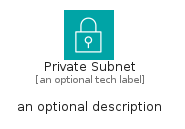

# PrivateSubnet


```text
aws-q1-2024/Resource/GroupIcons/PrivateSubnet
```

```text
include('aws-q1-2024/Resource/GroupIcons/PrivateSubnet')
```


| Illustration | PrivateSubnet | PrivateSubnetCard | PrivateSubnetGroup |
| :---: | :---: | :---: | :---: |
|  |  |  |  |


## Sprites
The item provides the following sriptes:

- `<$PrivateSubnetXs>`
- `<$PrivateSubnetSm>`
- `<$PrivateSubnetMd>`
- `<$PrivateSubnetLg>`


## PrivateSubnet

### Load remotely
```plantuml
@startuml
' configures the library
!global $LIB_BASE_LOCATION="https://raw.githubusercontent.com/tmorin/plantuml-libs/master/distribution"

' loads the library's bootstrap
!include $LIB_BASE_LOCATION/bootstrap.puml

' loads the package bootstrap
include('aws-q1-2024/bootstrap')

' loads the Item which embeds the element PrivateSubnet
include('aws-q1-2024/Resource/GroupIcons/PrivateSubnet')

' renders the element
PrivateSubnet('PrivateSubnet', 'Private Subnet', 'an optional tech label', 'an optional description')
@enduml
```

### Load locally
```plantuml
@startuml
' configures the library
!global $INCLUSION_MODE="local"
!global $LIB_BASE_LOCATION="../../.."

' loads the library's bootstrap
!include $LIB_BASE_LOCATION/bootstrap.puml

' loads the package bootstrap
include('aws-q1-2024/bootstrap')

' loads the Item which embeds the element PrivateSubnet
include('aws-q1-2024/Resource/GroupIcons/PrivateSubnet')

' renders the element
PrivateSubnet('PrivateSubnet', 'Private Subnet', 'an optional tech label', 'an optional description')
@enduml
```

## PrivateSubnetCard

### Load remotely
```plantuml
@startuml
' configures the library
!global $LIB_BASE_LOCATION="https://raw.githubusercontent.com/tmorin/plantuml-libs/master/distribution"

' loads the library's bootstrap
!include $LIB_BASE_LOCATION/bootstrap.puml

' loads the package bootstrap
include('aws-q1-2024/bootstrap')

' loads the Item which embeds the element PrivateSubnetCard
include('aws-q1-2024/Resource/GroupIcons/PrivateSubnet')

' renders the element
PrivateSubnetCard('PrivateSubnetCard', 'Private Subnet Card', 'an optional description')
@enduml
```

### Load locally
```plantuml
@startuml
' configures the library
!global $INCLUSION_MODE="local"
!global $LIB_BASE_LOCATION="../../.."

' loads the library's bootstrap
!include $LIB_BASE_LOCATION/bootstrap.puml

' loads the package bootstrap
include('aws-q1-2024/bootstrap')

' loads the Item which embeds the element PrivateSubnetCard
include('aws-q1-2024/Resource/GroupIcons/PrivateSubnet')

' renders the element
PrivateSubnetCard('PrivateSubnetCard', 'Private Subnet Card', 'an optional description')
@enduml
```

## PrivateSubnetGroup

### Load remotely
```plantuml
@startuml
' configures the library
!global $LIB_BASE_LOCATION="https://raw.githubusercontent.com/tmorin/plantuml-libs/master/distribution"

' loads the library's bootstrap
!include $LIB_BASE_LOCATION/bootstrap.puml

' loads the package bootstrap
include('aws-q1-2024/bootstrap')

' loads the Item which embeds the element PrivateSubnetGroup
include('aws-q1-2024/Resource/GroupIcons/PrivateSubnet')

' renders the element
PrivateSubnetGroup('PrivateSubnetGroup', 'Private Subnet Group', 'an optional tech label') {
    note as note
        the content of the group
    end note
}
@enduml
```

### Load locally
```plantuml
@startuml
' configures the library
!global $INCLUSION_MODE="local"
!global $LIB_BASE_LOCATION="../../.."

' loads the library's bootstrap
!include $LIB_BASE_LOCATION/bootstrap.puml

' loads the package bootstrap
include('aws-q1-2024/bootstrap')

' loads the Item which embeds the element PrivateSubnetGroup
include('aws-q1-2024/Resource/GroupIcons/PrivateSubnet')

' renders the element
PrivateSubnetGroup('PrivateSubnetGroup', 'Private Subnet Group', 'an optional tech label') {
    note as note
        the content of the group
    end note
}
@enduml
```

