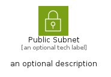
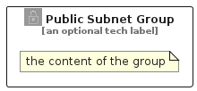

# PublicSubnet


```text
aws-q1-2024/Resource/GroupIcons/PublicSubnet
```

```text
include('aws-q1-2024/Resource/GroupIcons/PublicSubnet')
```


| Illustration | PublicSubnet | PublicSubnetCard | PublicSubnetGroup |
| :---: | :---: | :---: | :---: |
|  |  |  |  |


## Sprites
The item provides the following sriptes:

- `<$PublicSubnetXs>`
- `<$PublicSubnetSm>`
- `<$PublicSubnetMd>`
- `<$PublicSubnetLg>`


## PublicSubnet

### Load remotely
```plantuml
@startuml
' configures the library
!global $LIB_BASE_LOCATION="https://raw.githubusercontent.com/tmorin/plantuml-libs/master/distribution"

' loads the library's bootstrap
!include $LIB_BASE_LOCATION/bootstrap.puml

' loads the package bootstrap
include('aws-q1-2024/bootstrap')

' loads the Item which embeds the element PublicSubnet
include('aws-q1-2024/Resource/GroupIcons/PublicSubnet')

' renders the element
PublicSubnet('PublicSubnet', 'Public Subnet', 'an optional tech label', 'an optional description')
@enduml
```

### Load locally
```plantuml
@startuml
' configures the library
!global $INCLUSION_MODE="local"
!global $LIB_BASE_LOCATION="../../.."

' loads the library's bootstrap
!include $LIB_BASE_LOCATION/bootstrap.puml

' loads the package bootstrap
include('aws-q1-2024/bootstrap')

' loads the Item which embeds the element PublicSubnet
include('aws-q1-2024/Resource/GroupIcons/PublicSubnet')

' renders the element
PublicSubnet('PublicSubnet', 'Public Subnet', 'an optional tech label', 'an optional description')
@enduml
```

## PublicSubnetCard

### Load remotely
```plantuml
@startuml
' configures the library
!global $LIB_BASE_LOCATION="https://raw.githubusercontent.com/tmorin/plantuml-libs/master/distribution"

' loads the library's bootstrap
!include $LIB_BASE_LOCATION/bootstrap.puml

' loads the package bootstrap
include('aws-q1-2024/bootstrap')

' loads the Item which embeds the element PublicSubnetCard
include('aws-q1-2024/Resource/GroupIcons/PublicSubnet')

' renders the element
PublicSubnetCard('PublicSubnetCard', 'Public Subnet Card', 'an optional description')
@enduml
```

### Load locally
```plantuml
@startuml
' configures the library
!global $INCLUSION_MODE="local"
!global $LIB_BASE_LOCATION="../../.."

' loads the library's bootstrap
!include $LIB_BASE_LOCATION/bootstrap.puml

' loads the package bootstrap
include('aws-q1-2024/bootstrap')

' loads the Item which embeds the element PublicSubnetCard
include('aws-q1-2024/Resource/GroupIcons/PublicSubnet')

' renders the element
PublicSubnetCard('PublicSubnetCard', 'Public Subnet Card', 'an optional description')
@enduml
```

## PublicSubnetGroup

### Load remotely
```plantuml
@startuml
' configures the library
!global $LIB_BASE_LOCATION="https://raw.githubusercontent.com/tmorin/plantuml-libs/master/distribution"

' loads the library's bootstrap
!include $LIB_BASE_LOCATION/bootstrap.puml

' loads the package bootstrap
include('aws-q1-2024/bootstrap')

' loads the Item which embeds the element PublicSubnetGroup
include('aws-q1-2024/Resource/GroupIcons/PublicSubnet')

' renders the element
PublicSubnetGroup('PublicSubnetGroup', 'Public Subnet Group', 'an optional tech label') {
    note as note
        the content of the group
    end note
}
@enduml
```

### Load locally
```plantuml
@startuml
' configures the library
!global $INCLUSION_MODE="local"
!global $LIB_BASE_LOCATION="../../.."

' loads the library's bootstrap
!include $LIB_BASE_LOCATION/bootstrap.puml

' loads the package bootstrap
include('aws-q1-2024/bootstrap')

' loads the Item which embeds the element PublicSubnetGroup
include('aws-q1-2024/Resource/GroupIcons/PublicSubnet')

' renders the element
PublicSubnetGroup('PublicSubnetGroup', 'Public Subnet Group', 'an optional tech label') {
    note as note
        the content of the group
    end note
}
@enduml
```

