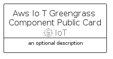

# AwsIoTGreengrassComponentPublic


```text
aws-q1-2024/Resource/IoT/AwsIoTGreengrassComponentPublic
```

```text
include('aws-q1-2024/Resource/IoT/AwsIoTGreengrassComponentPublic')
```


| Illustration | AwsIoTGreengrassComponentPublic | AwsIoTGreengrassComponentPublicCard | AwsIoTGreengrassComponentPublicGroup |
| :---: | :---: | :---: | :---: |
|  |  |  |  |


## Sprites
The item provides the following sriptes:

- `<$AwsIoTGreengrassComponentPublicXs>`
- `<$AwsIoTGreengrassComponentPublicSm>`
- `<$AwsIoTGreengrassComponentPublicMd>`
- `<$AwsIoTGreengrassComponentPublicLg>`


## AwsIoTGreengrassComponentPublic

### Load remotely
```plantuml
@startuml
' configures the library
!global $LIB_BASE_LOCATION="https://raw.githubusercontent.com/tmorin/plantuml-libs/master/distribution"

' loads the library's bootstrap
!include $LIB_BASE_LOCATION/bootstrap.puml

' loads the package bootstrap
include('aws-q1-2024/bootstrap')

' loads the Item which embeds the element AwsIoTGreengrassComponentPublic
include('aws-q1-2024/Resource/IoT/AwsIoTGreengrassComponentPublic')

' renders the element
AwsIoTGreengrassComponentPublic('AwsIoTGreengrassComponentPublic', 'Aws Io T Greengrass Component Public', 'an optional tech label', 'an optional description')
@enduml
```

### Load locally
```plantuml
@startuml
' configures the library
!global $INCLUSION_MODE="local"
!global $LIB_BASE_LOCATION="../../.."

' loads the library's bootstrap
!include $LIB_BASE_LOCATION/bootstrap.puml

' loads the package bootstrap
include('aws-q1-2024/bootstrap')

' loads the Item which embeds the element AwsIoTGreengrassComponentPublic
include('aws-q1-2024/Resource/IoT/AwsIoTGreengrassComponentPublic')

' renders the element
AwsIoTGreengrassComponentPublic('AwsIoTGreengrassComponentPublic', 'Aws Io T Greengrass Component Public', 'an optional tech label', 'an optional description')
@enduml
```

## AwsIoTGreengrassComponentPublicCard

### Load remotely
```plantuml
@startuml
' configures the library
!global $LIB_BASE_LOCATION="https://raw.githubusercontent.com/tmorin/plantuml-libs/master/distribution"

' loads the library's bootstrap
!include $LIB_BASE_LOCATION/bootstrap.puml

' loads the package bootstrap
include('aws-q1-2024/bootstrap')

' loads the Item which embeds the element AwsIoTGreengrassComponentPublicCard
include('aws-q1-2024/Resource/IoT/AwsIoTGreengrassComponentPublic')

' renders the element
AwsIoTGreengrassComponentPublicCard('AwsIoTGreengrassComponentPublicCard', 'Aws Io T Greengrass Component Public Card', 'an optional description')
@enduml
```

### Load locally
```plantuml
@startuml
' configures the library
!global $INCLUSION_MODE="local"
!global $LIB_BASE_LOCATION="../../.."

' loads the library's bootstrap
!include $LIB_BASE_LOCATION/bootstrap.puml

' loads the package bootstrap
include('aws-q1-2024/bootstrap')

' loads the Item which embeds the element AwsIoTGreengrassComponentPublicCard
include('aws-q1-2024/Resource/IoT/AwsIoTGreengrassComponentPublic')

' renders the element
AwsIoTGreengrassComponentPublicCard('AwsIoTGreengrassComponentPublicCard', 'Aws Io T Greengrass Component Public Card', 'an optional description')
@enduml
```

## AwsIoTGreengrassComponentPublicGroup

### Load remotely
```plantuml
@startuml
' configures the library
!global $LIB_BASE_LOCATION="https://raw.githubusercontent.com/tmorin/plantuml-libs/master/distribution"

' loads the library's bootstrap
!include $LIB_BASE_LOCATION/bootstrap.puml

' loads the package bootstrap
include('aws-q1-2024/bootstrap')

' loads the Item which embeds the element AwsIoTGreengrassComponentPublicGroup
include('aws-q1-2024/Resource/IoT/AwsIoTGreengrassComponentPublic')

' renders the element
AwsIoTGreengrassComponentPublicGroup('AwsIoTGreengrassComponentPublicGroup', 'Aws Io T Greengrass Component Public Group', 'an optional tech label') {
    note as note
        the content of the group
    end note
}
@enduml
```

### Load locally
```plantuml
@startuml
' configures the library
!global $INCLUSION_MODE="local"
!global $LIB_BASE_LOCATION="../../.."

' loads the library's bootstrap
!include $LIB_BASE_LOCATION/bootstrap.puml

' loads the package bootstrap
include('aws-q1-2024/bootstrap')

' loads the Item which embeds the element AwsIoTGreengrassComponentPublicGroup
include('aws-q1-2024/Resource/IoT/AwsIoTGreengrassComponentPublic')

' renders the element
AwsIoTGreengrassComponentPublicGroup('AwsIoTGreengrassComponentPublicGroup', 'Aws Io T Greengrass Component Public Group', 'an optional tech label') {
    note as note
        the content of the group
    end note
}
@enduml
```

