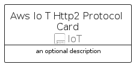

# AwsIoTHttp2Protocol


```text
aws-q1-2024/Resource/IoT/AwsIoTHttp2Protocol
```

```text
include('aws-q1-2024/Resource/IoT/AwsIoTHttp2Protocol')
```


| Illustration | AwsIoTHttp2Protocol | AwsIoTHttp2ProtocolCard | AwsIoTHttp2ProtocolGroup |
| :---: | :---: | :---: | :---: |
|  |  |  |  |


## Sprites
The item provides the following sriptes:

- `<$AwsIoTHttp2ProtocolXs>`
- `<$AwsIoTHttp2ProtocolSm>`
- `<$AwsIoTHttp2ProtocolMd>`
- `<$AwsIoTHttp2ProtocolLg>`


## AwsIoTHttp2Protocol

### Load remotely
```plantuml
@startuml
' configures the library
!global $LIB_BASE_LOCATION="https://raw.githubusercontent.com/tmorin/plantuml-libs/master/distribution"

' loads the library's bootstrap
!include $LIB_BASE_LOCATION/bootstrap.puml

' loads the package bootstrap
include('aws-q1-2024/bootstrap')

' loads the Item which embeds the element AwsIoTHttp2Protocol
include('aws-q1-2024/Resource/IoT/AwsIoTHttp2Protocol')

' renders the element
AwsIoTHttp2Protocol('AwsIoTHttp2Protocol', 'Aws Io T Http2 Protocol', 'an optional tech label', 'an optional description')
@enduml
```

### Load locally
```plantuml
@startuml
' configures the library
!global $INCLUSION_MODE="local"
!global $LIB_BASE_LOCATION="../../.."

' loads the library's bootstrap
!include $LIB_BASE_LOCATION/bootstrap.puml

' loads the package bootstrap
include('aws-q1-2024/bootstrap')

' loads the Item which embeds the element AwsIoTHttp2Protocol
include('aws-q1-2024/Resource/IoT/AwsIoTHttp2Protocol')

' renders the element
AwsIoTHttp2Protocol('AwsIoTHttp2Protocol', 'Aws Io T Http2 Protocol', 'an optional tech label', 'an optional description')
@enduml
```

## AwsIoTHttp2ProtocolCard

### Load remotely
```plantuml
@startuml
' configures the library
!global $LIB_BASE_LOCATION="https://raw.githubusercontent.com/tmorin/plantuml-libs/master/distribution"

' loads the library's bootstrap
!include $LIB_BASE_LOCATION/bootstrap.puml

' loads the package bootstrap
include('aws-q1-2024/bootstrap')

' loads the Item which embeds the element AwsIoTHttp2ProtocolCard
include('aws-q1-2024/Resource/IoT/AwsIoTHttp2Protocol')

' renders the element
AwsIoTHttp2ProtocolCard('AwsIoTHttp2ProtocolCard', 'Aws Io T Http2 Protocol Card', 'an optional description')
@enduml
```

### Load locally
```plantuml
@startuml
' configures the library
!global $INCLUSION_MODE="local"
!global $LIB_BASE_LOCATION="../../.."

' loads the library's bootstrap
!include $LIB_BASE_LOCATION/bootstrap.puml

' loads the package bootstrap
include('aws-q1-2024/bootstrap')

' loads the Item which embeds the element AwsIoTHttp2ProtocolCard
include('aws-q1-2024/Resource/IoT/AwsIoTHttp2Protocol')

' renders the element
AwsIoTHttp2ProtocolCard('AwsIoTHttp2ProtocolCard', 'Aws Io T Http2 Protocol Card', 'an optional description')
@enduml
```

## AwsIoTHttp2ProtocolGroup

### Load remotely
```plantuml
@startuml
' configures the library
!global $LIB_BASE_LOCATION="https://raw.githubusercontent.com/tmorin/plantuml-libs/master/distribution"

' loads the library's bootstrap
!include $LIB_BASE_LOCATION/bootstrap.puml

' loads the package bootstrap
include('aws-q1-2024/bootstrap')

' loads the Item which embeds the element AwsIoTHttp2ProtocolGroup
include('aws-q1-2024/Resource/IoT/AwsIoTHttp2Protocol')

' renders the element
AwsIoTHttp2ProtocolGroup('AwsIoTHttp2ProtocolGroup', 'Aws Io T Http2 Protocol Group', 'an optional tech label') {
    note as note
        the content of the group
    end note
}
@enduml
```

### Load locally
```plantuml
@startuml
' configures the library
!global $INCLUSION_MODE="local"
!global $LIB_BASE_LOCATION="../../.."

' loads the library's bootstrap
!include $LIB_BASE_LOCATION/bootstrap.puml

' loads the package bootstrap
include('aws-q1-2024/bootstrap')

' loads the Item which embeds the element AwsIoTHttp2ProtocolGroup
include('aws-q1-2024/Resource/IoT/AwsIoTHttp2Protocol')

' renders the element
AwsIoTHttp2ProtocolGroup('AwsIoTHttp2ProtocolGroup', 'Aws Io T Http2 Protocol Group', 'an optional tech label') {
    note as note
        the content of the group
    end note
}
@enduml
```

