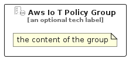

# AwsIoTPolicy


```text
aws-q1-2024/Resource/IoT/AwsIoTPolicy
```

```text
include('aws-q1-2024/Resource/IoT/AwsIoTPolicy')
```


| Illustration | AwsIoTPolicy | AwsIoTPolicyCard | AwsIoTPolicyGroup |
| :---: | :---: | :---: | :---: |
|  |  |  |  |


## Sprites
The item provides the following sriptes:

- `<$AwsIoTPolicyXs>`
- `<$AwsIoTPolicySm>`
- `<$AwsIoTPolicyMd>`
- `<$AwsIoTPolicyLg>`


## AwsIoTPolicy

### Load remotely
```plantuml
@startuml
' configures the library
!global $LIB_BASE_LOCATION="https://raw.githubusercontent.com/tmorin/plantuml-libs/master/distribution"

' loads the library's bootstrap
!include $LIB_BASE_LOCATION/bootstrap.puml

' loads the package bootstrap
include('aws-q1-2024/bootstrap')

' loads the Item which embeds the element AwsIoTPolicy
include('aws-q1-2024/Resource/IoT/AwsIoTPolicy')

' renders the element
AwsIoTPolicy('AwsIoTPolicy', 'Aws Io T Policy', 'an optional tech label', 'an optional description')
@enduml
```

### Load locally
```plantuml
@startuml
' configures the library
!global $INCLUSION_MODE="local"
!global $LIB_BASE_LOCATION="../../.."

' loads the library's bootstrap
!include $LIB_BASE_LOCATION/bootstrap.puml

' loads the package bootstrap
include('aws-q1-2024/bootstrap')

' loads the Item which embeds the element AwsIoTPolicy
include('aws-q1-2024/Resource/IoT/AwsIoTPolicy')

' renders the element
AwsIoTPolicy('AwsIoTPolicy', 'Aws Io T Policy', 'an optional tech label', 'an optional description')
@enduml
```

## AwsIoTPolicyCard

### Load remotely
```plantuml
@startuml
' configures the library
!global $LIB_BASE_LOCATION="https://raw.githubusercontent.com/tmorin/plantuml-libs/master/distribution"

' loads the library's bootstrap
!include $LIB_BASE_LOCATION/bootstrap.puml

' loads the package bootstrap
include('aws-q1-2024/bootstrap')

' loads the Item which embeds the element AwsIoTPolicyCard
include('aws-q1-2024/Resource/IoT/AwsIoTPolicy')

' renders the element
AwsIoTPolicyCard('AwsIoTPolicyCard', 'Aws Io T Policy Card', 'an optional description')
@enduml
```

### Load locally
```plantuml
@startuml
' configures the library
!global $INCLUSION_MODE="local"
!global $LIB_BASE_LOCATION="../../.."

' loads the library's bootstrap
!include $LIB_BASE_LOCATION/bootstrap.puml

' loads the package bootstrap
include('aws-q1-2024/bootstrap')

' loads the Item which embeds the element AwsIoTPolicyCard
include('aws-q1-2024/Resource/IoT/AwsIoTPolicy')

' renders the element
AwsIoTPolicyCard('AwsIoTPolicyCard', 'Aws Io T Policy Card', 'an optional description')
@enduml
```

## AwsIoTPolicyGroup

### Load remotely
```plantuml
@startuml
' configures the library
!global $LIB_BASE_LOCATION="https://raw.githubusercontent.com/tmorin/plantuml-libs/master/distribution"

' loads the library's bootstrap
!include $LIB_BASE_LOCATION/bootstrap.puml

' loads the package bootstrap
include('aws-q1-2024/bootstrap')

' loads the Item which embeds the element AwsIoTPolicyGroup
include('aws-q1-2024/Resource/IoT/AwsIoTPolicy')

' renders the element
AwsIoTPolicyGroup('AwsIoTPolicyGroup', 'Aws Io T Policy Group', 'an optional tech label') {
    note as note
        the content of the group
    end note
}
@enduml
```

### Load locally
```plantuml
@startuml
' configures the library
!global $INCLUSION_MODE="local"
!global $LIB_BASE_LOCATION="../../.."

' loads the library's bootstrap
!include $LIB_BASE_LOCATION/bootstrap.puml

' loads the package bootstrap
include('aws-q1-2024/bootstrap')

' loads the Item which embeds the element AwsIoTPolicyGroup
include('aws-q1-2024/Resource/IoT/AwsIoTPolicy')

' renders the element
AwsIoTPolicyGroup('AwsIoTPolicyGroup', 'Aws Io T Policy Group', 'an optional tech label') {
    note as note
        the content of the group
    end note
}
@enduml
```

