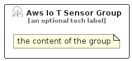

# AwsIoTSensor


```text
aws-q1-2024/Resource/IoT/AwsIoTSensor
```

```text
include('aws-q1-2024/Resource/IoT/AwsIoTSensor')
```


| Illustration | AwsIoTSensor | AwsIoTSensorCard | AwsIoTSensorGroup |
| :---: | :---: | :---: | :---: |
|  |  |  |  |


## Sprites
The item provides the following sriptes:

- `<$AwsIoTSensorXs>`
- `<$AwsIoTSensorSm>`
- `<$AwsIoTSensorMd>`
- `<$AwsIoTSensorLg>`


## AwsIoTSensor

### Load remotely
```plantuml
@startuml
' configures the library
!global $LIB_BASE_LOCATION="https://raw.githubusercontent.com/tmorin/plantuml-libs/master/distribution"

' loads the library's bootstrap
!include $LIB_BASE_LOCATION/bootstrap.puml

' loads the package bootstrap
include('aws-q1-2024/bootstrap')

' loads the Item which embeds the element AwsIoTSensor
include('aws-q1-2024/Resource/IoT/AwsIoTSensor')

' renders the element
AwsIoTSensor('AwsIoTSensor', 'Aws Io T Sensor', 'an optional tech label', 'an optional description')
@enduml
```

### Load locally
```plantuml
@startuml
' configures the library
!global $INCLUSION_MODE="local"
!global $LIB_BASE_LOCATION="../../.."

' loads the library's bootstrap
!include $LIB_BASE_LOCATION/bootstrap.puml

' loads the package bootstrap
include('aws-q1-2024/bootstrap')

' loads the Item which embeds the element AwsIoTSensor
include('aws-q1-2024/Resource/IoT/AwsIoTSensor')

' renders the element
AwsIoTSensor('AwsIoTSensor', 'Aws Io T Sensor', 'an optional tech label', 'an optional description')
@enduml
```

## AwsIoTSensorCard

### Load remotely
```plantuml
@startuml
' configures the library
!global $LIB_BASE_LOCATION="https://raw.githubusercontent.com/tmorin/plantuml-libs/master/distribution"

' loads the library's bootstrap
!include $LIB_BASE_LOCATION/bootstrap.puml

' loads the package bootstrap
include('aws-q1-2024/bootstrap')

' loads the Item which embeds the element AwsIoTSensorCard
include('aws-q1-2024/Resource/IoT/AwsIoTSensor')

' renders the element
AwsIoTSensorCard('AwsIoTSensorCard', 'Aws Io T Sensor Card', 'an optional description')
@enduml
```

### Load locally
```plantuml
@startuml
' configures the library
!global $INCLUSION_MODE="local"
!global $LIB_BASE_LOCATION="../../.."

' loads the library's bootstrap
!include $LIB_BASE_LOCATION/bootstrap.puml

' loads the package bootstrap
include('aws-q1-2024/bootstrap')

' loads the Item which embeds the element AwsIoTSensorCard
include('aws-q1-2024/Resource/IoT/AwsIoTSensor')

' renders the element
AwsIoTSensorCard('AwsIoTSensorCard', 'Aws Io T Sensor Card', 'an optional description')
@enduml
```

## AwsIoTSensorGroup

### Load remotely
```plantuml
@startuml
' configures the library
!global $LIB_BASE_LOCATION="https://raw.githubusercontent.com/tmorin/plantuml-libs/master/distribution"

' loads the library's bootstrap
!include $LIB_BASE_LOCATION/bootstrap.puml

' loads the package bootstrap
include('aws-q1-2024/bootstrap')

' loads the Item which embeds the element AwsIoTSensorGroup
include('aws-q1-2024/Resource/IoT/AwsIoTSensor')

' renders the element
AwsIoTSensorGroup('AwsIoTSensorGroup', 'Aws Io T Sensor Group', 'an optional tech label') {
    note as note
        the content of the group
    end note
}
@enduml
```

### Load locally
```plantuml
@startuml
' configures the library
!global $INCLUSION_MODE="local"
!global $LIB_BASE_LOCATION="../../.."

' loads the library's bootstrap
!include $LIB_BASE_LOCATION/bootstrap.puml

' loads the package bootstrap
include('aws-q1-2024/bootstrap')

' loads the Item which embeds the element AwsIoTSensorGroup
include('aws-q1-2024/Resource/IoT/AwsIoTSensor')

' renders the element
AwsIoTSensorGroup('AwsIoTSensorGroup', 'Aws Io T Sensor Group', 'an optional tech label') {
    note as note
        the content of the group
    end note
}
@enduml
```

