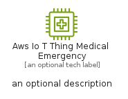
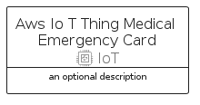

# AwsIoTThingMedicalEmergency


```text
aws-q1-2024/Resource/IoT/AwsIoTThingMedicalEmergency
```

```text
include('aws-q1-2024/Resource/IoT/AwsIoTThingMedicalEmergency')
```


| Illustration | AwsIoTThingMedicalEmergency | AwsIoTThingMedicalEmergencyCard | AwsIoTThingMedicalEmergencyGroup |
| :---: | :---: | :---: | :---: |
|  |  |  |  |


## Sprites
The item provides the following sriptes:

- `<$AwsIoTThingMedicalEmergencyXs>`
- `<$AwsIoTThingMedicalEmergencySm>`
- `<$AwsIoTThingMedicalEmergencyMd>`
- `<$AwsIoTThingMedicalEmergencyLg>`


## AwsIoTThingMedicalEmergency

### Load remotely
```plantuml
@startuml
' configures the library
!global $LIB_BASE_LOCATION="https://raw.githubusercontent.com/tmorin/plantuml-libs/master/distribution"

' loads the library's bootstrap
!include $LIB_BASE_LOCATION/bootstrap.puml

' loads the package bootstrap
include('aws-q1-2024/bootstrap')

' loads the Item which embeds the element AwsIoTThingMedicalEmergency
include('aws-q1-2024/Resource/IoT/AwsIoTThingMedicalEmergency')

' renders the element
AwsIoTThingMedicalEmergency('AwsIoTThingMedicalEmergency', 'Aws Io T Thing Medical Emergency', 'an optional tech label', 'an optional description')
@enduml
```

### Load locally
```plantuml
@startuml
' configures the library
!global $INCLUSION_MODE="local"
!global $LIB_BASE_LOCATION="../../.."

' loads the library's bootstrap
!include $LIB_BASE_LOCATION/bootstrap.puml

' loads the package bootstrap
include('aws-q1-2024/bootstrap')

' loads the Item which embeds the element AwsIoTThingMedicalEmergency
include('aws-q1-2024/Resource/IoT/AwsIoTThingMedicalEmergency')

' renders the element
AwsIoTThingMedicalEmergency('AwsIoTThingMedicalEmergency', 'Aws Io T Thing Medical Emergency', 'an optional tech label', 'an optional description')
@enduml
```

## AwsIoTThingMedicalEmergencyCard

### Load remotely
```plantuml
@startuml
' configures the library
!global $LIB_BASE_LOCATION="https://raw.githubusercontent.com/tmorin/plantuml-libs/master/distribution"

' loads the library's bootstrap
!include $LIB_BASE_LOCATION/bootstrap.puml

' loads the package bootstrap
include('aws-q1-2024/bootstrap')

' loads the Item which embeds the element AwsIoTThingMedicalEmergencyCard
include('aws-q1-2024/Resource/IoT/AwsIoTThingMedicalEmergency')

' renders the element
AwsIoTThingMedicalEmergencyCard('AwsIoTThingMedicalEmergencyCard', 'Aws Io T Thing Medical Emergency Card', 'an optional description')
@enduml
```

### Load locally
```plantuml
@startuml
' configures the library
!global $INCLUSION_MODE="local"
!global $LIB_BASE_LOCATION="../../.."

' loads the library's bootstrap
!include $LIB_BASE_LOCATION/bootstrap.puml

' loads the package bootstrap
include('aws-q1-2024/bootstrap')

' loads the Item which embeds the element AwsIoTThingMedicalEmergencyCard
include('aws-q1-2024/Resource/IoT/AwsIoTThingMedicalEmergency')

' renders the element
AwsIoTThingMedicalEmergencyCard('AwsIoTThingMedicalEmergencyCard', 'Aws Io T Thing Medical Emergency Card', 'an optional description')
@enduml
```

## AwsIoTThingMedicalEmergencyGroup

### Load remotely
```plantuml
@startuml
' configures the library
!global $LIB_BASE_LOCATION="https://raw.githubusercontent.com/tmorin/plantuml-libs/master/distribution"

' loads the library's bootstrap
!include $LIB_BASE_LOCATION/bootstrap.puml

' loads the package bootstrap
include('aws-q1-2024/bootstrap')

' loads the Item which embeds the element AwsIoTThingMedicalEmergencyGroup
include('aws-q1-2024/Resource/IoT/AwsIoTThingMedicalEmergency')

' renders the element
AwsIoTThingMedicalEmergencyGroup('AwsIoTThingMedicalEmergencyGroup', 'Aws Io T Thing Medical Emergency Group', 'an optional tech label') {
    note as note
        the content of the group
    end note
}
@enduml
```

### Load locally
```plantuml
@startuml
' configures the library
!global $INCLUSION_MODE="local"
!global $LIB_BASE_LOCATION="../../.."

' loads the library's bootstrap
!include $LIB_BASE_LOCATION/bootstrap.puml

' loads the package bootstrap
include('aws-q1-2024/bootstrap')

' loads the Item which embeds the element AwsIoTThingMedicalEmergencyGroup
include('aws-q1-2024/Resource/IoT/AwsIoTThingMedicalEmergency')

' renders the element
AwsIoTThingMedicalEmergencyGroup('AwsIoTThingMedicalEmergencyGroup', 'Aws Io T Thing Medical Emergency Group', 'an optional tech label') {
    note as note
        the content of the group
    end note
}
@enduml
```

