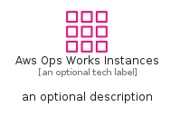
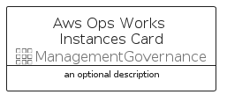

# AwsOpsWorksInstances


```text
aws-q1-2024/Resource/ManagementGovernance/AwsOpsWorksInstances
```

```text
include('aws-q1-2024/Resource/ManagementGovernance/AwsOpsWorksInstances')
```


| Illustration | AwsOpsWorksInstances | AwsOpsWorksInstancesCard | AwsOpsWorksInstancesGroup |
| :---: | :---: | :---: | :---: |
|  |  |  |  |


## Sprites
The item provides the following sriptes:

- `<$AwsOpsWorksInstancesXs>`
- `<$AwsOpsWorksInstancesSm>`
- `<$AwsOpsWorksInstancesMd>`
- `<$AwsOpsWorksInstancesLg>`


## AwsOpsWorksInstances

### Load remotely
```plantuml
@startuml
' configures the library
!global $LIB_BASE_LOCATION="https://raw.githubusercontent.com/tmorin/plantuml-libs/master/distribution"

' loads the library's bootstrap
!include $LIB_BASE_LOCATION/bootstrap.puml

' loads the package bootstrap
include('aws-q1-2024/bootstrap')

' loads the Item which embeds the element AwsOpsWorksInstances
include('aws-q1-2024/Resource/ManagementGovernance/AwsOpsWorksInstances')

' renders the element
AwsOpsWorksInstances('AwsOpsWorksInstances', 'Aws Ops Works Instances', 'an optional tech label', 'an optional description')
@enduml
```

### Load locally
```plantuml
@startuml
' configures the library
!global $INCLUSION_MODE="local"
!global $LIB_BASE_LOCATION="../../.."

' loads the library's bootstrap
!include $LIB_BASE_LOCATION/bootstrap.puml

' loads the package bootstrap
include('aws-q1-2024/bootstrap')

' loads the Item which embeds the element AwsOpsWorksInstances
include('aws-q1-2024/Resource/ManagementGovernance/AwsOpsWorksInstances')

' renders the element
AwsOpsWorksInstances('AwsOpsWorksInstances', 'Aws Ops Works Instances', 'an optional tech label', 'an optional description')
@enduml
```

## AwsOpsWorksInstancesCard

### Load remotely
```plantuml
@startuml
' configures the library
!global $LIB_BASE_LOCATION="https://raw.githubusercontent.com/tmorin/plantuml-libs/master/distribution"

' loads the library's bootstrap
!include $LIB_BASE_LOCATION/bootstrap.puml

' loads the package bootstrap
include('aws-q1-2024/bootstrap')

' loads the Item which embeds the element AwsOpsWorksInstancesCard
include('aws-q1-2024/Resource/ManagementGovernance/AwsOpsWorksInstances')

' renders the element
AwsOpsWorksInstancesCard('AwsOpsWorksInstancesCard', 'Aws Ops Works Instances Card', 'an optional description')
@enduml
```

### Load locally
```plantuml
@startuml
' configures the library
!global $INCLUSION_MODE="local"
!global $LIB_BASE_LOCATION="../../.."

' loads the library's bootstrap
!include $LIB_BASE_LOCATION/bootstrap.puml

' loads the package bootstrap
include('aws-q1-2024/bootstrap')

' loads the Item which embeds the element AwsOpsWorksInstancesCard
include('aws-q1-2024/Resource/ManagementGovernance/AwsOpsWorksInstances')

' renders the element
AwsOpsWorksInstancesCard('AwsOpsWorksInstancesCard', 'Aws Ops Works Instances Card', 'an optional description')
@enduml
```

## AwsOpsWorksInstancesGroup

### Load remotely
```plantuml
@startuml
' configures the library
!global $LIB_BASE_LOCATION="https://raw.githubusercontent.com/tmorin/plantuml-libs/master/distribution"

' loads the library's bootstrap
!include $LIB_BASE_LOCATION/bootstrap.puml

' loads the package bootstrap
include('aws-q1-2024/bootstrap')

' loads the Item which embeds the element AwsOpsWorksInstancesGroup
include('aws-q1-2024/Resource/ManagementGovernance/AwsOpsWorksInstances')

' renders the element
AwsOpsWorksInstancesGroup('AwsOpsWorksInstancesGroup', 'Aws Ops Works Instances Group', 'an optional tech label') {
    note as note
        the content of the group
    end note
}
@enduml
```

### Load locally
```plantuml
@startuml
' configures the library
!global $INCLUSION_MODE="local"
!global $LIB_BASE_LOCATION="../../.."

' loads the library's bootstrap
!include $LIB_BASE_LOCATION/bootstrap.puml

' loads the package bootstrap
include('aws-q1-2024/bootstrap')

' loads the Item which embeds the element AwsOpsWorksInstancesGroup
include('aws-q1-2024/Resource/ManagementGovernance/AwsOpsWorksInstances')

' renders the element
AwsOpsWorksInstancesGroup('AwsOpsWorksInstancesGroup', 'Aws Ops Works Instances Group', 'an optional tech label') {
    note as note
        the content of the group
    end note
}
@enduml
```

