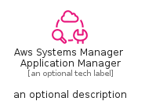
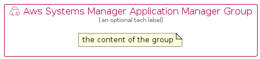

# AwsSystemsManagerApplicationManager


```text
aws-q1-2024/Resource/ManagementGovernance/AwsSystemsManagerApplicationManager
```

```text
include('aws-q1-2024/Resource/ManagementGovernance/AwsSystemsManagerApplicationManager')
```


| Illustration | AwsSystemsManagerApplicationManager | AwsSystemsManagerApplicationManagerCard | AwsSystemsManagerApplicationManagerGroup |
| :---: | :---: | :---: | :---: |
|  |  |  |  |


## Sprites
The item provides the following sriptes:

- `<$AwsSystemsManagerApplicationManagerXs>`
- `<$AwsSystemsManagerApplicationManagerSm>`
- `<$AwsSystemsManagerApplicationManagerMd>`
- `<$AwsSystemsManagerApplicationManagerLg>`


## AwsSystemsManagerApplicationManager

### Load remotely
```plantuml
@startuml
' configures the library
!global $LIB_BASE_LOCATION="https://raw.githubusercontent.com/tmorin/plantuml-libs/master/distribution"

' loads the library's bootstrap
!include $LIB_BASE_LOCATION/bootstrap.puml

' loads the package bootstrap
include('aws-q1-2024/bootstrap')

' loads the Item which embeds the element AwsSystemsManagerApplicationManager
include('aws-q1-2024/Resource/ManagementGovernance/AwsSystemsManagerApplicationManager')

' renders the element
AwsSystemsManagerApplicationManager('AwsSystemsManagerApplicationManager', 'Aws Systems Manager Application Manager', 'an optional tech label', 'an optional description')
@enduml
```

### Load locally
```plantuml
@startuml
' configures the library
!global $INCLUSION_MODE="local"
!global $LIB_BASE_LOCATION="../../.."

' loads the library's bootstrap
!include $LIB_BASE_LOCATION/bootstrap.puml

' loads the package bootstrap
include('aws-q1-2024/bootstrap')

' loads the Item which embeds the element AwsSystemsManagerApplicationManager
include('aws-q1-2024/Resource/ManagementGovernance/AwsSystemsManagerApplicationManager')

' renders the element
AwsSystemsManagerApplicationManager('AwsSystemsManagerApplicationManager', 'Aws Systems Manager Application Manager', 'an optional tech label', 'an optional description')
@enduml
```

## AwsSystemsManagerApplicationManagerCard

### Load remotely
```plantuml
@startuml
' configures the library
!global $LIB_BASE_LOCATION="https://raw.githubusercontent.com/tmorin/plantuml-libs/master/distribution"

' loads the library's bootstrap
!include $LIB_BASE_LOCATION/bootstrap.puml

' loads the package bootstrap
include('aws-q1-2024/bootstrap')

' loads the Item which embeds the element AwsSystemsManagerApplicationManagerCard
include('aws-q1-2024/Resource/ManagementGovernance/AwsSystemsManagerApplicationManager')

' renders the element
AwsSystemsManagerApplicationManagerCard('AwsSystemsManagerApplicationManagerCard', 'Aws Systems Manager Application Manager Card', 'an optional description')
@enduml
```

### Load locally
```plantuml
@startuml
' configures the library
!global $INCLUSION_MODE="local"
!global $LIB_BASE_LOCATION="../../.."

' loads the library's bootstrap
!include $LIB_BASE_LOCATION/bootstrap.puml

' loads the package bootstrap
include('aws-q1-2024/bootstrap')

' loads the Item which embeds the element AwsSystemsManagerApplicationManagerCard
include('aws-q1-2024/Resource/ManagementGovernance/AwsSystemsManagerApplicationManager')

' renders the element
AwsSystemsManagerApplicationManagerCard('AwsSystemsManagerApplicationManagerCard', 'Aws Systems Manager Application Manager Card', 'an optional description')
@enduml
```

## AwsSystemsManagerApplicationManagerGroup

### Load remotely
```plantuml
@startuml
' configures the library
!global $LIB_BASE_LOCATION="https://raw.githubusercontent.com/tmorin/plantuml-libs/master/distribution"

' loads the library's bootstrap
!include $LIB_BASE_LOCATION/bootstrap.puml

' loads the package bootstrap
include('aws-q1-2024/bootstrap')

' loads the Item which embeds the element AwsSystemsManagerApplicationManagerGroup
include('aws-q1-2024/Resource/ManagementGovernance/AwsSystemsManagerApplicationManager')

' renders the element
AwsSystemsManagerApplicationManagerGroup('AwsSystemsManagerApplicationManagerGroup', 'Aws Systems Manager Application Manager Group', 'an optional tech label') {
    note as note
        the content of the group
    end note
}
@enduml
```

### Load locally
```plantuml
@startuml
' configures the library
!global $INCLUSION_MODE="local"
!global $LIB_BASE_LOCATION="../../.."

' loads the library's bootstrap
!include $LIB_BASE_LOCATION/bootstrap.puml

' loads the package bootstrap
include('aws-q1-2024/bootstrap')

' loads the Item which embeds the element AwsSystemsManagerApplicationManagerGroup
include('aws-q1-2024/Resource/ManagementGovernance/AwsSystemsManagerApplicationManager')

' renders the element
AwsSystemsManagerApplicationManagerGroup('AwsSystemsManagerApplicationManagerGroup', 'Aws Systems Manager Application Manager Group', 'an optional tech label') {
    note as note
        the content of the group
    end note
}
@enduml
```

