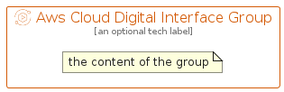

# AwsCloudDigitalInterface


```text
aws-q1-2024/Resource/MediaServices/AwsCloudDigitalInterface
```

```text
include('aws-q1-2024/Resource/MediaServices/AwsCloudDigitalInterface')
```


| Illustration | AwsCloudDigitalInterface | AwsCloudDigitalInterfaceCard | AwsCloudDigitalInterfaceGroup |
| :---: | :---: | :---: | :---: |
|  |  |  |  |


## Sprites
The item provides the following sriptes:

- `<$AwsCloudDigitalInterfaceXs>`
- `<$AwsCloudDigitalInterfaceSm>`
- `<$AwsCloudDigitalInterfaceMd>`
- `<$AwsCloudDigitalInterfaceLg>`


## AwsCloudDigitalInterface

### Load remotely
```plantuml
@startuml
' configures the library
!global $LIB_BASE_LOCATION="https://raw.githubusercontent.com/tmorin/plantuml-libs/master/distribution"

' loads the library's bootstrap
!include $LIB_BASE_LOCATION/bootstrap.puml

' loads the package bootstrap
include('aws-q1-2024/bootstrap')

' loads the Item which embeds the element AwsCloudDigitalInterface
include('aws-q1-2024/Resource/MediaServices/AwsCloudDigitalInterface')

' renders the element
AwsCloudDigitalInterface('AwsCloudDigitalInterface', 'Aws Cloud Digital Interface', 'an optional tech label', 'an optional description')
@enduml
```

### Load locally
```plantuml
@startuml
' configures the library
!global $INCLUSION_MODE="local"
!global $LIB_BASE_LOCATION="../../.."

' loads the library's bootstrap
!include $LIB_BASE_LOCATION/bootstrap.puml

' loads the package bootstrap
include('aws-q1-2024/bootstrap')

' loads the Item which embeds the element AwsCloudDigitalInterface
include('aws-q1-2024/Resource/MediaServices/AwsCloudDigitalInterface')

' renders the element
AwsCloudDigitalInterface('AwsCloudDigitalInterface', 'Aws Cloud Digital Interface', 'an optional tech label', 'an optional description')
@enduml
```

## AwsCloudDigitalInterfaceCard

### Load remotely
```plantuml
@startuml
' configures the library
!global $LIB_BASE_LOCATION="https://raw.githubusercontent.com/tmorin/plantuml-libs/master/distribution"

' loads the library's bootstrap
!include $LIB_BASE_LOCATION/bootstrap.puml

' loads the package bootstrap
include('aws-q1-2024/bootstrap')

' loads the Item which embeds the element AwsCloudDigitalInterfaceCard
include('aws-q1-2024/Resource/MediaServices/AwsCloudDigitalInterface')

' renders the element
AwsCloudDigitalInterfaceCard('AwsCloudDigitalInterfaceCard', 'Aws Cloud Digital Interface Card', 'an optional description')
@enduml
```

### Load locally
```plantuml
@startuml
' configures the library
!global $INCLUSION_MODE="local"
!global $LIB_BASE_LOCATION="../../.."

' loads the library's bootstrap
!include $LIB_BASE_LOCATION/bootstrap.puml

' loads the package bootstrap
include('aws-q1-2024/bootstrap')

' loads the Item which embeds the element AwsCloudDigitalInterfaceCard
include('aws-q1-2024/Resource/MediaServices/AwsCloudDigitalInterface')

' renders the element
AwsCloudDigitalInterfaceCard('AwsCloudDigitalInterfaceCard', 'Aws Cloud Digital Interface Card', 'an optional description')
@enduml
```

## AwsCloudDigitalInterfaceGroup

### Load remotely
```plantuml
@startuml
' configures the library
!global $LIB_BASE_LOCATION="https://raw.githubusercontent.com/tmorin/plantuml-libs/master/distribution"

' loads the library's bootstrap
!include $LIB_BASE_LOCATION/bootstrap.puml

' loads the package bootstrap
include('aws-q1-2024/bootstrap')

' loads the Item which embeds the element AwsCloudDigitalInterfaceGroup
include('aws-q1-2024/Resource/MediaServices/AwsCloudDigitalInterface')

' renders the element
AwsCloudDigitalInterfaceGroup('AwsCloudDigitalInterfaceGroup', 'Aws Cloud Digital Interface Group', 'an optional tech label') {
    note as note
        the content of the group
    end note
}
@enduml
```

### Load locally
```plantuml
@startuml
' configures the library
!global $INCLUSION_MODE="local"
!global $LIB_BASE_LOCATION="../../.."

' loads the library's bootstrap
!include $LIB_BASE_LOCATION/bootstrap.puml

' loads the package bootstrap
include('aws-q1-2024/bootstrap')

' loads the Item which embeds the element AwsCloudDigitalInterfaceGroup
include('aws-q1-2024/Resource/MediaServices/AwsCloudDigitalInterface')

' renders the element
AwsCloudDigitalInterfaceGroup('AwsCloudDigitalInterfaceGroup', 'Aws Cloud Digital Interface Group', 'an optional tech label') {
    note as note
        the content of the group
    end note
}
@enduml
```

