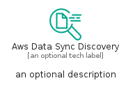

# AwsDataSyncDiscovery


```text
aws-q1-2024/Resource/MigrationTransfer/AwsDataSyncDiscovery
```

```text
include('aws-q1-2024/Resource/MigrationTransfer/AwsDataSyncDiscovery')
```


| Illustration | AwsDataSyncDiscovery | AwsDataSyncDiscoveryCard | AwsDataSyncDiscoveryGroup |
| :---: | :---: | :---: | :---: |
|  |  |  |  |


## Sprites
The item provides the following sriptes:

- `<$AwsDataSyncDiscoveryXs>`
- `<$AwsDataSyncDiscoverySm>`
- `<$AwsDataSyncDiscoveryMd>`
- `<$AwsDataSyncDiscoveryLg>`


## AwsDataSyncDiscovery

### Load remotely
```plantuml
@startuml
' configures the library
!global $LIB_BASE_LOCATION="https://raw.githubusercontent.com/tmorin/plantuml-libs/master/distribution"

' loads the library's bootstrap
!include $LIB_BASE_LOCATION/bootstrap.puml

' loads the package bootstrap
include('aws-q1-2024/bootstrap')

' loads the Item which embeds the element AwsDataSyncDiscovery
include('aws-q1-2024/Resource/MigrationTransfer/AwsDataSyncDiscovery')

' renders the element
AwsDataSyncDiscovery('AwsDataSyncDiscovery', 'Aws Data Sync Discovery', 'an optional tech label', 'an optional description')
@enduml
```

### Load locally
```plantuml
@startuml
' configures the library
!global $INCLUSION_MODE="local"
!global $LIB_BASE_LOCATION="../../.."

' loads the library's bootstrap
!include $LIB_BASE_LOCATION/bootstrap.puml

' loads the package bootstrap
include('aws-q1-2024/bootstrap')

' loads the Item which embeds the element AwsDataSyncDiscovery
include('aws-q1-2024/Resource/MigrationTransfer/AwsDataSyncDiscovery')

' renders the element
AwsDataSyncDiscovery('AwsDataSyncDiscovery', 'Aws Data Sync Discovery', 'an optional tech label', 'an optional description')
@enduml
```

## AwsDataSyncDiscoveryCard

### Load remotely
```plantuml
@startuml
' configures the library
!global $LIB_BASE_LOCATION="https://raw.githubusercontent.com/tmorin/plantuml-libs/master/distribution"

' loads the library's bootstrap
!include $LIB_BASE_LOCATION/bootstrap.puml

' loads the package bootstrap
include('aws-q1-2024/bootstrap')

' loads the Item which embeds the element AwsDataSyncDiscoveryCard
include('aws-q1-2024/Resource/MigrationTransfer/AwsDataSyncDiscovery')

' renders the element
AwsDataSyncDiscoveryCard('AwsDataSyncDiscoveryCard', 'Aws Data Sync Discovery Card', 'an optional description')
@enduml
```

### Load locally
```plantuml
@startuml
' configures the library
!global $INCLUSION_MODE="local"
!global $LIB_BASE_LOCATION="../../.."

' loads the library's bootstrap
!include $LIB_BASE_LOCATION/bootstrap.puml

' loads the package bootstrap
include('aws-q1-2024/bootstrap')

' loads the Item which embeds the element AwsDataSyncDiscoveryCard
include('aws-q1-2024/Resource/MigrationTransfer/AwsDataSyncDiscovery')

' renders the element
AwsDataSyncDiscoveryCard('AwsDataSyncDiscoveryCard', 'Aws Data Sync Discovery Card', 'an optional description')
@enduml
```

## AwsDataSyncDiscoveryGroup

### Load remotely
```plantuml
@startuml
' configures the library
!global $LIB_BASE_LOCATION="https://raw.githubusercontent.com/tmorin/plantuml-libs/master/distribution"

' loads the library's bootstrap
!include $LIB_BASE_LOCATION/bootstrap.puml

' loads the package bootstrap
include('aws-q1-2024/bootstrap')

' loads the Item which embeds the element AwsDataSyncDiscoveryGroup
include('aws-q1-2024/Resource/MigrationTransfer/AwsDataSyncDiscovery')

' renders the element
AwsDataSyncDiscoveryGroup('AwsDataSyncDiscoveryGroup', 'Aws Data Sync Discovery Group', 'an optional tech label') {
    note as note
        the content of the group
    end note
}
@enduml
```

### Load locally
```plantuml
@startuml
' configures the library
!global $INCLUSION_MODE="local"
!global $LIB_BASE_LOCATION="../../.."

' loads the library's bootstrap
!include $LIB_BASE_LOCATION/bootstrap.puml

' loads the package bootstrap
include('aws-q1-2024/bootstrap')

' loads the Item which embeds the element AwsDataSyncDiscoveryGroup
include('aws-q1-2024/Resource/MigrationTransfer/AwsDataSyncDiscovery')

' renders the element
AwsDataSyncDiscoveryGroup('AwsDataSyncDiscoveryGroup', 'Aws Data Sync Discovery Group', 'an optional tech label') {
    note as note
        the content of the group
    end note
}
@enduml
```

