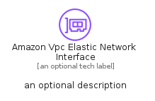

# AmazonVpcElasticNetworkInterface


```text
aws-q1-2024/Resource/NetworkingContentDelivery/AmazonVpcElasticNetworkInterface
```

```text
include('aws-q1-2024/Resource/NetworkingContentDelivery/AmazonVpcElasticNetworkInterface')
```


| Illustration | AmazonVpcElasticNetworkInterface | AmazonVpcElasticNetworkInterfaceCard | AmazonVpcElasticNetworkInterfaceGroup |
| :---: | :---: | :---: | :---: |
|  |  |  |  |


## Sprites
The item provides the following sriptes:

- `<$AmazonVpcElasticNetworkInterfaceXs>`
- `<$AmazonVpcElasticNetworkInterfaceSm>`
- `<$AmazonVpcElasticNetworkInterfaceMd>`
- `<$AmazonVpcElasticNetworkInterfaceLg>`


## AmazonVpcElasticNetworkInterface

### Load remotely
```plantuml
@startuml
' configures the library
!global $LIB_BASE_LOCATION="https://raw.githubusercontent.com/tmorin/plantuml-libs/master/distribution"

' loads the library's bootstrap
!include $LIB_BASE_LOCATION/bootstrap.puml

' loads the package bootstrap
include('aws-q1-2024/bootstrap')

' loads the Item which embeds the element AmazonVpcElasticNetworkInterface
include('aws-q1-2024/Resource/NetworkingContentDelivery/AmazonVpcElasticNetworkInterface')

' renders the element
AmazonVpcElasticNetworkInterface('AmazonVpcElasticNetworkInterface', 'Amazon Vpc Elastic Network Interface', 'an optional tech label', 'an optional description')
@enduml
```

### Load locally
```plantuml
@startuml
' configures the library
!global $INCLUSION_MODE="local"
!global $LIB_BASE_LOCATION="../../.."

' loads the library's bootstrap
!include $LIB_BASE_LOCATION/bootstrap.puml

' loads the package bootstrap
include('aws-q1-2024/bootstrap')

' loads the Item which embeds the element AmazonVpcElasticNetworkInterface
include('aws-q1-2024/Resource/NetworkingContentDelivery/AmazonVpcElasticNetworkInterface')

' renders the element
AmazonVpcElasticNetworkInterface('AmazonVpcElasticNetworkInterface', 'Amazon Vpc Elastic Network Interface', 'an optional tech label', 'an optional description')
@enduml
```

## AmazonVpcElasticNetworkInterfaceCard

### Load remotely
```plantuml
@startuml
' configures the library
!global $LIB_BASE_LOCATION="https://raw.githubusercontent.com/tmorin/plantuml-libs/master/distribution"

' loads the library's bootstrap
!include $LIB_BASE_LOCATION/bootstrap.puml

' loads the package bootstrap
include('aws-q1-2024/bootstrap')

' loads the Item which embeds the element AmazonVpcElasticNetworkInterfaceCard
include('aws-q1-2024/Resource/NetworkingContentDelivery/AmazonVpcElasticNetworkInterface')

' renders the element
AmazonVpcElasticNetworkInterfaceCard('AmazonVpcElasticNetworkInterfaceCard', 'Amazon Vpc Elastic Network Interface Card', 'an optional description')
@enduml
```

### Load locally
```plantuml
@startuml
' configures the library
!global $INCLUSION_MODE="local"
!global $LIB_BASE_LOCATION="../../.."

' loads the library's bootstrap
!include $LIB_BASE_LOCATION/bootstrap.puml

' loads the package bootstrap
include('aws-q1-2024/bootstrap')

' loads the Item which embeds the element AmazonVpcElasticNetworkInterfaceCard
include('aws-q1-2024/Resource/NetworkingContentDelivery/AmazonVpcElasticNetworkInterface')

' renders the element
AmazonVpcElasticNetworkInterfaceCard('AmazonVpcElasticNetworkInterfaceCard', 'Amazon Vpc Elastic Network Interface Card', 'an optional description')
@enduml
```

## AmazonVpcElasticNetworkInterfaceGroup

### Load remotely
```plantuml
@startuml
' configures the library
!global $LIB_BASE_LOCATION="https://raw.githubusercontent.com/tmorin/plantuml-libs/master/distribution"

' loads the library's bootstrap
!include $LIB_BASE_LOCATION/bootstrap.puml

' loads the package bootstrap
include('aws-q1-2024/bootstrap')

' loads the Item which embeds the element AmazonVpcElasticNetworkInterfaceGroup
include('aws-q1-2024/Resource/NetworkingContentDelivery/AmazonVpcElasticNetworkInterface')

' renders the element
AmazonVpcElasticNetworkInterfaceGroup('AmazonVpcElasticNetworkInterfaceGroup', 'Amazon Vpc Elastic Network Interface Group', 'an optional tech label') {
    note as note
        the content of the group
    end note
}
@enduml
```

### Load locally
```plantuml
@startuml
' configures the library
!global $INCLUSION_MODE="local"
!global $LIB_BASE_LOCATION="../../.."

' loads the library's bootstrap
!include $LIB_BASE_LOCATION/bootstrap.puml

' loads the package bootstrap
include('aws-q1-2024/bootstrap')

' loads the Item which embeds the element AmazonVpcElasticNetworkInterfaceGroup
include('aws-q1-2024/Resource/NetworkingContentDelivery/AmazonVpcElasticNetworkInterface')

' renders the element
AmazonVpcElasticNetworkInterfaceGroup('AmazonVpcElasticNetworkInterfaceGroup', 'Amazon Vpc Elastic Network Interface Group', 'an optional tech label') {
    note as note
        the content of the group
    end note
}
@enduml
```

