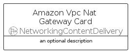
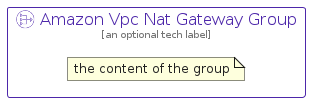

# AmazonVpcNatGateway


```text
aws-q1-2024/Resource/NetworkingContentDelivery/AmazonVpcNatGateway
```

```text
include('aws-q1-2024/Resource/NetworkingContentDelivery/AmazonVpcNatGateway')
```


| Illustration | AmazonVpcNatGateway | AmazonVpcNatGatewayCard | AmazonVpcNatGatewayGroup |
| :---: | :---: | :---: | :---: |
|  |  |  |  |


## Sprites
The item provides the following sriptes:

- `<$AmazonVpcNatGatewayXs>`
- `<$AmazonVpcNatGatewaySm>`
- `<$AmazonVpcNatGatewayMd>`
- `<$AmazonVpcNatGatewayLg>`


## AmazonVpcNatGateway

### Load remotely
```plantuml
@startuml
' configures the library
!global $LIB_BASE_LOCATION="https://raw.githubusercontent.com/tmorin/plantuml-libs/master/distribution"

' loads the library's bootstrap
!include $LIB_BASE_LOCATION/bootstrap.puml

' loads the package bootstrap
include('aws-q1-2024/bootstrap')

' loads the Item which embeds the element AmazonVpcNatGateway
include('aws-q1-2024/Resource/NetworkingContentDelivery/AmazonVpcNatGateway')

' renders the element
AmazonVpcNatGateway('AmazonVpcNatGateway', 'Amazon Vpc Nat Gateway', 'an optional tech label', 'an optional description')
@enduml
```

### Load locally
```plantuml
@startuml
' configures the library
!global $INCLUSION_MODE="local"
!global $LIB_BASE_LOCATION="../../.."

' loads the library's bootstrap
!include $LIB_BASE_LOCATION/bootstrap.puml

' loads the package bootstrap
include('aws-q1-2024/bootstrap')

' loads the Item which embeds the element AmazonVpcNatGateway
include('aws-q1-2024/Resource/NetworkingContentDelivery/AmazonVpcNatGateway')

' renders the element
AmazonVpcNatGateway('AmazonVpcNatGateway', 'Amazon Vpc Nat Gateway', 'an optional tech label', 'an optional description')
@enduml
```

## AmazonVpcNatGatewayCard

### Load remotely
```plantuml
@startuml
' configures the library
!global $LIB_BASE_LOCATION="https://raw.githubusercontent.com/tmorin/plantuml-libs/master/distribution"

' loads the library's bootstrap
!include $LIB_BASE_LOCATION/bootstrap.puml

' loads the package bootstrap
include('aws-q1-2024/bootstrap')

' loads the Item which embeds the element AmazonVpcNatGatewayCard
include('aws-q1-2024/Resource/NetworkingContentDelivery/AmazonVpcNatGateway')

' renders the element
AmazonVpcNatGatewayCard('AmazonVpcNatGatewayCard', 'Amazon Vpc Nat Gateway Card', 'an optional description')
@enduml
```

### Load locally
```plantuml
@startuml
' configures the library
!global $INCLUSION_MODE="local"
!global $LIB_BASE_LOCATION="../../.."

' loads the library's bootstrap
!include $LIB_BASE_LOCATION/bootstrap.puml

' loads the package bootstrap
include('aws-q1-2024/bootstrap')

' loads the Item which embeds the element AmazonVpcNatGatewayCard
include('aws-q1-2024/Resource/NetworkingContentDelivery/AmazonVpcNatGateway')

' renders the element
AmazonVpcNatGatewayCard('AmazonVpcNatGatewayCard', 'Amazon Vpc Nat Gateway Card', 'an optional description')
@enduml
```

## AmazonVpcNatGatewayGroup

### Load remotely
```plantuml
@startuml
' configures the library
!global $LIB_BASE_LOCATION="https://raw.githubusercontent.com/tmorin/plantuml-libs/master/distribution"

' loads the library's bootstrap
!include $LIB_BASE_LOCATION/bootstrap.puml

' loads the package bootstrap
include('aws-q1-2024/bootstrap')

' loads the Item which embeds the element AmazonVpcNatGatewayGroup
include('aws-q1-2024/Resource/NetworkingContentDelivery/AmazonVpcNatGateway')

' renders the element
AmazonVpcNatGatewayGroup('AmazonVpcNatGatewayGroup', 'Amazon Vpc Nat Gateway Group', 'an optional tech label') {
    note as note
        the content of the group
    end note
}
@enduml
```

### Load locally
```plantuml
@startuml
' configures the library
!global $INCLUSION_MODE="local"
!global $LIB_BASE_LOCATION="../../.."

' loads the library's bootstrap
!include $LIB_BASE_LOCATION/bootstrap.puml

' loads the package bootstrap
include('aws-q1-2024/bootstrap')

' loads the Item which embeds the element AmazonVpcNatGatewayGroup
include('aws-q1-2024/Resource/NetworkingContentDelivery/AmazonVpcNatGateway')

' renders the element
AmazonVpcNatGatewayGroup('AmazonVpcNatGatewayGroup', 'Amazon Vpc Nat Gateway Group', 'an optional tech label') {
    note as note
        the content of the group
    end note
}
@enduml
```

