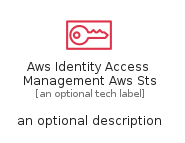
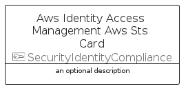

# AwsIdentityAccessManagementAwsSts


```text
aws-q1-2024/Resource/SecurityIdentityCompliance/AwsIdentityAccessManagementAwsSts
```

```text
include('aws-q1-2024/Resource/SecurityIdentityCompliance/AwsIdentityAccessManagementAwsSts')
```


| Illustration | AwsIdentityAccessManagementAwsSts | AwsIdentityAccessManagementAwsStsCard | AwsIdentityAccessManagementAwsStsGroup |
| :---: | :---: | :---: | :---: |
|  |  |  |  |


## Sprites
The item provides the following sriptes:

- `<$AwsIdentityAccessManagementAwsStsXs>`
- `<$AwsIdentityAccessManagementAwsStsSm>`
- `<$AwsIdentityAccessManagementAwsStsMd>`
- `<$AwsIdentityAccessManagementAwsStsLg>`


## AwsIdentityAccessManagementAwsSts

### Load remotely
```plantuml
@startuml
' configures the library
!global $LIB_BASE_LOCATION="https://raw.githubusercontent.com/tmorin/plantuml-libs/master/distribution"

' loads the library's bootstrap
!include $LIB_BASE_LOCATION/bootstrap.puml

' loads the package bootstrap
include('aws-q1-2024/bootstrap')

' loads the Item which embeds the element AwsIdentityAccessManagementAwsSts
include('aws-q1-2024/Resource/SecurityIdentityCompliance/AwsIdentityAccessManagementAwsSts')

' renders the element
AwsIdentityAccessManagementAwsSts('AwsIdentityAccessManagementAwsSts', 'Aws Identity Access Management Aws Sts', 'an optional tech label', 'an optional description')
@enduml
```

### Load locally
```plantuml
@startuml
' configures the library
!global $INCLUSION_MODE="local"
!global $LIB_BASE_LOCATION="../../.."

' loads the library's bootstrap
!include $LIB_BASE_LOCATION/bootstrap.puml

' loads the package bootstrap
include('aws-q1-2024/bootstrap')

' loads the Item which embeds the element AwsIdentityAccessManagementAwsSts
include('aws-q1-2024/Resource/SecurityIdentityCompliance/AwsIdentityAccessManagementAwsSts')

' renders the element
AwsIdentityAccessManagementAwsSts('AwsIdentityAccessManagementAwsSts', 'Aws Identity Access Management Aws Sts', 'an optional tech label', 'an optional description')
@enduml
```

## AwsIdentityAccessManagementAwsStsCard

### Load remotely
```plantuml
@startuml
' configures the library
!global $LIB_BASE_LOCATION="https://raw.githubusercontent.com/tmorin/plantuml-libs/master/distribution"

' loads the library's bootstrap
!include $LIB_BASE_LOCATION/bootstrap.puml

' loads the package bootstrap
include('aws-q1-2024/bootstrap')

' loads the Item which embeds the element AwsIdentityAccessManagementAwsStsCard
include('aws-q1-2024/Resource/SecurityIdentityCompliance/AwsIdentityAccessManagementAwsSts')

' renders the element
AwsIdentityAccessManagementAwsStsCard('AwsIdentityAccessManagementAwsStsCard', 'Aws Identity Access Management Aws Sts Card', 'an optional description')
@enduml
```

### Load locally
```plantuml
@startuml
' configures the library
!global $INCLUSION_MODE="local"
!global $LIB_BASE_LOCATION="../../.."

' loads the library's bootstrap
!include $LIB_BASE_LOCATION/bootstrap.puml

' loads the package bootstrap
include('aws-q1-2024/bootstrap')

' loads the Item which embeds the element AwsIdentityAccessManagementAwsStsCard
include('aws-q1-2024/Resource/SecurityIdentityCompliance/AwsIdentityAccessManagementAwsSts')

' renders the element
AwsIdentityAccessManagementAwsStsCard('AwsIdentityAccessManagementAwsStsCard', 'Aws Identity Access Management Aws Sts Card', 'an optional description')
@enduml
```

## AwsIdentityAccessManagementAwsStsGroup

### Load remotely
```plantuml
@startuml
' configures the library
!global $LIB_BASE_LOCATION="https://raw.githubusercontent.com/tmorin/plantuml-libs/master/distribution"

' loads the library's bootstrap
!include $LIB_BASE_LOCATION/bootstrap.puml

' loads the package bootstrap
include('aws-q1-2024/bootstrap')

' loads the Item which embeds the element AwsIdentityAccessManagementAwsStsGroup
include('aws-q1-2024/Resource/SecurityIdentityCompliance/AwsIdentityAccessManagementAwsSts')

' renders the element
AwsIdentityAccessManagementAwsStsGroup('AwsIdentityAccessManagementAwsStsGroup', 'Aws Identity Access Management Aws Sts Group', 'an optional tech label') {
    note as note
        the content of the group
    end note
}
@enduml
```

### Load locally
```plantuml
@startuml
' configures the library
!global $INCLUSION_MODE="local"
!global $LIB_BASE_LOCATION="../../.."

' loads the library's bootstrap
!include $LIB_BASE_LOCATION/bootstrap.puml

' loads the package bootstrap
include('aws-q1-2024/bootstrap')

' loads the Item which embeds the element AwsIdentityAccessManagementAwsStsGroup
include('aws-q1-2024/Resource/SecurityIdentityCompliance/AwsIdentityAccessManagementAwsSts')

' renders the element
AwsIdentityAccessManagementAwsStsGroup('AwsIdentityAccessManagementAwsStsGroup', 'Aws Identity Access Management Aws Sts Group', 'an optional tech label') {
    note as note
        the content of the group
    end note
}
@enduml
```

