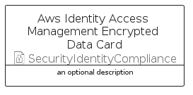

# AwsIdentityAccessManagementEncryptedData


```text
aws-q1-2024/Resource/SecurityIdentityCompliance/AwsIdentityAccessManagementEncryptedData
```

```text
include('aws-q1-2024/Resource/SecurityIdentityCompliance/AwsIdentityAccessManagementEncryptedData')
```


| Illustration | AwsIdentityAccessManagementEncryptedData | AwsIdentityAccessManagementEncryptedDataCard | AwsIdentityAccessManagementEncryptedDataGroup |
| :---: | :---: | :---: | :---: |
|  |  |  |  |


## Sprites
The item provides the following sriptes:

- `<$AwsIdentityAccessManagementEncryptedDataXs>`
- `<$AwsIdentityAccessManagementEncryptedDataSm>`
- `<$AwsIdentityAccessManagementEncryptedDataMd>`
- `<$AwsIdentityAccessManagementEncryptedDataLg>`


## AwsIdentityAccessManagementEncryptedData

### Load remotely
```plantuml
@startuml
' configures the library
!global $LIB_BASE_LOCATION="https://raw.githubusercontent.com/tmorin/plantuml-libs/master/distribution"

' loads the library's bootstrap
!include $LIB_BASE_LOCATION/bootstrap.puml

' loads the package bootstrap
include('aws-q1-2024/bootstrap')

' loads the Item which embeds the element AwsIdentityAccessManagementEncryptedData
include('aws-q1-2024/Resource/SecurityIdentityCompliance/AwsIdentityAccessManagementEncryptedData')

' renders the element
AwsIdentityAccessManagementEncryptedData('AwsIdentityAccessManagementEncryptedData', 'Aws Identity Access Management Encrypted Data', 'an optional tech label', 'an optional description')
@enduml
```

### Load locally
```plantuml
@startuml
' configures the library
!global $INCLUSION_MODE="local"
!global $LIB_BASE_LOCATION="../../.."

' loads the library's bootstrap
!include $LIB_BASE_LOCATION/bootstrap.puml

' loads the package bootstrap
include('aws-q1-2024/bootstrap')

' loads the Item which embeds the element AwsIdentityAccessManagementEncryptedData
include('aws-q1-2024/Resource/SecurityIdentityCompliance/AwsIdentityAccessManagementEncryptedData')

' renders the element
AwsIdentityAccessManagementEncryptedData('AwsIdentityAccessManagementEncryptedData', 'Aws Identity Access Management Encrypted Data', 'an optional tech label', 'an optional description')
@enduml
```

## AwsIdentityAccessManagementEncryptedDataCard

### Load remotely
```plantuml
@startuml
' configures the library
!global $LIB_BASE_LOCATION="https://raw.githubusercontent.com/tmorin/plantuml-libs/master/distribution"

' loads the library's bootstrap
!include $LIB_BASE_LOCATION/bootstrap.puml

' loads the package bootstrap
include('aws-q1-2024/bootstrap')

' loads the Item which embeds the element AwsIdentityAccessManagementEncryptedDataCard
include('aws-q1-2024/Resource/SecurityIdentityCompliance/AwsIdentityAccessManagementEncryptedData')

' renders the element
AwsIdentityAccessManagementEncryptedDataCard('AwsIdentityAccessManagementEncryptedDataCard', 'Aws Identity Access Management Encrypted Data Card', 'an optional description')
@enduml
```

### Load locally
```plantuml
@startuml
' configures the library
!global $INCLUSION_MODE="local"
!global $LIB_BASE_LOCATION="../../.."

' loads the library's bootstrap
!include $LIB_BASE_LOCATION/bootstrap.puml

' loads the package bootstrap
include('aws-q1-2024/bootstrap')

' loads the Item which embeds the element AwsIdentityAccessManagementEncryptedDataCard
include('aws-q1-2024/Resource/SecurityIdentityCompliance/AwsIdentityAccessManagementEncryptedData')

' renders the element
AwsIdentityAccessManagementEncryptedDataCard('AwsIdentityAccessManagementEncryptedDataCard', 'Aws Identity Access Management Encrypted Data Card', 'an optional description')
@enduml
```

## AwsIdentityAccessManagementEncryptedDataGroup

### Load remotely
```plantuml
@startuml
' configures the library
!global $LIB_BASE_LOCATION="https://raw.githubusercontent.com/tmorin/plantuml-libs/master/distribution"

' loads the library's bootstrap
!include $LIB_BASE_LOCATION/bootstrap.puml

' loads the package bootstrap
include('aws-q1-2024/bootstrap')

' loads the Item which embeds the element AwsIdentityAccessManagementEncryptedDataGroup
include('aws-q1-2024/Resource/SecurityIdentityCompliance/AwsIdentityAccessManagementEncryptedData')

' renders the element
AwsIdentityAccessManagementEncryptedDataGroup('AwsIdentityAccessManagementEncryptedDataGroup', 'Aws Identity Access Management Encrypted Data Group', 'an optional tech label') {
    note as note
        the content of the group
    end note
}
@enduml
```

### Load locally
```plantuml
@startuml
' configures the library
!global $INCLUSION_MODE="local"
!global $LIB_BASE_LOCATION="../../.."

' loads the library's bootstrap
!include $LIB_BASE_LOCATION/bootstrap.puml

' loads the package bootstrap
include('aws-q1-2024/bootstrap')

' loads the Item which embeds the element AwsIdentityAccessManagementEncryptedDataGroup
include('aws-q1-2024/Resource/SecurityIdentityCompliance/AwsIdentityAccessManagementEncryptedData')

' renders the element
AwsIdentityAccessManagementEncryptedDataGroup('AwsIdentityAccessManagementEncryptedDataGroup', 'Aws Identity Access Management Encrypted Data Group', 'an optional tech label') {
    note as note
        the content of the group
    end note
}
@enduml
```

