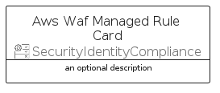

# AwsWafManagedRule


```text
aws-q1-2024/Resource/SecurityIdentityCompliance/AwsWafManagedRule
```

```text
include('aws-q1-2024/Resource/SecurityIdentityCompliance/AwsWafManagedRule')
```


| Illustration | AwsWafManagedRule | AwsWafManagedRuleCard | AwsWafManagedRuleGroup |
| :---: | :---: | :---: | :---: |
|  |  |  |  |


## Sprites
The item provides the following sriptes:

- `<$AwsWafManagedRuleXs>`
- `<$AwsWafManagedRuleSm>`
- `<$AwsWafManagedRuleMd>`
- `<$AwsWafManagedRuleLg>`


## AwsWafManagedRule

### Load remotely
```plantuml
@startuml
' configures the library
!global $LIB_BASE_LOCATION="https://raw.githubusercontent.com/tmorin/plantuml-libs/master/distribution"

' loads the library's bootstrap
!include $LIB_BASE_LOCATION/bootstrap.puml

' loads the package bootstrap
include('aws-q1-2024/bootstrap')

' loads the Item which embeds the element AwsWafManagedRule
include('aws-q1-2024/Resource/SecurityIdentityCompliance/AwsWafManagedRule')

' renders the element
AwsWafManagedRule('AwsWafManagedRule', 'Aws Waf Managed Rule', 'an optional tech label', 'an optional description')
@enduml
```

### Load locally
```plantuml
@startuml
' configures the library
!global $INCLUSION_MODE="local"
!global $LIB_BASE_LOCATION="../../.."

' loads the library's bootstrap
!include $LIB_BASE_LOCATION/bootstrap.puml

' loads the package bootstrap
include('aws-q1-2024/bootstrap')

' loads the Item which embeds the element AwsWafManagedRule
include('aws-q1-2024/Resource/SecurityIdentityCompliance/AwsWafManagedRule')

' renders the element
AwsWafManagedRule('AwsWafManagedRule', 'Aws Waf Managed Rule', 'an optional tech label', 'an optional description')
@enduml
```

## AwsWafManagedRuleCard

### Load remotely
```plantuml
@startuml
' configures the library
!global $LIB_BASE_LOCATION="https://raw.githubusercontent.com/tmorin/plantuml-libs/master/distribution"

' loads the library's bootstrap
!include $LIB_BASE_LOCATION/bootstrap.puml

' loads the package bootstrap
include('aws-q1-2024/bootstrap')

' loads the Item which embeds the element AwsWafManagedRuleCard
include('aws-q1-2024/Resource/SecurityIdentityCompliance/AwsWafManagedRule')

' renders the element
AwsWafManagedRuleCard('AwsWafManagedRuleCard', 'Aws Waf Managed Rule Card', 'an optional description')
@enduml
```

### Load locally
```plantuml
@startuml
' configures the library
!global $INCLUSION_MODE="local"
!global $LIB_BASE_LOCATION="../../.."

' loads the library's bootstrap
!include $LIB_BASE_LOCATION/bootstrap.puml

' loads the package bootstrap
include('aws-q1-2024/bootstrap')

' loads the Item which embeds the element AwsWafManagedRuleCard
include('aws-q1-2024/Resource/SecurityIdentityCompliance/AwsWafManagedRule')

' renders the element
AwsWafManagedRuleCard('AwsWafManagedRuleCard', 'Aws Waf Managed Rule Card', 'an optional description')
@enduml
```

## AwsWafManagedRuleGroup

### Load remotely
```plantuml
@startuml
' configures the library
!global $LIB_BASE_LOCATION="https://raw.githubusercontent.com/tmorin/plantuml-libs/master/distribution"

' loads the library's bootstrap
!include $LIB_BASE_LOCATION/bootstrap.puml

' loads the package bootstrap
include('aws-q1-2024/bootstrap')

' loads the Item which embeds the element AwsWafManagedRuleGroup
include('aws-q1-2024/Resource/SecurityIdentityCompliance/AwsWafManagedRule')

' renders the element
AwsWafManagedRuleGroup('AwsWafManagedRuleGroup', 'Aws Waf Managed Rule Group', 'an optional tech label') {
    note as note
        the content of the group
    end note
}
@enduml
```

### Load locally
```plantuml
@startuml
' configures the library
!global $INCLUSION_MODE="local"
!global $LIB_BASE_LOCATION="../../.."

' loads the library's bootstrap
!include $LIB_BASE_LOCATION/bootstrap.puml

' loads the package bootstrap
include('aws-q1-2024/bootstrap')

' loads the Item which embeds the element AwsWafManagedRuleGroup
include('aws-q1-2024/Resource/SecurityIdentityCompliance/AwsWafManagedRule')

' renders the element
AwsWafManagedRuleGroup('AwsWafManagedRuleGroup', 'Aws Waf Managed Rule Group', 'an optional tech label') {
    note as note
        the content of the group
    end note
}
@enduml
```

