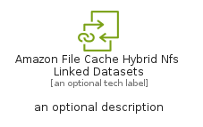

# AmazonFileCacheHybridNfsLinkedDatasets


```text
aws-q1-2024/Resource/Storage/AmazonFileCacheHybridNfsLinkedDatasets
```

```text
include('aws-q1-2024/Resource/Storage/AmazonFileCacheHybridNfsLinkedDatasets')
```


| Illustration | AmazonFileCacheHybridNfsLinkedDatasets | AmazonFileCacheHybridNfsLinkedDatasetsCard | AmazonFileCacheHybridNfsLinkedDatasetsGroup |
| :---: | :---: | :---: | :---: |
|  |  |  |  |


## Sprites
The item provides the following sriptes:

- `<$AmazonFileCacheHybridNfsLinkedDatasetsXs>`
- `<$AmazonFileCacheHybridNfsLinkedDatasetsSm>`
- `<$AmazonFileCacheHybridNfsLinkedDatasetsMd>`
- `<$AmazonFileCacheHybridNfsLinkedDatasetsLg>`


## AmazonFileCacheHybridNfsLinkedDatasets

### Load remotely
```plantuml
@startuml
' configures the library
!global $LIB_BASE_LOCATION="https://raw.githubusercontent.com/tmorin/plantuml-libs/master/distribution"

' loads the library's bootstrap
!include $LIB_BASE_LOCATION/bootstrap.puml

' loads the package bootstrap
include('aws-q1-2024/bootstrap')

' loads the Item which embeds the element AmazonFileCacheHybridNfsLinkedDatasets
include('aws-q1-2024/Resource/Storage/AmazonFileCacheHybridNfsLinkedDatasets')

' renders the element
AmazonFileCacheHybridNfsLinkedDatasets('AmazonFileCacheHybridNfsLinkedDatasets', 'Amazon File Cache Hybrid Nfs Linked Datasets', 'an optional tech label', 'an optional description')
@enduml
```

### Load locally
```plantuml
@startuml
' configures the library
!global $INCLUSION_MODE="local"
!global $LIB_BASE_LOCATION="../../.."

' loads the library's bootstrap
!include $LIB_BASE_LOCATION/bootstrap.puml

' loads the package bootstrap
include('aws-q1-2024/bootstrap')

' loads the Item which embeds the element AmazonFileCacheHybridNfsLinkedDatasets
include('aws-q1-2024/Resource/Storage/AmazonFileCacheHybridNfsLinkedDatasets')

' renders the element
AmazonFileCacheHybridNfsLinkedDatasets('AmazonFileCacheHybridNfsLinkedDatasets', 'Amazon File Cache Hybrid Nfs Linked Datasets', 'an optional tech label', 'an optional description')
@enduml
```

## AmazonFileCacheHybridNfsLinkedDatasetsCard

### Load remotely
```plantuml
@startuml
' configures the library
!global $LIB_BASE_LOCATION="https://raw.githubusercontent.com/tmorin/plantuml-libs/master/distribution"

' loads the library's bootstrap
!include $LIB_BASE_LOCATION/bootstrap.puml

' loads the package bootstrap
include('aws-q1-2024/bootstrap')

' loads the Item which embeds the element AmazonFileCacheHybridNfsLinkedDatasetsCard
include('aws-q1-2024/Resource/Storage/AmazonFileCacheHybridNfsLinkedDatasets')

' renders the element
AmazonFileCacheHybridNfsLinkedDatasetsCard('AmazonFileCacheHybridNfsLinkedDatasetsCard', 'Amazon File Cache Hybrid Nfs Linked Datasets Card', 'an optional description')
@enduml
```

### Load locally
```plantuml
@startuml
' configures the library
!global $INCLUSION_MODE="local"
!global $LIB_BASE_LOCATION="../../.."

' loads the library's bootstrap
!include $LIB_BASE_LOCATION/bootstrap.puml

' loads the package bootstrap
include('aws-q1-2024/bootstrap')

' loads the Item which embeds the element AmazonFileCacheHybridNfsLinkedDatasetsCard
include('aws-q1-2024/Resource/Storage/AmazonFileCacheHybridNfsLinkedDatasets')

' renders the element
AmazonFileCacheHybridNfsLinkedDatasetsCard('AmazonFileCacheHybridNfsLinkedDatasetsCard', 'Amazon File Cache Hybrid Nfs Linked Datasets Card', 'an optional description')
@enduml
```

## AmazonFileCacheHybridNfsLinkedDatasetsGroup

### Load remotely
```plantuml
@startuml
' configures the library
!global $LIB_BASE_LOCATION="https://raw.githubusercontent.com/tmorin/plantuml-libs/master/distribution"

' loads the library's bootstrap
!include $LIB_BASE_LOCATION/bootstrap.puml

' loads the package bootstrap
include('aws-q1-2024/bootstrap')

' loads the Item which embeds the element AmazonFileCacheHybridNfsLinkedDatasetsGroup
include('aws-q1-2024/Resource/Storage/AmazonFileCacheHybridNfsLinkedDatasets')

' renders the element
AmazonFileCacheHybridNfsLinkedDatasetsGroup('AmazonFileCacheHybridNfsLinkedDatasetsGroup', 'Amazon File Cache Hybrid Nfs Linked Datasets Group', 'an optional tech label') {
    note as note
        the content of the group
    end note
}
@enduml
```

### Load locally
```plantuml
@startuml
' configures the library
!global $INCLUSION_MODE="local"
!global $LIB_BASE_LOCATION="../../.."

' loads the library's bootstrap
!include $LIB_BASE_LOCATION/bootstrap.puml

' loads the package bootstrap
include('aws-q1-2024/bootstrap')

' loads the Item which embeds the element AmazonFileCacheHybridNfsLinkedDatasetsGroup
include('aws-q1-2024/Resource/Storage/AmazonFileCacheHybridNfsLinkedDatasets')

' renders the element
AmazonFileCacheHybridNfsLinkedDatasetsGroup('AmazonFileCacheHybridNfsLinkedDatasetsGroup', 'Amazon File Cache Hybrid Nfs Linked Datasets Group', 'an optional tech label') {
    note as note
        the content of the group
    end note
}
@enduml
```

