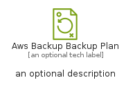
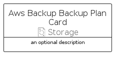

# AwsBackupBackupPlan


```text
aws-q1-2024/Resource/Storage/AwsBackupBackupPlan
```

```text
include('aws-q1-2024/Resource/Storage/AwsBackupBackupPlan')
```


| Illustration | AwsBackupBackupPlan | AwsBackupBackupPlanCard | AwsBackupBackupPlanGroup |
| :---: | :---: | :---: | :---: |
|  |  |  |  |


## Sprites
The item provides the following sriptes:

- `<$AwsBackupBackupPlanXs>`
- `<$AwsBackupBackupPlanSm>`
- `<$AwsBackupBackupPlanMd>`
- `<$AwsBackupBackupPlanLg>`


## AwsBackupBackupPlan

### Load remotely
```plantuml
@startuml
' configures the library
!global $LIB_BASE_LOCATION="https://raw.githubusercontent.com/tmorin/plantuml-libs/master/distribution"

' loads the library's bootstrap
!include $LIB_BASE_LOCATION/bootstrap.puml

' loads the package bootstrap
include('aws-q1-2024/bootstrap')

' loads the Item which embeds the element AwsBackupBackupPlan
include('aws-q1-2024/Resource/Storage/AwsBackupBackupPlan')

' renders the element
AwsBackupBackupPlan('AwsBackupBackupPlan', 'Aws Backup Backup Plan', 'an optional tech label', 'an optional description')
@enduml
```

### Load locally
```plantuml
@startuml
' configures the library
!global $INCLUSION_MODE="local"
!global $LIB_BASE_LOCATION="../../.."

' loads the library's bootstrap
!include $LIB_BASE_LOCATION/bootstrap.puml

' loads the package bootstrap
include('aws-q1-2024/bootstrap')

' loads the Item which embeds the element AwsBackupBackupPlan
include('aws-q1-2024/Resource/Storage/AwsBackupBackupPlan')

' renders the element
AwsBackupBackupPlan('AwsBackupBackupPlan', 'Aws Backup Backup Plan', 'an optional tech label', 'an optional description')
@enduml
```

## AwsBackupBackupPlanCard

### Load remotely
```plantuml
@startuml
' configures the library
!global $LIB_BASE_LOCATION="https://raw.githubusercontent.com/tmorin/plantuml-libs/master/distribution"

' loads the library's bootstrap
!include $LIB_BASE_LOCATION/bootstrap.puml

' loads the package bootstrap
include('aws-q1-2024/bootstrap')

' loads the Item which embeds the element AwsBackupBackupPlanCard
include('aws-q1-2024/Resource/Storage/AwsBackupBackupPlan')

' renders the element
AwsBackupBackupPlanCard('AwsBackupBackupPlanCard', 'Aws Backup Backup Plan Card', 'an optional description')
@enduml
```

### Load locally
```plantuml
@startuml
' configures the library
!global $INCLUSION_MODE="local"
!global $LIB_BASE_LOCATION="../../.."

' loads the library's bootstrap
!include $LIB_BASE_LOCATION/bootstrap.puml

' loads the package bootstrap
include('aws-q1-2024/bootstrap')

' loads the Item which embeds the element AwsBackupBackupPlanCard
include('aws-q1-2024/Resource/Storage/AwsBackupBackupPlan')

' renders the element
AwsBackupBackupPlanCard('AwsBackupBackupPlanCard', 'Aws Backup Backup Plan Card', 'an optional description')
@enduml
```

## AwsBackupBackupPlanGroup

### Load remotely
```plantuml
@startuml
' configures the library
!global $LIB_BASE_LOCATION="https://raw.githubusercontent.com/tmorin/plantuml-libs/master/distribution"

' loads the library's bootstrap
!include $LIB_BASE_LOCATION/bootstrap.puml

' loads the package bootstrap
include('aws-q1-2024/bootstrap')

' loads the Item which embeds the element AwsBackupBackupPlanGroup
include('aws-q1-2024/Resource/Storage/AwsBackupBackupPlan')

' renders the element
AwsBackupBackupPlanGroup('AwsBackupBackupPlanGroup', 'Aws Backup Backup Plan Group', 'an optional tech label') {
    note as note
        the content of the group
    end note
}
@enduml
```

### Load locally
```plantuml
@startuml
' configures the library
!global $INCLUSION_MODE="local"
!global $LIB_BASE_LOCATION="../../.."

' loads the library's bootstrap
!include $LIB_BASE_LOCATION/bootstrap.puml

' loads the package bootstrap
include('aws-q1-2024/bootstrap')

' loads the Item which embeds the element AwsBackupBackupPlanGroup
include('aws-q1-2024/Resource/Storage/AwsBackupBackupPlan')

' renders the element
AwsBackupBackupPlanGroup('AwsBackupBackupPlanGroup', 'Aws Backup Backup Plan Group', 'an optional tech label') {
    note as note
        the content of the group
    end note
}
@enduml
```

