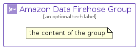

# AmazonDataFirehose


```text
aws-q1-2025/Architecture/Analytics/AmazonDataFirehose
```

```text
include('aws-q1-2025/Architecture/Analytics/AmazonDataFirehose')
```


| Illustration | AmazonDataFirehose | AmazonDataFirehoseCard | AmazonDataFirehoseGroup |
| :---: | :---: | :---: | :---: |
|  |  |  |  |


## Sprites
The item provides the following sriptes:

- `<$AmazonDataFirehoseXs>`
- `<$AmazonDataFirehoseSm>`
- `<$AmazonDataFirehoseMd>`
- `<$AmazonDataFirehoseLg>`


## AmazonDataFirehose

### Load remotely
```plantuml
@startuml
' configures the library
!global $LIB_BASE_LOCATION="https://raw.githubusercontent.com/tmorin/plantuml-libs/master/distribution"

' loads the library's bootstrap
!include $LIB_BASE_LOCATION/bootstrap.puml

' loads the package bootstrap
include('aws-q1-2025/bootstrap')

' loads the Item which embeds the element AmazonDataFirehose
include('aws-q1-2025/Architecture/Analytics/AmazonDataFirehose')

' renders the element
AmazonDataFirehose('AmazonDataFirehose', 'Amazon Data Firehose', 'an optional tech label', 'an optional description')
@enduml
```

### Load locally
```plantuml
@startuml
' configures the library
!global $INCLUSION_MODE="local"
!global $LIB_BASE_LOCATION="../../.."

' loads the library's bootstrap
!include $LIB_BASE_LOCATION/bootstrap.puml

' loads the package bootstrap
include('aws-q1-2025/bootstrap')

' loads the Item which embeds the element AmazonDataFirehose
include('aws-q1-2025/Architecture/Analytics/AmazonDataFirehose')

' renders the element
AmazonDataFirehose('AmazonDataFirehose', 'Amazon Data Firehose', 'an optional tech label', 'an optional description')
@enduml
```

## AmazonDataFirehoseCard

### Load remotely
```plantuml
@startuml
' configures the library
!global $LIB_BASE_LOCATION="https://raw.githubusercontent.com/tmorin/plantuml-libs/master/distribution"

' loads the library's bootstrap
!include $LIB_BASE_LOCATION/bootstrap.puml

' loads the package bootstrap
include('aws-q1-2025/bootstrap')

' loads the Item which embeds the element AmazonDataFirehoseCard
include('aws-q1-2025/Architecture/Analytics/AmazonDataFirehose')

' renders the element
AmazonDataFirehoseCard('AmazonDataFirehoseCard', 'Amazon Data Firehose Card', 'an optional description')
@enduml
```

### Load locally
```plantuml
@startuml
' configures the library
!global $INCLUSION_MODE="local"
!global $LIB_BASE_LOCATION="../../.."

' loads the library's bootstrap
!include $LIB_BASE_LOCATION/bootstrap.puml

' loads the package bootstrap
include('aws-q1-2025/bootstrap')

' loads the Item which embeds the element AmazonDataFirehoseCard
include('aws-q1-2025/Architecture/Analytics/AmazonDataFirehose')

' renders the element
AmazonDataFirehoseCard('AmazonDataFirehoseCard', 'Amazon Data Firehose Card', 'an optional description')
@enduml
```

## AmazonDataFirehoseGroup

### Load remotely
```plantuml
@startuml
' configures the library
!global $LIB_BASE_LOCATION="https://raw.githubusercontent.com/tmorin/plantuml-libs/master/distribution"

' loads the library's bootstrap
!include $LIB_BASE_LOCATION/bootstrap.puml

' loads the package bootstrap
include('aws-q1-2025/bootstrap')

' loads the Item which embeds the element AmazonDataFirehoseGroup
include('aws-q1-2025/Architecture/Analytics/AmazonDataFirehose')

' renders the element
AmazonDataFirehoseGroup('AmazonDataFirehoseGroup', 'Amazon Data Firehose Group', 'an optional tech label') {
    note as note
        the content of the group
    end note
}
@enduml
```

### Load locally
```plantuml
@startuml
' configures the library
!global $INCLUSION_MODE="local"
!global $LIB_BASE_LOCATION="../../.."

' loads the library's bootstrap
!include $LIB_BASE_LOCATION/bootstrap.puml

' loads the package bootstrap
include('aws-q1-2025/bootstrap')

' loads the Item which embeds the element AmazonDataFirehoseGroup
include('aws-q1-2025/Architecture/Analytics/AmazonDataFirehose')

' renders the element
AmazonDataFirehoseGroup('AmazonDataFirehoseGroup', 'Amazon Data Firehose Group', 'an optional tech label') {
    note as note
        the content of the group
    end note
}
@enduml
```

