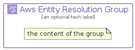

# AwsEntityResolution


```text
aws-q1-2025/Architecture/Analytics/AwsEntityResolution
```

```text
include('aws-q1-2025/Architecture/Analytics/AwsEntityResolution')
```


| Illustration | AwsEntityResolution | AwsEntityResolutionCard | AwsEntityResolutionGroup |
| :---: | :---: | :---: | :---: |
|  |  |  |  |


## Sprites
The item provides the following sriptes:

- `<$AwsEntityResolutionXs>`
- `<$AwsEntityResolutionSm>`
- `<$AwsEntityResolutionMd>`
- `<$AwsEntityResolutionLg>`


## AwsEntityResolution

### Load remotely
```plantuml
@startuml
' configures the library
!global $LIB_BASE_LOCATION="https://raw.githubusercontent.com/tmorin/plantuml-libs/master/distribution"

' loads the library's bootstrap
!include $LIB_BASE_LOCATION/bootstrap.puml

' loads the package bootstrap
include('aws-q1-2025/bootstrap')

' loads the Item which embeds the element AwsEntityResolution
include('aws-q1-2025/Architecture/Analytics/AwsEntityResolution')

' renders the element
AwsEntityResolution('AwsEntityResolution', 'Aws Entity Resolution', 'an optional tech label', 'an optional description')
@enduml
```

### Load locally
```plantuml
@startuml
' configures the library
!global $INCLUSION_MODE="local"
!global $LIB_BASE_LOCATION="../../.."

' loads the library's bootstrap
!include $LIB_BASE_LOCATION/bootstrap.puml

' loads the package bootstrap
include('aws-q1-2025/bootstrap')

' loads the Item which embeds the element AwsEntityResolution
include('aws-q1-2025/Architecture/Analytics/AwsEntityResolution')

' renders the element
AwsEntityResolution('AwsEntityResolution', 'Aws Entity Resolution', 'an optional tech label', 'an optional description')
@enduml
```

## AwsEntityResolutionCard

### Load remotely
```plantuml
@startuml
' configures the library
!global $LIB_BASE_LOCATION="https://raw.githubusercontent.com/tmorin/plantuml-libs/master/distribution"

' loads the library's bootstrap
!include $LIB_BASE_LOCATION/bootstrap.puml

' loads the package bootstrap
include('aws-q1-2025/bootstrap')

' loads the Item which embeds the element AwsEntityResolutionCard
include('aws-q1-2025/Architecture/Analytics/AwsEntityResolution')

' renders the element
AwsEntityResolutionCard('AwsEntityResolutionCard', 'Aws Entity Resolution Card', 'an optional description')
@enduml
```

### Load locally
```plantuml
@startuml
' configures the library
!global $INCLUSION_MODE="local"
!global $LIB_BASE_LOCATION="../../.."

' loads the library's bootstrap
!include $LIB_BASE_LOCATION/bootstrap.puml

' loads the package bootstrap
include('aws-q1-2025/bootstrap')

' loads the Item which embeds the element AwsEntityResolutionCard
include('aws-q1-2025/Architecture/Analytics/AwsEntityResolution')

' renders the element
AwsEntityResolutionCard('AwsEntityResolutionCard', 'Aws Entity Resolution Card', 'an optional description')
@enduml
```

## AwsEntityResolutionGroup

### Load remotely
```plantuml
@startuml
' configures the library
!global $LIB_BASE_LOCATION="https://raw.githubusercontent.com/tmorin/plantuml-libs/master/distribution"

' loads the library's bootstrap
!include $LIB_BASE_LOCATION/bootstrap.puml

' loads the package bootstrap
include('aws-q1-2025/bootstrap')

' loads the Item which embeds the element AwsEntityResolutionGroup
include('aws-q1-2025/Architecture/Analytics/AwsEntityResolution')

' renders the element
AwsEntityResolutionGroup('AwsEntityResolutionGroup', 'Aws Entity Resolution Group', 'an optional tech label') {
    note as note
        the content of the group
    end note
}
@enduml
```

### Load locally
```plantuml
@startuml
' configures the library
!global $INCLUSION_MODE="local"
!global $LIB_BASE_LOCATION="../../.."

' loads the library's bootstrap
!include $LIB_BASE_LOCATION/bootstrap.puml

' loads the package bootstrap
include('aws-q1-2025/bootstrap')

' loads the Item which embeds the element AwsEntityResolutionGroup
include('aws-q1-2025/Architecture/Analytics/AwsEntityResolution')

' renders the element
AwsEntityResolutionGroup('AwsEntityResolutionGroup', 'Aws Entity Resolution Group', 'an optional tech label') {
    note as note
        the content of the group
    end note
}
@enduml
```

