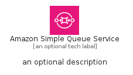
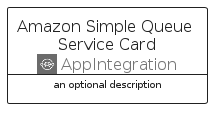

# AmazonSimpleQueueService


```text
aws-q1-2025/Architecture/AppIntegration/AmazonSimpleQueueService
```

```text
include('aws-q1-2025/Architecture/AppIntegration/AmazonSimpleQueueService')
```


| Illustration | AmazonSimpleQueueService | AmazonSimpleQueueServiceCard | AmazonSimpleQueueServiceGroup |
| :---: | :---: | :---: | :---: |
|  |  |  |  |


## Sprites
The item provides the following sriptes:

- `<$AmazonSimpleQueueServiceXs>`
- `<$AmazonSimpleQueueServiceSm>`
- `<$AmazonSimpleQueueServiceMd>`
- `<$AmazonSimpleQueueServiceLg>`


## AmazonSimpleQueueService

### Load remotely
```plantuml
@startuml
' configures the library
!global $LIB_BASE_LOCATION="https://raw.githubusercontent.com/tmorin/plantuml-libs/master/distribution"

' loads the library's bootstrap
!include $LIB_BASE_LOCATION/bootstrap.puml

' loads the package bootstrap
include('aws-q1-2025/bootstrap')

' loads the Item which embeds the element AmazonSimpleQueueService
include('aws-q1-2025/Architecture/AppIntegration/AmazonSimpleQueueService')

' renders the element
AmazonSimpleQueueService('AmazonSimpleQueueService', 'Amazon Simple Queue Service', 'an optional tech label', 'an optional description')
@enduml
```

### Load locally
```plantuml
@startuml
' configures the library
!global $INCLUSION_MODE="local"
!global $LIB_BASE_LOCATION="../../.."

' loads the library's bootstrap
!include $LIB_BASE_LOCATION/bootstrap.puml

' loads the package bootstrap
include('aws-q1-2025/bootstrap')

' loads the Item which embeds the element AmazonSimpleQueueService
include('aws-q1-2025/Architecture/AppIntegration/AmazonSimpleQueueService')

' renders the element
AmazonSimpleQueueService('AmazonSimpleQueueService', 'Amazon Simple Queue Service', 'an optional tech label', 'an optional description')
@enduml
```

## AmazonSimpleQueueServiceCard

### Load remotely
```plantuml
@startuml
' configures the library
!global $LIB_BASE_LOCATION="https://raw.githubusercontent.com/tmorin/plantuml-libs/master/distribution"

' loads the library's bootstrap
!include $LIB_BASE_LOCATION/bootstrap.puml

' loads the package bootstrap
include('aws-q1-2025/bootstrap')

' loads the Item which embeds the element AmazonSimpleQueueServiceCard
include('aws-q1-2025/Architecture/AppIntegration/AmazonSimpleQueueService')

' renders the element
AmazonSimpleQueueServiceCard('AmazonSimpleQueueServiceCard', 'Amazon Simple Queue Service Card', 'an optional description')
@enduml
```

### Load locally
```plantuml
@startuml
' configures the library
!global $INCLUSION_MODE="local"
!global $LIB_BASE_LOCATION="../../.."

' loads the library's bootstrap
!include $LIB_BASE_LOCATION/bootstrap.puml

' loads the package bootstrap
include('aws-q1-2025/bootstrap')

' loads the Item which embeds the element AmazonSimpleQueueServiceCard
include('aws-q1-2025/Architecture/AppIntegration/AmazonSimpleQueueService')

' renders the element
AmazonSimpleQueueServiceCard('AmazonSimpleQueueServiceCard', 'Amazon Simple Queue Service Card', 'an optional description')
@enduml
```

## AmazonSimpleQueueServiceGroup

### Load remotely
```plantuml
@startuml
' configures the library
!global $LIB_BASE_LOCATION="https://raw.githubusercontent.com/tmorin/plantuml-libs/master/distribution"

' loads the library's bootstrap
!include $LIB_BASE_LOCATION/bootstrap.puml

' loads the package bootstrap
include('aws-q1-2025/bootstrap')

' loads the Item which embeds the element AmazonSimpleQueueServiceGroup
include('aws-q1-2025/Architecture/AppIntegration/AmazonSimpleQueueService')

' renders the element
AmazonSimpleQueueServiceGroup('AmazonSimpleQueueServiceGroup', 'Amazon Simple Queue Service Group', 'an optional tech label') {
    note as note
        the content of the group
    end note
}
@enduml
```

### Load locally
```plantuml
@startuml
' configures the library
!global $INCLUSION_MODE="local"
!global $LIB_BASE_LOCATION="../../.."

' loads the library's bootstrap
!include $LIB_BASE_LOCATION/bootstrap.puml

' loads the package bootstrap
include('aws-q1-2025/bootstrap')

' loads the Item which embeds the element AmazonSimpleQueueServiceGroup
include('aws-q1-2025/Architecture/AppIntegration/AmazonSimpleQueueService')

' renders the element
AmazonSimpleQueueServiceGroup('AmazonSimpleQueueServiceGroup', 'Amazon Simple Queue Service Group', 'an optional tech label') {
    note as note
        the content of the group
    end note
}
@enduml
```

