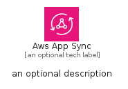
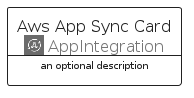

# AwsAppSync


```text
aws-q1-2025/Architecture/AppIntegration/AwsAppSync
```

```text
include('aws-q1-2025/Architecture/AppIntegration/AwsAppSync')
```


| Illustration | AwsAppSync | AwsAppSyncCard | AwsAppSyncGroup |
| :---: | :---: | :---: | :---: |
|  |  |  |  |


## Sprites
The item provides the following sriptes:

- `<$AwsAppSyncXs>`
- `<$AwsAppSyncSm>`
- `<$AwsAppSyncMd>`
- `<$AwsAppSyncLg>`


## AwsAppSync

### Load remotely
```plantuml
@startuml
' configures the library
!global $LIB_BASE_LOCATION="https://raw.githubusercontent.com/tmorin/plantuml-libs/master/distribution"

' loads the library's bootstrap
!include $LIB_BASE_LOCATION/bootstrap.puml

' loads the package bootstrap
include('aws-q1-2025/bootstrap')

' loads the Item which embeds the element AwsAppSync
include('aws-q1-2025/Architecture/AppIntegration/AwsAppSync')

' renders the element
AwsAppSync('AwsAppSync', 'Aws App Sync', 'an optional tech label', 'an optional description')
@enduml
```

### Load locally
```plantuml
@startuml
' configures the library
!global $INCLUSION_MODE="local"
!global $LIB_BASE_LOCATION="../../.."

' loads the library's bootstrap
!include $LIB_BASE_LOCATION/bootstrap.puml

' loads the package bootstrap
include('aws-q1-2025/bootstrap')

' loads the Item which embeds the element AwsAppSync
include('aws-q1-2025/Architecture/AppIntegration/AwsAppSync')

' renders the element
AwsAppSync('AwsAppSync', 'Aws App Sync', 'an optional tech label', 'an optional description')
@enduml
```

## AwsAppSyncCard

### Load remotely
```plantuml
@startuml
' configures the library
!global $LIB_BASE_LOCATION="https://raw.githubusercontent.com/tmorin/plantuml-libs/master/distribution"

' loads the library's bootstrap
!include $LIB_BASE_LOCATION/bootstrap.puml

' loads the package bootstrap
include('aws-q1-2025/bootstrap')

' loads the Item which embeds the element AwsAppSyncCard
include('aws-q1-2025/Architecture/AppIntegration/AwsAppSync')

' renders the element
AwsAppSyncCard('AwsAppSyncCard', 'Aws App Sync Card', 'an optional description')
@enduml
```

### Load locally
```plantuml
@startuml
' configures the library
!global $INCLUSION_MODE="local"
!global $LIB_BASE_LOCATION="../../.."

' loads the library's bootstrap
!include $LIB_BASE_LOCATION/bootstrap.puml

' loads the package bootstrap
include('aws-q1-2025/bootstrap')

' loads the Item which embeds the element AwsAppSyncCard
include('aws-q1-2025/Architecture/AppIntegration/AwsAppSync')

' renders the element
AwsAppSyncCard('AwsAppSyncCard', 'Aws App Sync Card', 'an optional description')
@enduml
```

## AwsAppSyncGroup

### Load remotely
```plantuml
@startuml
' configures the library
!global $LIB_BASE_LOCATION="https://raw.githubusercontent.com/tmorin/plantuml-libs/master/distribution"

' loads the library's bootstrap
!include $LIB_BASE_LOCATION/bootstrap.puml

' loads the package bootstrap
include('aws-q1-2025/bootstrap')

' loads the Item which embeds the element AwsAppSyncGroup
include('aws-q1-2025/Architecture/AppIntegration/AwsAppSync')

' renders the element
AwsAppSyncGroup('AwsAppSyncGroup', 'Aws App Sync Group', 'an optional tech label') {
    note as note
        the content of the group
    end note
}
@enduml
```

### Load locally
```plantuml
@startuml
' configures the library
!global $INCLUSION_MODE="local"
!global $LIB_BASE_LOCATION="../../.."

' loads the library's bootstrap
!include $LIB_BASE_LOCATION/bootstrap.puml

' loads the package bootstrap
include('aws-q1-2025/bootstrap')

' loads the Item which embeds the element AwsAppSyncGroup
include('aws-q1-2025/Architecture/AppIntegration/AwsAppSync')

' renders the element
AwsAppSyncGroup('AwsAppSyncGroup', 'Aws App Sync Group', 'an optional tech label') {
    note as note
        the content of the group
    end note
}
@enduml
```

