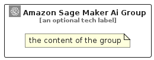

# AmazonSageMakerAi


```text
aws-q1-2025/Architecture/ArtificialIntelligence/AmazonSageMakerAi
```

```text
include('aws-q1-2025/Architecture/ArtificialIntelligence/AmazonSageMakerAi')
```


| Illustration | AmazonSageMakerAi | AmazonSageMakerAiCard | AmazonSageMakerAiGroup |
| :---: | :---: | :---: | :---: |
|  |  |  |  |


## Sprites
The item provides the following sriptes:

- `<$AmazonSageMakerAiXs>`
- `<$AmazonSageMakerAiSm>`
- `<$AmazonSageMakerAiMd>`
- `<$AmazonSageMakerAiLg>`


## AmazonSageMakerAi

### Load remotely
```plantuml
@startuml
' configures the library
!global $LIB_BASE_LOCATION="https://raw.githubusercontent.com/tmorin/plantuml-libs/master/distribution"

' loads the library's bootstrap
!include $LIB_BASE_LOCATION/bootstrap.puml

' loads the package bootstrap
include('aws-q1-2025/bootstrap')

' loads the Item which embeds the element AmazonSageMakerAi
include('aws-q1-2025/Architecture/ArtificialIntelligence/AmazonSageMakerAi')

' renders the element
AmazonSageMakerAi('AmazonSageMakerAi', 'Amazon Sage Maker Ai', 'an optional tech label', 'an optional description')
@enduml
```

### Load locally
```plantuml
@startuml
' configures the library
!global $INCLUSION_MODE="local"
!global $LIB_BASE_LOCATION="../../.."

' loads the library's bootstrap
!include $LIB_BASE_LOCATION/bootstrap.puml

' loads the package bootstrap
include('aws-q1-2025/bootstrap')

' loads the Item which embeds the element AmazonSageMakerAi
include('aws-q1-2025/Architecture/ArtificialIntelligence/AmazonSageMakerAi')

' renders the element
AmazonSageMakerAi('AmazonSageMakerAi', 'Amazon Sage Maker Ai', 'an optional tech label', 'an optional description')
@enduml
```

## AmazonSageMakerAiCard

### Load remotely
```plantuml
@startuml
' configures the library
!global $LIB_BASE_LOCATION="https://raw.githubusercontent.com/tmorin/plantuml-libs/master/distribution"

' loads the library's bootstrap
!include $LIB_BASE_LOCATION/bootstrap.puml

' loads the package bootstrap
include('aws-q1-2025/bootstrap')

' loads the Item which embeds the element AmazonSageMakerAiCard
include('aws-q1-2025/Architecture/ArtificialIntelligence/AmazonSageMakerAi')

' renders the element
AmazonSageMakerAiCard('AmazonSageMakerAiCard', 'Amazon Sage Maker Ai Card', 'an optional description')
@enduml
```

### Load locally
```plantuml
@startuml
' configures the library
!global $INCLUSION_MODE="local"
!global $LIB_BASE_LOCATION="../../.."

' loads the library's bootstrap
!include $LIB_BASE_LOCATION/bootstrap.puml

' loads the package bootstrap
include('aws-q1-2025/bootstrap')

' loads the Item which embeds the element AmazonSageMakerAiCard
include('aws-q1-2025/Architecture/ArtificialIntelligence/AmazonSageMakerAi')

' renders the element
AmazonSageMakerAiCard('AmazonSageMakerAiCard', 'Amazon Sage Maker Ai Card', 'an optional description')
@enduml
```

## AmazonSageMakerAiGroup

### Load remotely
```plantuml
@startuml
' configures the library
!global $LIB_BASE_LOCATION="https://raw.githubusercontent.com/tmorin/plantuml-libs/master/distribution"

' loads the library's bootstrap
!include $LIB_BASE_LOCATION/bootstrap.puml

' loads the package bootstrap
include('aws-q1-2025/bootstrap')

' loads the Item which embeds the element AmazonSageMakerAiGroup
include('aws-q1-2025/Architecture/ArtificialIntelligence/AmazonSageMakerAi')

' renders the element
AmazonSageMakerAiGroup('AmazonSageMakerAiGroup', 'Amazon Sage Maker Ai Group', 'an optional tech label') {
    note as note
        the content of the group
    end note
}
@enduml
```

### Load locally
```plantuml
@startuml
' configures the library
!global $INCLUSION_MODE="local"
!global $LIB_BASE_LOCATION="../../.."

' loads the library's bootstrap
!include $LIB_BASE_LOCATION/bootstrap.puml

' loads the package bootstrap
include('aws-q1-2025/bootstrap')

' loads the Item which embeds the element AmazonSageMakerAiGroup
include('aws-q1-2025/Architecture/ArtificialIntelligence/AmazonSageMakerAi')

' renders the element
AmazonSageMakerAiGroup('AmazonSageMakerAiGroup', 'Amazon Sage Maker Ai Group', 'an optional tech label') {
    note as note
        the content of the group
    end note
}
@enduml
```

