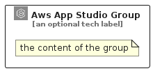

# AwsAppStudio


```text
aws-q1-2025/Architecture/ArtificialIntelligence/AwsAppStudio
```

```text
include('aws-q1-2025/Architecture/ArtificialIntelligence/AwsAppStudio')
```


| Illustration | AwsAppStudio | AwsAppStudioCard | AwsAppStudioGroup |
| :---: | :---: | :---: | :---: |
|  |  |  |  |


## Sprites
The item provides the following sriptes:

- `<$AwsAppStudioXs>`
- `<$AwsAppStudioSm>`
- `<$AwsAppStudioMd>`
- `<$AwsAppStudioLg>`


## AwsAppStudio

### Load remotely
```plantuml
@startuml
' configures the library
!global $LIB_BASE_LOCATION="https://raw.githubusercontent.com/tmorin/plantuml-libs/master/distribution"

' loads the library's bootstrap
!include $LIB_BASE_LOCATION/bootstrap.puml

' loads the package bootstrap
include('aws-q1-2025/bootstrap')

' loads the Item which embeds the element AwsAppStudio
include('aws-q1-2025/Architecture/ArtificialIntelligence/AwsAppStudio')

' renders the element
AwsAppStudio('AwsAppStudio', 'Aws App Studio', 'an optional tech label', 'an optional description')
@enduml
```

### Load locally
```plantuml
@startuml
' configures the library
!global $INCLUSION_MODE="local"
!global $LIB_BASE_LOCATION="../../.."

' loads the library's bootstrap
!include $LIB_BASE_LOCATION/bootstrap.puml

' loads the package bootstrap
include('aws-q1-2025/bootstrap')

' loads the Item which embeds the element AwsAppStudio
include('aws-q1-2025/Architecture/ArtificialIntelligence/AwsAppStudio')

' renders the element
AwsAppStudio('AwsAppStudio', 'Aws App Studio', 'an optional tech label', 'an optional description')
@enduml
```

## AwsAppStudioCard

### Load remotely
```plantuml
@startuml
' configures the library
!global $LIB_BASE_LOCATION="https://raw.githubusercontent.com/tmorin/plantuml-libs/master/distribution"

' loads the library's bootstrap
!include $LIB_BASE_LOCATION/bootstrap.puml

' loads the package bootstrap
include('aws-q1-2025/bootstrap')

' loads the Item which embeds the element AwsAppStudioCard
include('aws-q1-2025/Architecture/ArtificialIntelligence/AwsAppStudio')

' renders the element
AwsAppStudioCard('AwsAppStudioCard', 'Aws App Studio Card', 'an optional description')
@enduml
```

### Load locally
```plantuml
@startuml
' configures the library
!global $INCLUSION_MODE="local"
!global $LIB_BASE_LOCATION="../../.."

' loads the library's bootstrap
!include $LIB_BASE_LOCATION/bootstrap.puml

' loads the package bootstrap
include('aws-q1-2025/bootstrap')

' loads the Item which embeds the element AwsAppStudioCard
include('aws-q1-2025/Architecture/ArtificialIntelligence/AwsAppStudio')

' renders the element
AwsAppStudioCard('AwsAppStudioCard', 'Aws App Studio Card', 'an optional description')
@enduml
```

## AwsAppStudioGroup

### Load remotely
```plantuml
@startuml
' configures the library
!global $LIB_BASE_LOCATION="https://raw.githubusercontent.com/tmorin/plantuml-libs/master/distribution"

' loads the library's bootstrap
!include $LIB_BASE_LOCATION/bootstrap.puml

' loads the package bootstrap
include('aws-q1-2025/bootstrap')

' loads the Item which embeds the element AwsAppStudioGroup
include('aws-q1-2025/Architecture/ArtificialIntelligence/AwsAppStudio')

' renders the element
AwsAppStudioGroup('AwsAppStudioGroup', 'Aws App Studio Group', 'an optional tech label') {
    note as note
        the content of the group
    end note
}
@enduml
```

### Load locally
```plantuml
@startuml
' configures the library
!global $INCLUSION_MODE="local"
!global $LIB_BASE_LOCATION="../../.."

' loads the library's bootstrap
!include $LIB_BASE_LOCATION/bootstrap.puml

' loads the package bootstrap
include('aws-q1-2025/bootstrap')

' loads the Item which embeds the element AwsAppStudioGroup
include('aws-q1-2025/Architecture/ArtificialIntelligence/AwsAppStudio')

' renders the element
AwsAppStudioGroup('AwsAppStudioGroup', 'Aws App Studio Group', 'an optional tech label') {
    note as note
        the content of the group
    end note
}
@enduml
```

