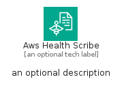

# AwsHealthScribe


```text
aws-q1-2025/Architecture/ArtificialIntelligence/AwsHealthScribe
```

```text
include('aws-q1-2025/Architecture/ArtificialIntelligence/AwsHealthScribe')
```


| Illustration | AwsHealthScribe | AwsHealthScribeCard | AwsHealthScribeGroup |
| :---: | :---: | :---: | :---: |
|  |  |  |  |


## Sprites
The item provides the following sriptes:

- `<$AwsHealthScribeXs>`
- `<$AwsHealthScribeSm>`
- `<$AwsHealthScribeMd>`
- `<$AwsHealthScribeLg>`


## AwsHealthScribe

### Load remotely
```plantuml
@startuml
' configures the library
!global $LIB_BASE_LOCATION="https://raw.githubusercontent.com/tmorin/plantuml-libs/master/distribution"

' loads the library's bootstrap
!include $LIB_BASE_LOCATION/bootstrap.puml

' loads the package bootstrap
include('aws-q1-2025/bootstrap')

' loads the Item which embeds the element AwsHealthScribe
include('aws-q1-2025/Architecture/ArtificialIntelligence/AwsHealthScribe')

' renders the element
AwsHealthScribe('AwsHealthScribe', 'Aws Health Scribe', 'an optional tech label', 'an optional description')
@enduml
```

### Load locally
```plantuml
@startuml
' configures the library
!global $INCLUSION_MODE="local"
!global $LIB_BASE_LOCATION="../../.."

' loads the library's bootstrap
!include $LIB_BASE_LOCATION/bootstrap.puml

' loads the package bootstrap
include('aws-q1-2025/bootstrap')

' loads the Item which embeds the element AwsHealthScribe
include('aws-q1-2025/Architecture/ArtificialIntelligence/AwsHealthScribe')

' renders the element
AwsHealthScribe('AwsHealthScribe', 'Aws Health Scribe', 'an optional tech label', 'an optional description')
@enduml
```

## AwsHealthScribeCard

### Load remotely
```plantuml
@startuml
' configures the library
!global $LIB_BASE_LOCATION="https://raw.githubusercontent.com/tmorin/plantuml-libs/master/distribution"

' loads the library's bootstrap
!include $LIB_BASE_LOCATION/bootstrap.puml

' loads the package bootstrap
include('aws-q1-2025/bootstrap')

' loads the Item which embeds the element AwsHealthScribeCard
include('aws-q1-2025/Architecture/ArtificialIntelligence/AwsHealthScribe')

' renders the element
AwsHealthScribeCard('AwsHealthScribeCard', 'Aws Health Scribe Card', 'an optional description')
@enduml
```

### Load locally
```plantuml
@startuml
' configures the library
!global $INCLUSION_MODE="local"
!global $LIB_BASE_LOCATION="../../.."

' loads the library's bootstrap
!include $LIB_BASE_LOCATION/bootstrap.puml

' loads the package bootstrap
include('aws-q1-2025/bootstrap')

' loads the Item which embeds the element AwsHealthScribeCard
include('aws-q1-2025/Architecture/ArtificialIntelligence/AwsHealthScribe')

' renders the element
AwsHealthScribeCard('AwsHealthScribeCard', 'Aws Health Scribe Card', 'an optional description')
@enduml
```

## AwsHealthScribeGroup

### Load remotely
```plantuml
@startuml
' configures the library
!global $LIB_BASE_LOCATION="https://raw.githubusercontent.com/tmorin/plantuml-libs/master/distribution"

' loads the library's bootstrap
!include $LIB_BASE_LOCATION/bootstrap.puml

' loads the package bootstrap
include('aws-q1-2025/bootstrap')

' loads the Item which embeds the element AwsHealthScribeGroup
include('aws-q1-2025/Architecture/ArtificialIntelligence/AwsHealthScribe')

' renders the element
AwsHealthScribeGroup('AwsHealthScribeGroup', 'Aws Health Scribe Group', 'an optional tech label') {
    note as note
        the content of the group
    end note
}
@enduml
```

### Load locally
```plantuml
@startuml
' configures the library
!global $INCLUSION_MODE="local"
!global $LIB_BASE_LOCATION="../../.."

' loads the library's bootstrap
!include $LIB_BASE_LOCATION/bootstrap.puml

' loads the package bootstrap
include('aws-q1-2025/bootstrap')

' loads the Item which embeds the element AwsHealthScribeGroup
include('aws-q1-2025/Architecture/ArtificialIntelligence/AwsHealthScribe')

' renders the element
AwsHealthScribeGroup('AwsHealthScribeGroup', 'Aws Health Scribe Group', 'an optional tech label') {
    note as note
        the content of the group
    end note
}
@enduml
```

