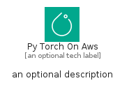
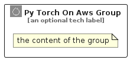

# PyTorchOnAws


```text
aws-q1-2025/Architecture/ArtificialIntelligence/PyTorchOnAws
```

```text
include('aws-q1-2025/Architecture/ArtificialIntelligence/PyTorchOnAws')
```


| Illustration | PyTorchOnAws | PyTorchOnAwsCard | PyTorchOnAwsGroup |
| :---: | :---: | :---: | :---: |
|  |  |  |  |


## Sprites
The item provides the following sriptes:

- `<$PyTorchOnAwsXs>`
- `<$PyTorchOnAwsSm>`
- `<$PyTorchOnAwsMd>`
- `<$PyTorchOnAwsLg>`


## PyTorchOnAws

### Load remotely
```plantuml
@startuml
' configures the library
!global $LIB_BASE_LOCATION="https://raw.githubusercontent.com/tmorin/plantuml-libs/master/distribution"

' loads the library's bootstrap
!include $LIB_BASE_LOCATION/bootstrap.puml

' loads the package bootstrap
include('aws-q1-2025/bootstrap')

' loads the Item which embeds the element PyTorchOnAws
include('aws-q1-2025/Architecture/ArtificialIntelligence/PyTorchOnAws')

' renders the element
PyTorchOnAws('PyTorchOnAws', 'Py Torch On Aws', 'an optional tech label', 'an optional description')
@enduml
```

### Load locally
```plantuml
@startuml
' configures the library
!global $INCLUSION_MODE="local"
!global $LIB_BASE_LOCATION="../../.."

' loads the library's bootstrap
!include $LIB_BASE_LOCATION/bootstrap.puml

' loads the package bootstrap
include('aws-q1-2025/bootstrap')

' loads the Item which embeds the element PyTorchOnAws
include('aws-q1-2025/Architecture/ArtificialIntelligence/PyTorchOnAws')

' renders the element
PyTorchOnAws('PyTorchOnAws', 'Py Torch On Aws', 'an optional tech label', 'an optional description')
@enduml
```

## PyTorchOnAwsCard

### Load remotely
```plantuml
@startuml
' configures the library
!global $LIB_BASE_LOCATION="https://raw.githubusercontent.com/tmorin/plantuml-libs/master/distribution"

' loads the library's bootstrap
!include $LIB_BASE_LOCATION/bootstrap.puml

' loads the package bootstrap
include('aws-q1-2025/bootstrap')

' loads the Item which embeds the element PyTorchOnAwsCard
include('aws-q1-2025/Architecture/ArtificialIntelligence/PyTorchOnAws')

' renders the element
PyTorchOnAwsCard('PyTorchOnAwsCard', 'Py Torch On Aws Card', 'an optional description')
@enduml
```

### Load locally
```plantuml
@startuml
' configures the library
!global $INCLUSION_MODE="local"
!global $LIB_BASE_LOCATION="../../.."

' loads the library's bootstrap
!include $LIB_BASE_LOCATION/bootstrap.puml

' loads the package bootstrap
include('aws-q1-2025/bootstrap')

' loads the Item which embeds the element PyTorchOnAwsCard
include('aws-q1-2025/Architecture/ArtificialIntelligence/PyTorchOnAws')

' renders the element
PyTorchOnAwsCard('PyTorchOnAwsCard', 'Py Torch On Aws Card', 'an optional description')
@enduml
```

## PyTorchOnAwsGroup

### Load remotely
```plantuml
@startuml
' configures the library
!global $LIB_BASE_LOCATION="https://raw.githubusercontent.com/tmorin/plantuml-libs/master/distribution"

' loads the library's bootstrap
!include $LIB_BASE_LOCATION/bootstrap.puml

' loads the package bootstrap
include('aws-q1-2025/bootstrap')

' loads the Item which embeds the element PyTorchOnAwsGroup
include('aws-q1-2025/Architecture/ArtificialIntelligence/PyTorchOnAws')

' renders the element
PyTorchOnAwsGroup('PyTorchOnAwsGroup', 'Py Torch On Aws Group', 'an optional tech label') {
    note as note
        the content of the group
    end note
}
@enduml
```

### Load locally
```plantuml
@startuml
' configures the library
!global $INCLUSION_MODE="local"
!global $LIB_BASE_LOCATION="../../.."

' loads the library's bootstrap
!include $LIB_BASE_LOCATION/bootstrap.puml

' loads the package bootstrap
include('aws-q1-2025/bootstrap')

' loads the Item which embeds the element PyTorchOnAwsGroup
include('aws-q1-2025/Architecture/ArtificialIntelligence/PyTorchOnAws')

' renders the element
PyTorchOnAwsGroup('PyTorchOnAwsGroup', 'Py Torch On Aws Group', 'an optional tech label') {
    note as note
        the content of the group
    end note
}
@enduml
```

