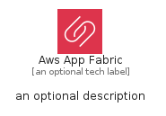

# AwsAppFabric


```text
aws-q1-2025/Architecture/BusinessApplications/AwsAppFabric
```

```text
include('aws-q1-2025/Architecture/BusinessApplications/AwsAppFabric')
```


| Illustration | AwsAppFabric | AwsAppFabricCard | AwsAppFabricGroup |
| :---: | :---: | :---: | :---: |
|  |  |  |  |


## Sprites
The item provides the following sriptes:

- `<$AwsAppFabricXs>`
- `<$AwsAppFabricSm>`
- `<$AwsAppFabricMd>`
- `<$AwsAppFabricLg>`


## AwsAppFabric

### Load remotely
```plantuml
@startuml
' configures the library
!global $LIB_BASE_LOCATION="https://raw.githubusercontent.com/tmorin/plantuml-libs/master/distribution"

' loads the library's bootstrap
!include $LIB_BASE_LOCATION/bootstrap.puml

' loads the package bootstrap
include('aws-q1-2025/bootstrap')

' loads the Item which embeds the element AwsAppFabric
include('aws-q1-2025/Architecture/BusinessApplications/AwsAppFabric')

' renders the element
AwsAppFabric('AwsAppFabric', 'Aws App Fabric', 'an optional tech label', 'an optional description')
@enduml
```

### Load locally
```plantuml
@startuml
' configures the library
!global $INCLUSION_MODE="local"
!global $LIB_BASE_LOCATION="../../.."

' loads the library's bootstrap
!include $LIB_BASE_LOCATION/bootstrap.puml

' loads the package bootstrap
include('aws-q1-2025/bootstrap')

' loads the Item which embeds the element AwsAppFabric
include('aws-q1-2025/Architecture/BusinessApplications/AwsAppFabric')

' renders the element
AwsAppFabric('AwsAppFabric', 'Aws App Fabric', 'an optional tech label', 'an optional description')
@enduml
```

## AwsAppFabricCard

### Load remotely
```plantuml
@startuml
' configures the library
!global $LIB_BASE_LOCATION="https://raw.githubusercontent.com/tmorin/plantuml-libs/master/distribution"

' loads the library's bootstrap
!include $LIB_BASE_LOCATION/bootstrap.puml

' loads the package bootstrap
include('aws-q1-2025/bootstrap')

' loads the Item which embeds the element AwsAppFabricCard
include('aws-q1-2025/Architecture/BusinessApplications/AwsAppFabric')

' renders the element
AwsAppFabricCard('AwsAppFabricCard', 'Aws App Fabric Card', 'an optional description')
@enduml
```

### Load locally
```plantuml
@startuml
' configures the library
!global $INCLUSION_MODE="local"
!global $LIB_BASE_LOCATION="../../.."

' loads the library's bootstrap
!include $LIB_BASE_LOCATION/bootstrap.puml

' loads the package bootstrap
include('aws-q1-2025/bootstrap')

' loads the Item which embeds the element AwsAppFabricCard
include('aws-q1-2025/Architecture/BusinessApplications/AwsAppFabric')

' renders the element
AwsAppFabricCard('AwsAppFabricCard', 'Aws App Fabric Card', 'an optional description')
@enduml
```

## AwsAppFabricGroup

### Load remotely
```plantuml
@startuml
' configures the library
!global $LIB_BASE_LOCATION="https://raw.githubusercontent.com/tmorin/plantuml-libs/master/distribution"

' loads the library's bootstrap
!include $LIB_BASE_LOCATION/bootstrap.puml

' loads the package bootstrap
include('aws-q1-2025/bootstrap')

' loads the Item which embeds the element AwsAppFabricGroup
include('aws-q1-2025/Architecture/BusinessApplications/AwsAppFabric')

' renders the element
AwsAppFabricGroup('AwsAppFabricGroup', 'Aws App Fabric Group', 'an optional tech label') {
    note as note
        the content of the group
    end note
}
@enduml
```

### Load locally
```plantuml
@startuml
' configures the library
!global $INCLUSION_MODE="local"
!global $LIB_BASE_LOCATION="../../.."

' loads the library's bootstrap
!include $LIB_BASE_LOCATION/bootstrap.puml

' loads the package bootstrap
include('aws-q1-2025/bootstrap')

' loads the Item which embeds the element AwsAppFabricGroup
include('aws-q1-2025/Architecture/BusinessApplications/AwsAppFabric')

' renders the element
AwsAppFabricGroup('AwsAppFabricGroup', 'Aws App Fabric Group', 'an optional tech label') {
    note as note
        the content of the group
    end note
}
@enduml
```

