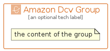

# AmazonDcv


```text
aws-q1-2025/Architecture/Compute/AmazonDcv
```

```text
include('aws-q1-2025/Architecture/Compute/AmazonDcv')
```


| Illustration | AmazonDcv | AmazonDcvCard | AmazonDcvGroup |
| :---: | :---: | :---: | :---: |
|  |  |  |  |


## Sprites
The item provides the following sriptes:

- `<$AmazonDcvXs>`
- `<$AmazonDcvSm>`
- `<$AmazonDcvMd>`
- `<$AmazonDcvLg>`


## AmazonDcv

### Load remotely
```plantuml
@startuml
' configures the library
!global $LIB_BASE_LOCATION="https://raw.githubusercontent.com/tmorin/plantuml-libs/master/distribution"

' loads the library's bootstrap
!include $LIB_BASE_LOCATION/bootstrap.puml

' loads the package bootstrap
include('aws-q1-2025/bootstrap')

' loads the Item which embeds the element AmazonDcv
include('aws-q1-2025/Architecture/Compute/AmazonDcv')

' renders the element
AmazonDcv('AmazonDcv', 'Amazon Dcv', 'an optional tech label', 'an optional description')
@enduml
```

### Load locally
```plantuml
@startuml
' configures the library
!global $INCLUSION_MODE="local"
!global $LIB_BASE_LOCATION="../../.."

' loads the library's bootstrap
!include $LIB_BASE_LOCATION/bootstrap.puml

' loads the package bootstrap
include('aws-q1-2025/bootstrap')

' loads the Item which embeds the element AmazonDcv
include('aws-q1-2025/Architecture/Compute/AmazonDcv')

' renders the element
AmazonDcv('AmazonDcv', 'Amazon Dcv', 'an optional tech label', 'an optional description')
@enduml
```

## AmazonDcvCard

### Load remotely
```plantuml
@startuml
' configures the library
!global $LIB_BASE_LOCATION="https://raw.githubusercontent.com/tmorin/plantuml-libs/master/distribution"

' loads the library's bootstrap
!include $LIB_BASE_LOCATION/bootstrap.puml

' loads the package bootstrap
include('aws-q1-2025/bootstrap')

' loads the Item which embeds the element AmazonDcvCard
include('aws-q1-2025/Architecture/Compute/AmazonDcv')

' renders the element
AmazonDcvCard('AmazonDcvCard', 'Amazon Dcv Card', 'an optional description')
@enduml
```

### Load locally
```plantuml
@startuml
' configures the library
!global $INCLUSION_MODE="local"
!global $LIB_BASE_LOCATION="../../.."

' loads the library's bootstrap
!include $LIB_BASE_LOCATION/bootstrap.puml

' loads the package bootstrap
include('aws-q1-2025/bootstrap')

' loads the Item which embeds the element AmazonDcvCard
include('aws-q1-2025/Architecture/Compute/AmazonDcv')

' renders the element
AmazonDcvCard('AmazonDcvCard', 'Amazon Dcv Card', 'an optional description')
@enduml
```

## AmazonDcvGroup

### Load remotely
```plantuml
@startuml
' configures the library
!global $LIB_BASE_LOCATION="https://raw.githubusercontent.com/tmorin/plantuml-libs/master/distribution"

' loads the library's bootstrap
!include $LIB_BASE_LOCATION/bootstrap.puml

' loads the package bootstrap
include('aws-q1-2025/bootstrap')

' loads the Item which embeds the element AmazonDcvGroup
include('aws-q1-2025/Architecture/Compute/AmazonDcv')

' renders the element
AmazonDcvGroup('AmazonDcvGroup', 'Amazon Dcv Group', 'an optional tech label') {
    note as note
        the content of the group
    end note
}
@enduml
```

### Load locally
```plantuml
@startuml
' configures the library
!global $INCLUSION_MODE="local"
!global $LIB_BASE_LOCATION="../../.."

' loads the library's bootstrap
!include $LIB_BASE_LOCATION/bootstrap.puml

' loads the package bootstrap
include('aws-q1-2025/bootstrap')

' loads the Item which embeds the element AmazonDcvGroup
include('aws-q1-2025/Architecture/Compute/AmazonDcv')

' renders the element
AmazonDcvGroup('AmazonDcvGroup', 'Amazon Dcv Group', 'an optional tech label') {
    note as note
        the content of the group
    end note
}
@enduml
```

