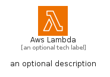
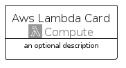

# AwsLambda


```text
aws-q1-2025/Architecture/Compute/AwsLambda
```

```text
include('aws-q1-2025/Architecture/Compute/AwsLambda')
```


| Illustration | AwsLambda | AwsLambdaCard | AwsLambdaGroup |
| :---: | :---: | :---: | :---: |
|  |  |  |  |


## Sprites
The item provides the following sriptes:

- `<$AwsLambdaXs>`
- `<$AwsLambdaSm>`
- `<$AwsLambdaMd>`
- `<$AwsLambdaLg>`


## AwsLambda

### Load remotely
```plantuml
@startuml
' configures the library
!global $LIB_BASE_LOCATION="https://raw.githubusercontent.com/tmorin/plantuml-libs/master/distribution"

' loads the library's bootstrap
!include $LIB_BASE_LOCATION/bootstrap.puml

' loads the package bootstrap
include('aws-q1-2025/bootstrap')

' loads the Item which embeds the element AwsLambda
include('aws-q1-2025/Architecture/Compute/AwsLambda')

' renders the element
AwsLambda('AwsLambda', 'Aws Lambda', 'an optional tech label', 'an optional description')
@enduml
```

### Load locally
```plantuml
@startuml
' configures the library
!global $INCLUSION_MODE="local"
!global $LIB_BASE_LOCATION="../../.."

' loads the library's bootstrap
!include $LIB_BASE_LOCATION/bootstrap.puml

' loads the package bootstrap
include('aws-q1-2025/bootstrap')

' loads the Item which embeds the element AwsLambda
include('aws-q1-2025/Architecture/Compute/AwsLambda')

' renders the element
AwsLambda('AwsLambda', 'Aws Lambda', 'an optional tech label', 'an optional description')
@enduml
```

## AwsLambdaCard

### Load remotely
```plantuml
@startuml
' configures the library
!global $LIB_BASE_LOCATION="https://raw.githubusercontent.com/tmorin/plantuml-libs/master/distribution"

' loads the library's bootstrap
!include $LIB_BASE_LOCATION/bootstrap.puml

' loads the package bootstrap
include('aws-q1-2025/bootstrap')

' loads the Item which embeds the element AwsLambdaCard
include('aws-q1-2025/Architecture/Compute/AwsLambda')

' renders the element
AwsLambdaCard('AwsLambdaCard', 'Aws Lambda Card', 'an optional description')
@enduml
```

### Load locally
```plantuml
@startuml
' configures the library
!global $INCLUSION_MODE="local"
!global $LIB_BASE_LOCATION="../../.."

' loads the library's bootstrap
!include $LIB_BASE_LOCATION/bootstrap.puml

' loads the package bootstrap
include('aws-q1-2025/bootstrap')

' loads the Item which embeds the element AwsLambdaCard
include('aws-q1-2025/Architecture/Compute/AwsLambda')

' renders the element
AwsLambdaCard('AwsLambdaCard', 'Aws Lambda Card', 'an optional description')
@enduml
```

## AwsLambdaGroup

### Load remotely
```plantuml
@startuml
' configures the library
!global $LIB_BASE_LOCATION="https://raw.githubusercontent.com/tmorin/plantuml-libs/master/distribution"

' loads the library's bootstrap
!include $LIB_BASE_LOCATION/bootstrap.puml

' loads the package bootstrap
include('aws-q1-2025/bootstrap')

' loads the Item which embeds the element AwsLambdaGroup
include('aws-q1-2025/Architecture/Compute/AwsLambda')

' renders the element
AwsLambdaGroup('AwsLambdaGroup', 'Aws Lambda Group', 'an optional tech label') {
    note as note
        the content of the group
    end note
}
@enduml
```

### Load locally
```plantuml
@startuml
' configures the library
!global $INCLUSION_MODE="local"
!global $LIB_BASE_LOCATION="../../.."

' loads the library's bootstrap
!include $LIB_BASE_LOCATION/bootstrap.puml

' loads the package bootstrap
include('aws-q1-2025/bootstrap')

' loads the Item which embeds the element AwsLambdaGroup
include('aws-q1-2025/Architecture/Compute/AwsLambda')

' renders the element
AwsLambdaGroup('AwsLambdaGroup', 'Aws Lambda Group', 'an optional tech label') {
    note as note
        the content of the group
    end note
}
@enduml
```

