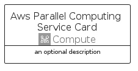

# AwsParallelComputingService


```text
aws-q1-2025/Architecture/Compute/AwsParallelComputingService
```

```text
include('aws-q1-2025/Architecture/Compute/AwsParallelComputingService')
```


| Illustration | AwsParallelComputingService | AwsParallelComputingServiceCard | AwsParallelComputingServiceGroup |
| :---: | :---: | :---: | :---: |
|  |  |  |  |


## Sprites
The item provides the following sriptes:

- `<$AwsParallelComputingServiceXs>`
- `<$AwsParallelComputingServiceSm>`
- `<$AwsParallelComputingServiceMd>`
- `<$AwsParallelComputingServiceLg>`


## AwsParallelComputingService

### Load remotely
```plantuml
@startuml
' configures the library
!global $LIB_BASE_LOCATION="https://raw.githubusercontent.com/tmorin/plantuml-libs/master/distribution"

' loads the library's bootstrap
!include $LIB_BASE_LOCATION/bootstrap.puml

' loads the package bootstrap
include('aws-q1-2025/bootstrap')

' loads the Item which embeds the element AwsParallelComputingService
include('aws-q1-2025/Architecture/Compute/AwsParallelComputingService')

' renders the element
AwsParallelComputingService('AwsParallelComputingService', 'Aws Parallel Computing Service', 'an optional tech label', 'an optional description')
@enduml
```

### Load locally
```plantuml
@startuml
' configures the library
!global $INCLUSION_MODE="local"
!global $LIB_BASE_LOCATION="../../.."

' loads the library's bootstrap
!include $LIB_BASE_LOCATION/bootstrap.puml

' loads the package bootstrap
include('aws-q1-2025/bootstrap')

' loads the Item which embeds the element AwsParallelComputingService
include('aws-q1-2025/Architecture/Compute/AwsParallelComputingService')

' renders the element
AwsParallelComputingService('AwsParallelComputingService', 'Aws Parallel Computing Service', 'an optional tech label', 'an optional description')
@enduml
```

## AwsParallelComputingServiceCard

### Load remotely
```plantuml
@startuml
' configures the library
!global $LIB_BASE_LOCATION="https://raw.githubusercontent.com/tmorin/plantuml-libs/master/distribution"

' loads the library's bootstrap
!include $LIB_BASE_LOCATION/bootstrap.puml

' loads the package bootstrap
include('aws-q1-2025/bootstrap')

' loads the Item which embeds the element AwsParallelComputingServiceCard
include('aws-q1-2025/Architecture/Compute/AwsParallelComputingService')

' renders the element
AwsParallelComputingServiceCard('AwsParallelComputingServiceCard', 'Aws Parallel Computing Service Card', 'an optional description')
@enduml
```

### Load locally
```plantuml
@startuml
' configures the library
!global $INCLUSION_MODE="local"
!global $LIB_BASE_LOCATION="../../.."

' loads the library's bootstrap
!include $LIB_BASE_LOCATION/bootstrap.puml

' loads the package bootstrap
include('aws-q1-2025/bootstrap')

' loads the Item which embeds the element AwsParallelComputingServiceCard
include('aws-q1-2025/Architecture/Compute/AwsParallelComputingService')

' renders the element
AwsParallelComputingServiceCard('AwsParallelComputingServiceCard', 'Aws Parallel Computing Service Card', 'an optional description')
@enduml
```

## AwsParallelComputingServiceGroup

### Load remotely
```plantuml
@startuml
' configures the library
!global $LIB_BASE_LOCATION="https://raw.githubusercontent.com/tmorin/plantuml-libs/master/distribution"

' loads the library's bootstrap
!include $LIB_BASE_LOCATION/bootstrap.puml

' loads the package bootstrap
include('aws-q1-2025/bootstrap')

' loads the Item which embeds the element AwsParallelComputingServiceGroup
include('aws-q1-2025/Architecture/Compute/AwsParallelComputingService')

' renders the element
AwsParallelComputingServiceGroup('AwsParallelComputingServiceGroup', 'Aws Parallel Computing Service Group', 'an optional tech label') {
    note as note
        the content of the group
    end note
}
@enduml
```

### Load locally
```plantuml
@startuml
' configures the library
!global $INCLUSION_MODE="local"
!global $LIB_BASE_LOCATION="../../.."

' loads the library's bootstrap
!include $LIB_BASE_LOCATION/bootstrap.puml

' loads the package bootstrap
include('aws-q1-2025/bootstrap')

' loads the Item which embeds the element AwsParallelComputingServiceGroup
include('aws-q1-2025/Architecture/Compute/AwsParallelComputingService')

' renders the element
AwsParallelComputingServiceGroup('AwsParallelComputingServiceGroup', 'Aws Parallel Computing Service Group', 'an optional tech label') {
    note as note
        the content of the group
    end note
}
@enduml
```

