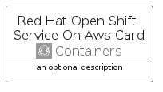

# RedHatOpenShiftServiceOnAws


```text
aws-q1-2025/Architecture/Containers/RedHatOpenShiftServiceOnAws
```

```text
include('aws-q1-2025/Architecture/Containers/RedHatOpenShiftServiceOnAws')
```


| Illustration | RedHatOpenShiftServiceOnAws | RedHatOpenShiftServiceOnAwsCard | RedHatOpenShiftServiceOnAwsGroup |
| :---: | :---: | :---: | :---: |
|  |  |  |  |


## Sprites
The item provides the following sriptes:

- `<$RedHatOpenShiftServiceOnAwsXs>`
- `<$RedHatOpenShiftServiceOnAwsSm>`
- `<$RedHatOpenShiftServiceOnAwsMd>`
- `<$RedHatOpenShiftServiceOnAwsLg>`


## RedHatOpenShiftServiceOnAws

### Load remotely
```plantuml
@startuml
' configures the library
!global $LIB_BASE_LOCATION="https://raw.githubusercontent.com/tmorin/plantuml-libs/master/distribution"

' loads the library's bootstrap
!include $LIB_BASE_LOCATION/bootstrap.puml

' loads the package bootstrap
include('aws-q1-2025/bootstrap')

' loads the Item which embeds the element RedHatOpenShiftServiceOnAws
include('aws-q1-2025/Architecture/Containers/RedHatOpenShiftServiceOnAws')

' renders the element
RedHatOpenShiftServiceOnAws('RedHatOpenShiftServiceOnAws', 'Red Hat Open Shift Service On Aws', 'an optional tech label', 'an optional description')
@enduml
```

### Load locally
```plantuml
@startuml
' configures the library
!global $INCLUSION_MODE="local"
!global $LIB_BASE_LOCATION="../../.."

' loads the library's bootstrap
!include $LIB_BASE_LOCATION/bootstrap.puml

' loads the package bootstrap
include('aws-q1-2025/bootstrap')

' loads the Item which embeds the element RedHatOpenShiftServiceOnAws
include('aws-q1-2025/Architecture/Containers/RedHatOpenShiftServiceOnAws')

' renders the element
RedHatOpenShiftServiceOnAws('RedHatOpenShiftServiceOnAws', 'Red Hat Open Shift Service On Aws', 'an optional tech label', 'an optional description')
@enduml
```

## RedHatOpenShiftServiceOnAwsCard

### Load remotely
```plantuml
@startuml
' configures the library
!global $LIB_BASE_LOCATION="https://raw.githubusercontent.com/tmorin/plantuml-libs/master/distribution"

' loads the library's bootstrap
!include $LIB_BASE_LOCATION/bootstrap.puml

' loads the package bootstrap
include('aws-q1-2025/bootstrap')

' loads the Item which embeds the element RedHatOpenShiftServiceOnAwsCard
include('aws-q1-2025/Architecture/Containers/RedHatOpenShiftServiceOnAws')

' renders the element
RedHatOpenShiftServiceOnAwsCard('RedHatOpenShiftServiceOnAwsCard', 'Red Hat Open Shift Service On Aws Card', 'an optional description')
@enduml
```

### Load locally
```plantuml
@startuml
' configures the library
!global $INCLUSION_MODE="local"
!global $LIB_BASE_LOCATION="../../.."

' loads the library's bootstrap
!include $LIB_BASE_LOCATION/bootstrap.puml

' loads the package bootstrap
include('aws-q1-2025/bootstrap')

' loads the Item which embeds the element RedHatOpenShiftServiceOnAwsCard
include('aws-q1-2025/Architecture/Containers/RedHatOpenShiftServiceOnAws')

' renders the element
RedHatOpenShiftServiceOnAwsCard('RedHatOpenShiftServiceOnAwsCard', 'Red Hat Open Shift Service On Aws Card', 'an optional description')
@enduml
```

## RedHatOpenShiftServiceOnAwsGroup

### Load remotely
```plantuml
@startuml
' configures the library
!global $LIB_BASE_LOCATION="https://raw.githubusercontent.com/tmorin/plantuml-libs/master/distribution"

' loads the library's bootstrap
!include $LIB_BASE_LOCATION/bootstrap.puml

' loads the package bootstrap
include('aws-q1-2025/bootstrap')

' loads the Item which embeds the element RedHatOpenShiftServiceOnAwsGroup
include('aws-q1-2025/Architecture/Containers/RedHatOpenShiftServiceOnAws')

' renders the element
RedHatOpenShiftServiceOnAwsGroup('RedHatOpenShiftServiceOnAwsGroup', 'Red Hat Open Shift Service On Aws Group', 'an optional tech label') {
    note as note
        the content of the group
    end note
}
@enduml
```

### Load locally
```plantuml
@startuml
' configures the library
!global $INCLUSION_MODE="local"
!global $LIB_BASE_LOCATION="../../.."

' loads the library's bootstrap
!include $LIB_BASE_LOCATION/bootstrap.puml

' loads the package bootstrap
include('aws-q1-2025/bootstrap')

' loads the Item which embeds the element RedHatOpenShiftServiceOnAwsGroup
include('aws-q1-2025/Architecture/Containers/RedHatOpenShiftServiceOnAws')

' renders the element
RedHatOpenShiftServiceOnAwsGroup('RedHatOpenShiftServiceOnAwsGroup', 'Red Hat Open Shift Service On Aws Group', 'an optional tech label') {
    note as note
        the content of the group
    end note
}
@enduml
```

